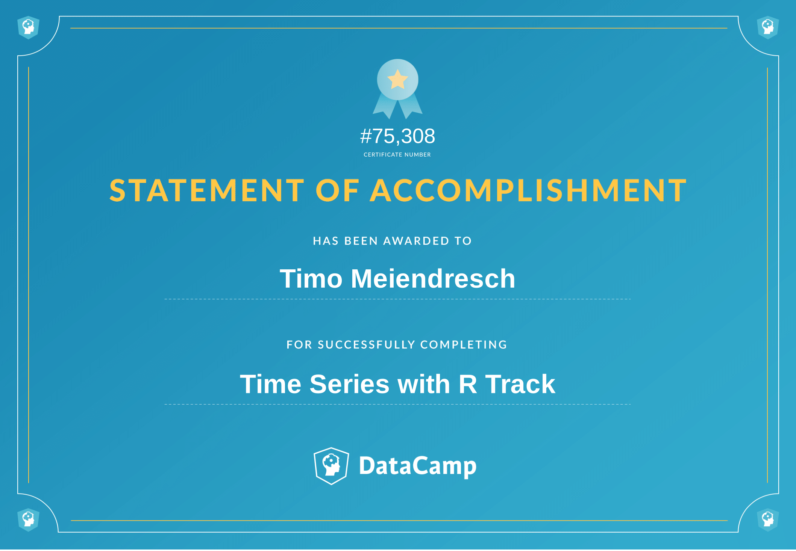

# Time-Series-with-R
Notes and Code of the "Time Series with R" Track on DataCamp. 

My suggestion is to download the repository and view the files in your browser. Alternatively, you could copy/paste the URL of the respective html file into this [html preview tool](http://htmlpreview.github.io/). Links to the previews are provided below:

Preview Links: 
- Course 2: [Intro to Time Series Analysis](http://htmlpreview.github.io/?https://github.com/tm1611/Time-Series-with-R/blob/master/html_files/c2_summary_Intro_TSA.html)
- Course 3: [ARIMA Models](http://htmlpreview.github.io/?https://github.com/tm1611/Time-Series-with-R/blob/master/html_files/c3_summary_ARIMA.html) 
- Course 4: [Forecasting](http://htmlpreview.github.io/?https://github.com/tm1611/Time-Series-with-R/blob/master/html_files/c4_summary_forecasting.html)
- Course 5: [Advanced Methods](http://htmlpreview.github.io/?https://github.com/tm1611/Time-Series-with-R/blob/master/html_files/c5_summary_advanced_methods.html)
- Course 6: [Time Series Visualization](http://htmlpreview.github.io/?https://github.com/tm1611/Time-Series-with-R/blob/master/html_files/c6_summary_TS_visualization.html)
- Course 7: [Manipulating Time Series: Case Studies](http://htmlpreview.github.io/?https://github.com/tm1611/Time-Series-with-R/blob/master/html_files/c7_summary_manip_TS.html)
