```r
# Change CPI to xts
cpi <- xts(x = dat$CPIAUCSL, order.by = as.Date(dat$DATE))
econ <- xts(x = economics[,-1], order.by = as.Date(economics[,1]))
```

## Ch. 1: Introduction

The following introduction to time series (ts) will cover how to work with ts in R, covering the basic models as building blocks to more advanced ways of modeling and forecasting ts. These models are: 
 
 * White Noise (WN)
 * Random Walk (RW)
 * Autoregression (AR)
 * Simple Moving Average (MA)


```r
periodicity(Nile)
```

```
## Yearly periodicity from 1871-01-01 to 1970-01-01
```

```r
length(Nile)
```

```
## [1] 100
```

```r
plot(Nile, main="Annual River Nile Volume at Aswan, 1871-1970" ,xlab = "Year", ylab = "River Volume (1e9 m^{3})", type="b")
```

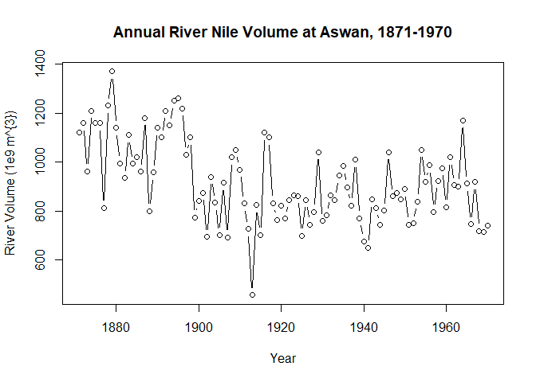<!-- -->

Frequency of time series may differ. In general it is desirable to have evenly spaced observations. To check the sampling frequency we can use the following functions: 


```r
# Use AirPassengers data for this 
data(AirPassengers)
air <- AirPassengers
plot(air, main="AirPassengers, 1949-1960", xlab="Year", ylab="Passengers")
```

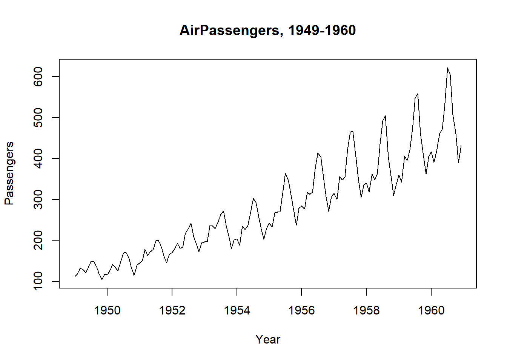<!-- -->

```r
# Check start and end
start(air)
```

```
## [1] 1949    1
```

```r
end(air)
```

```
## [1] 1960   12
```

```r
## time(), deltat(), frequency(), cycle()

# vector of time indices
tail(time(air))
```

```
## [1] 1960.500 1960.583 1960.667 1960.750 1960.833 1960.917
```

```r
# returns fixed time interval
deltat(air)
```

```
## [1] 0.08333333
```

```r
# returns number of observations per unit time
frequency(air)
```

```
## [1] 12
```

```r
# Return position in each cycle
cycle(air)
```

```
##      Jan Feb Mar Apr May Jun Jul Aug Sep Oct Nov Dec
## 1949   1   2   3   4   5   6   7   8   9  10  11  12
## 1950   1   2   3   4   5   6   7   8   9  10  11  12
## 1951   1   2   3   4   5   6   7   8   9  10  11  12
## 1952   1   2   3   4   5   6   7   8   9  10  11  12
## 1953   1   2   3   4   5   6   7   8   9  10  11  12
## 1954   1   2   3   4   5   6   7   8   9  10  11  12
## 1955   1   2   3   4   5   6   7   8   9  10  11  12
## 1956   1   2   3   4   5   6   7   8   9  10  11  12
## 1957   1   2   3   4   5   6   7   8   9  10  11  12
## 1958   1   2   3   4   5   6   7   8   9  10  11  12
## 1959   1   2   3   4   5   6   7   8   9  10  11  12
## 1960   1   2   3   4   5   6   7   8   9  10  11  12
```

### Time Series Objects
Using `ts()` function: 

```r
data_vector <- sample(x = 1:20,size = 10, replace = FALSE)
data_vector
```

```
##  [1] 12 14  2  8  4  6 11 20 16  7
```

```r
time_series <- ts(data_vector, start = 2010, frequency = 1)
plot(time_series)
```

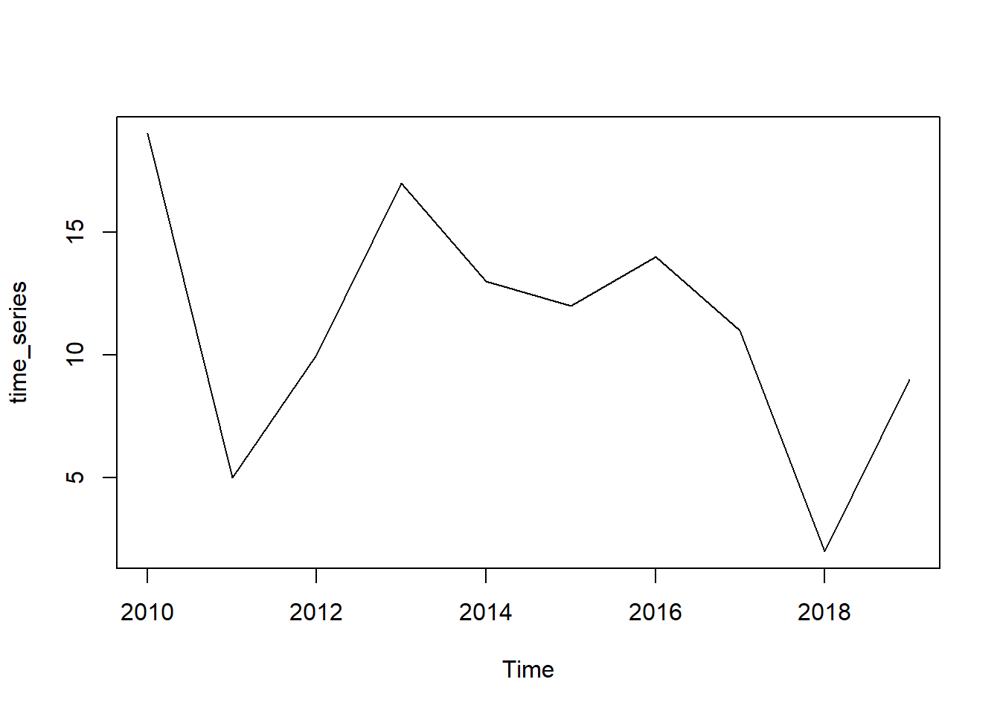<!-- -->

```r
# check if ts
is.ts(time_series)
```

```
## [1] TRUE
```
The main reason to create an object of ts() class is that many methods are available for utilizing time series attributes, such as time index information. When it comes to plotting, plot() will automatically generate a ts plot for ts-objects. 


```r
# Create a more sophisticatd example
#data_vector <- 

data_vector <- seq(from = 0, 1, length.out = 50) + rnorm(n = 50, mean = 0, sd = 1)
plot(data_vector)
```

<!-- -->

```r
# Convert to quarterly ts and plot again
time_series <- ts(data_vector, start = 2000, frequency = 4)
plot(time_series)
```

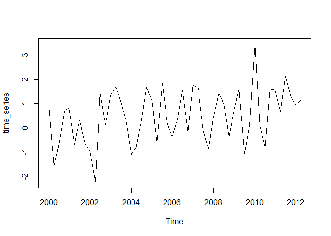<!-- -->

```r
# more complex time series plot with ts.plot()
data(EuStockMarkets)
eu_stocks <- EuStockMarkets
ts.plot(eu_stocks, col = 1:4, xlab = "Year", ylab = "Index Value", main = "Major European Stock Indices, 1991-1998")
legend("topleft", colnames(eu_stocks), lty = 1, col = 1:4, bty = "n")
```

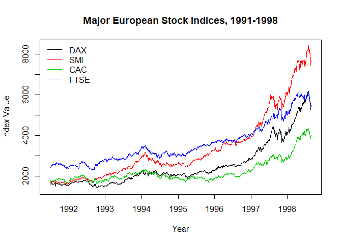<!-- -->

## Ch. 2 The Future
Starting with trend spotting and how to remove those trends using transformations:

* log() to linearize a rapid growth trend.
* diff() to remove linear trends.
* diff(..., s) as a seasonal difference transformation can remove periodioc trends -> s is the cycle length of the series. 

### The White Noise Model
The white Noise (WN) process ${z}$ is the simplest example of a stationary process. A sequence $z_1, z_2, ...$ is a (weak) white noise process if :

- $E(z_t) = \mu$ for all t
- $Var(z_t) = \sigma^2$ for all t, and
- $Cov(z_t, z_s) = 0$ for all $t \neq s$.

It has a fixed, constant mean and a fixed constant variance over time. Also, there is no pattern or correlation in the data. Without any dependence, past values of a WN process contain no information that can be used to predict future values. If the sequence $z_1, z_2, ...$ is an i.i.d $WN(\mu, sigma^2)$ process, then: 
$$ E(z_{t+h} | z_1, ..., z_t) = \mu$$ for all $h \geq 1$. We cannot predict deviations of WN from mean. The future is independent of its past and present. This means that the best prediction of any future value is simply the mean $\mu$. 


```r
# Simulate n=50 observations from the WN model using arima.sim
WN_1 <- arima.sim(model = list(order=c(0,0,0)), n=100)
ts.plot(WN_1)
```

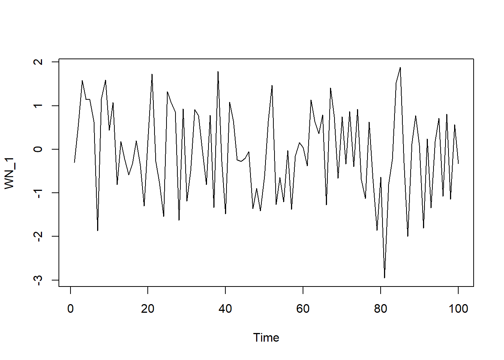<!-- -->

```r
# WN with mean and different sd
WN_2 <- arima.sim(model=list(order=c(0,0,0)),
                  n=100,
                  mean=4,
                  sd=2)
ts.plot(WN_2)
```

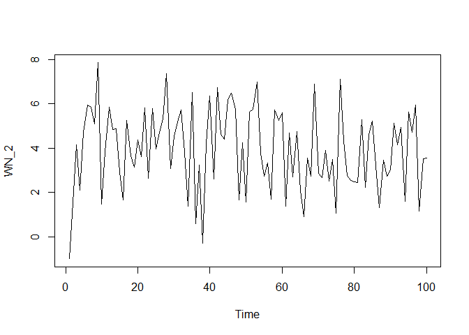<!-- -->

```r
# Switching sides: fitting WN model with arima()
arima(WN_2, order=c(0,0,0))
```

```
## 
## Call:
## arima(x = WN_2, order = c(0, 0, 0))
## 
## Coefficients:
##       intercept
##          3.9185
## s.e.     0.1803
## 
## sigma^2 estimated as 3.252:  log likelihood = -200.86,  aic = 405.73
```

```r
# Compare to standard functions.
mean(WN_2)
```

```
## [1] 3.918509
```

```r
var(WN_2)
```

```
## [1] 3.285281
```

### The Random Walk Model
A random walk (RW) is a simple example of a non-stationary process.  

It has no specified mean or variance and its changes or increments are white noise (WN). The random walk is the cumulative sum (or integration) of a mean zero white noise (WN) series. Note for reference that the RW model is an *ARIMA(0,1,0) model, in which the middle entry of 1 indicates the model's order integration as 1. 

The entire sequence of a random walk can be defined as: 
$$y_t = y_0 + \sum_{i=1}^{t-1} \epsilon_i$$

Let ${y_t}$ be a pure RW, then:
$$y_t = y_{t-1} + \epsilon_t $$

The first difference of a random walk is white noise term 
$$ \Delta y_t = \epsilon_t$$
which can be calculated as `diff(y)`in R.

$\epsilon_t$ being a zero white noise process. Simulation requires an initial point and is often chosen to be zero for simplicity. The RW process has one parameter which is the variance of the white noise $\sigma^2_{\epsilon}$. 


```r
rw <- arima.sim(model=list(order=c(0,1,0)), n=100)
ts.plot(rw)
```

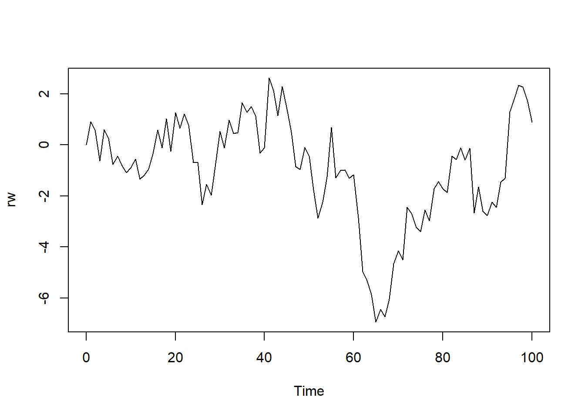<!-- -->

```r
ts.plot(diff(rw))
```

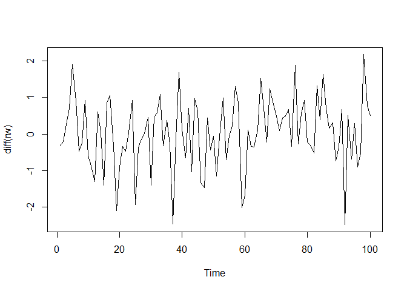<!-- -->

#### Random Walk with Drift
Random walk with an additional constant or intercept of the model: 
$$y_t = c + y_{t-1} + \epsilon_t$$
The process has now two parameters, namely the variance of the white noise process $\sigma^2_\epsilon$ and the constant $c$.

The first difference is:
$$\Delta y_t = y_t - y_{t-1} = c + \epsilon_t$$
so it is WN with a constan mean of $c$.


```r
rw_drift <- arima.sim(model = list(order=c(0,1,0)),
                      n = 100,
                      mean=1,
                      sd=2)

ts.plot(rw_drift)
```

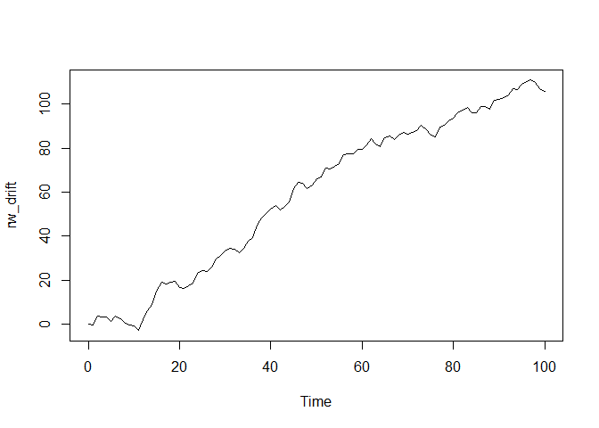<!-- -->

```r
ts.plot(diff(rw_drift))
```

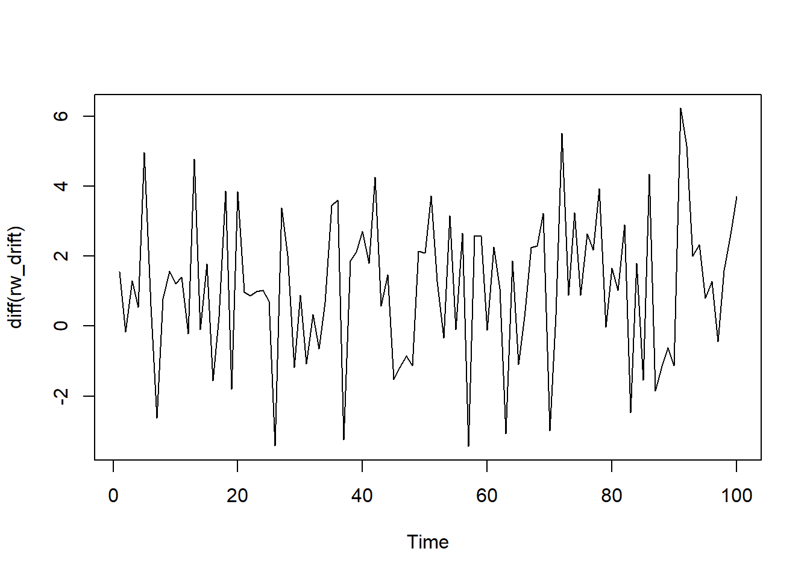<!-- -->

```r
# Estimate the mean of the differenced series (white noise) using arima()
model_wn <- arima(diff(rw_drift), order=c(0,0,0))
wn_coef <- model_wn$coef

# add this to initial plot
ts.plot(rw_drift)
abline(0, wn_coef, col="red", lty=2)
```

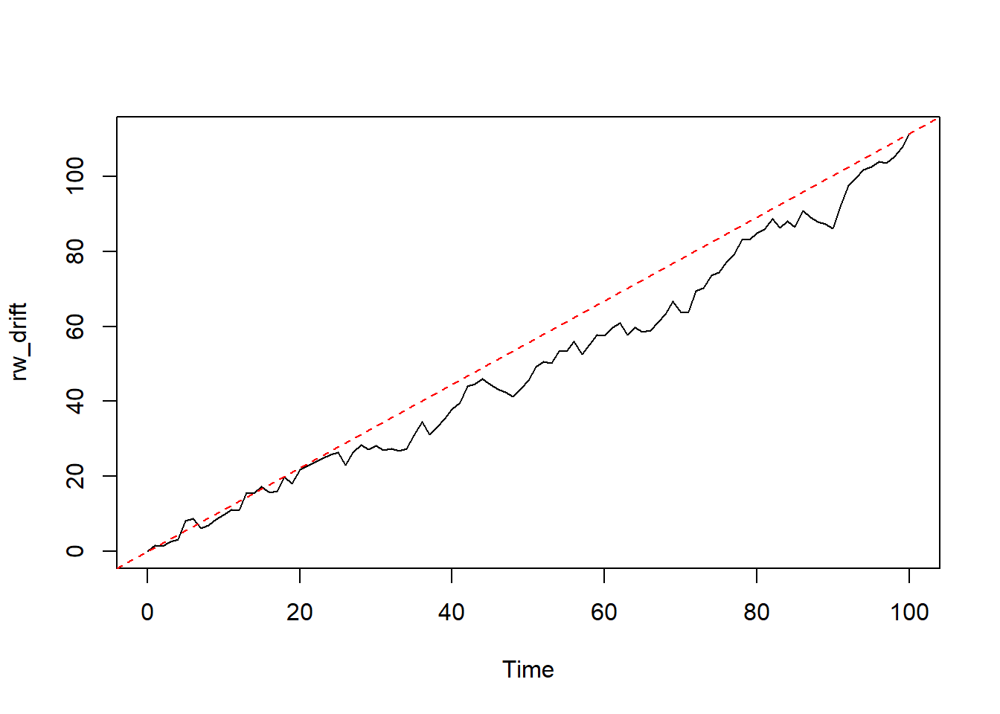<!-- -->

The estimated intercept is 1.059, whereas 1 was the given mean without noise.

## Stationarity
Stationary processes have distributional stability over time. For observed time series fluctutations appear randomly but ts often behave similarly from one time period to the next. A stationary process can be modeled with fewer parameters. For example we only have one mean and variance for the observations instead of a time-varying mean and variance. $\mu$ can bes estimated with the sample mean $\bar{y}$.  

A process is *strictly stationary* if all aspects of its probabilistic behavior are unchanged by shifts in time. For every m and n, 

- $(Y_1,...,Y_n)$ and $(Y_{1+m},...,Y_{n+m})$ have the same distributions;
- The distribution of a sequence of n observations does *not* depend on their time origin (1 or 1+m). It is often enough to assume a weaker version of this which is defined below. 

A process is *weakly stationary* if its mean, variance, and covariance are unchanged by time shifts. $Y_1, Y_2, ...$ is a weakly stationary process if: 

- $E(Y_t) = \mu$ for all t
- $Var(Y_t) = \sigma^2$ for all t
- $Cov(Y_t, Y_s) = \gamma(|t-s|)$ for all t and s for the covariance function $\gamma(h)$.

Weakly stationary is also referred to as *covariance stationarity*. Mean and variance do not change with time and the covariance between two observations depends only on the lag, the time distance $|t-s|$ between observations, not the indices t or s directly. 

It is important to know when a time series is stationary and when it is not. Many financial time series do not exhibit stationarity. However, changes in the series are often approximately stationary. 


```r
# Use arima.sim() to generate WN data
white_noise <- arima.sim(model=list(order=c(0,0,0)), n=100)

# Use cumsum() to convert your WN data to RW
random_walk <- cumsum(white_noise)
  
# Use arima.sim() to generate WN drift data
wn_drift <- arima.sim(model=list(order=c(0,0,0)), n=100, mean=0.4)
  
# Use cumsum() to convert your WN drift data to RW
rw_drift <- cumsum(wn_drift)

# Plot all four data objects
plot.ts(cbind(white_noise, random_walk, wn_drift, rw_drift))
```

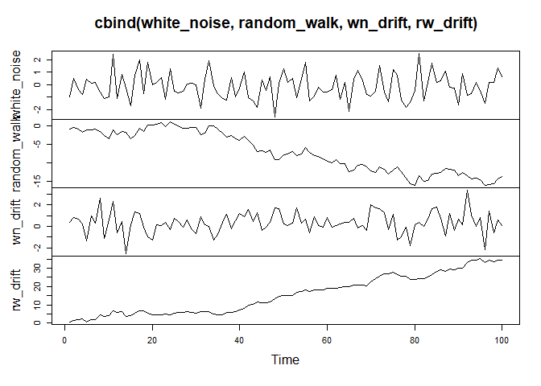<!-- -->

## Ch. 3: Correlation Analysis and the autocorrelation function
Several ways to scatterplot which will be shown below using the eu_stocks data again.

### Scatterplots

```r
# Plot eu_stocks
plot(eu_stocks)
```

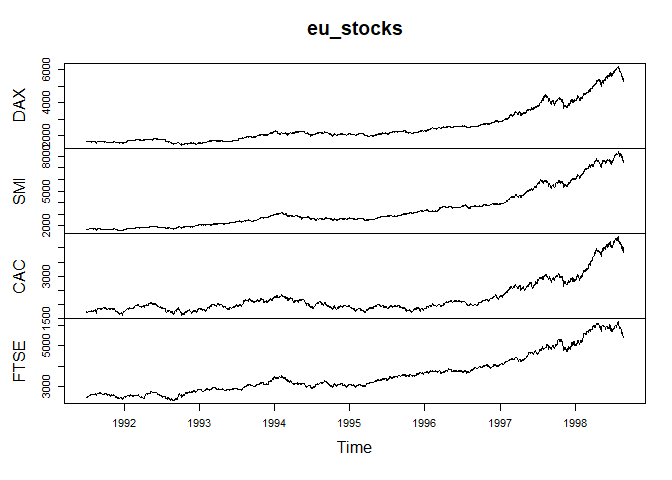<!-- -->

```r
# Convert prices to returns
returns <- eu_stocks[-1,] / eu_stocks[-dim(eu_stocks)[1],] - 1

# Convert returns to ts
returns <- ts(returns, start = c(1991, 130), frequency = 260)

# Plot returns
head(returns)
```

```
##               DAX          SMI          CAC         FTSE
## [1,] -0.009283193  0.006197485 -0.012578971  0.006793256
## [2,] -0.004412412 -0.005863192 -0.018566124 -0.004877652
## [3,]  0.009044450  0.003276540 -0.005762515  0.009067887
## [4,] -0.001776637  0.001484472  0.008781687  0.005788536
## [5,] -0.004665793 -0.008893632 -0.005107074 -0.007204089
## [6,]  0.012504579  0.006759990  0.011783235  0.008553592
```

```r
# Convert prices to log returns
logreturns <- diff(log(eu_stocks))

# Plot logreturns
plot(logreturns)
```

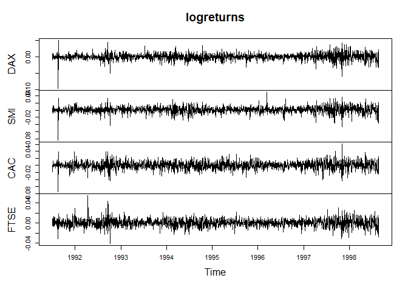<!-- -->

```r
# 
eu_percentreturns <- returns*100
colMeans(eu_percentreturns)
```

```
##        DAX        SMI        CAC       FTSE 
## 0.07052174 0.08609470 0.04979471 0.04637479
```

```r
# apply sample variance sd to cols (MARGIN=2)
apply(eu_percentreturns, MARGIN = 2, FUN = var)
```

```
##       DAX       SMI       CAC      FTSE 
## 1.0569648 0.8523711 1.2159091 0.6344767
```

```r
# Calculate sd
apply(eu_percentreturns, MARGIN=2, sd)
```

```
##       DAX       SMI       CAC      FTSE 
## 1.0280879 0.9232394 1.1026827 0.7965405
```

```r
# pairwise scatterplots
pairs(eu_stocks)
```

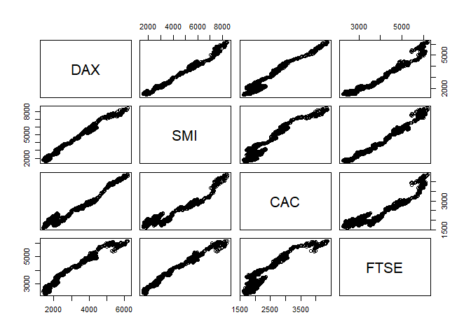<!-- -->

```r
pairs(logreturns)
```

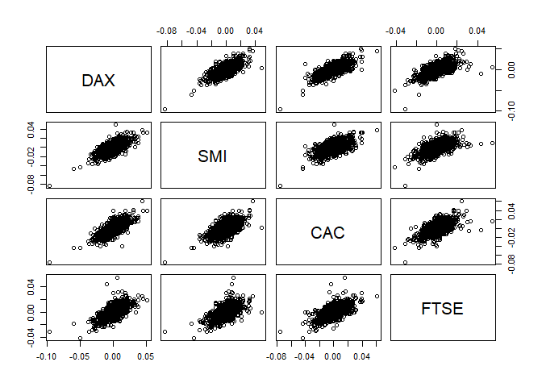<!-- -->


```r
# histogram for all four indices
par(mfrow = c(2,2))
apply(eu_percentreturns, MARGIN = 2, FUN = hist, main = "", xlab = "Percentage Return")
```

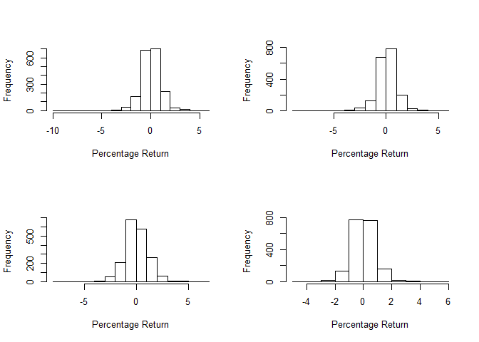<!-- -->

### Covariance and Correlation
Covariance is a measure of association between two variables. It depends on the scale of the variance. Correlation is the standardized version of covariance. It is easier to compare between various series and independent of the scale. The correlation is in the range [-1, +1], where -1 indicates a perfect negative linear relationship and +1 indicates a perfectly positive linear relationship. 0 indicates no linear association. Note that there may be nonlinear associations not picked up by this measure. 


```r
# Pick 2/4 stocks for measuring their association
stock_a <- tail(eu_stocks[,1], 100)
stock_b <- tail(eu_stocks[,2], 100)

# plot both series: 
# (to do) Standardize normalize to make them comparable 
ts.plot(cbind(stock_a, stock_b))
```

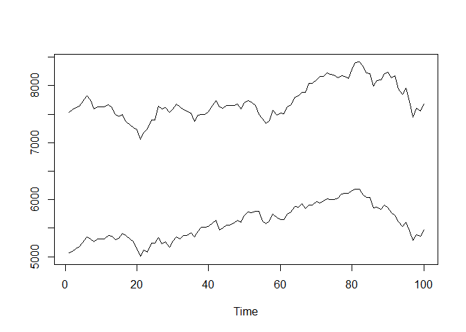<!-- -->

```r
# Covariance: hard to interpret
cov(stock_a, stock_b)
```

```
## [1] 76965.27
```

```r
# Correlation: Standardized to [-1,+1]
cor(stock_a, stock_b)
```

```
## [1] 0.8210877
```

```r
cov(stock_a, stock_b) / (sd(stock_a) * sd(stock_b))
```

```
## [1] 0.8210877
```

```r
## Same for logreturns
logreturn_a <- diff(log(stock_a))
logreturn_b <- diff(log(stock_b))
ts.plot(cbind(logreturn_a, logreturn_b), col=c("black", "blue"))
```

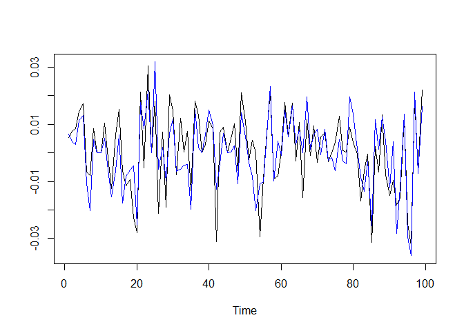<!-- -->

```r
# Cov and cor
cov(logreturn_a, logreturn_b)
```

```
## [1] 0.0001340315
```

```r
cor(logreturn_a, logreturn_b)
```

```
## [1] 0.8117921
```

```r
# We can also calculate a complete correlation matrix
cor(eu_stocks)
```

```
##            DAX       SMI       CAC      FTSE
## DAX  1.0000000 0.9911539 0.9662274 0.9751778
## SMI  0.9911539 1.0000000 0.9468139 0.9899691
## CAC  0.9662274 0.9468139 1.0000000 0.9157265
## FTSE 0.9751778 0.9899691 0.9157265 1.0000000
```

### Autocorrelation
The function $\gamma$ is called the *autocovariance function*. It measures the association of the process with itself at 2 points in time. The difference between the points in time is denoted by $h$, steps or lags, between these two points:

- Covariance between $Y_t$ and $Y_{t+h}$ is denoted by $\gamma(h)$.

The function $\rho$ is called the *autocorrelation function*.

- Correlation between $Y_t$ and $Y_{t+h}$ is denoted with $\rho(h)$.

Note: 

- $\gamma_x(0) = Var(x) = \sigma^2$ (variance)
- $\gamma(h) = \sigma^2 \rho(h)$ (autocovariance)
- $\rho(h) = \gamma(h) / \gamma(0)$ (autocorrelation)

The autocovariance and autocorrelation function are estimated using their sample equivalent with sample mean $\bar{y}$ and sample variance $s^2$. The estimated *sample autocovariance function* is then defined as: 

$$ \hat{\gamma}(h) = n^{-1} \; \sum_{t=1}^{n-h}(Y_{t+h}-\overline{y})(Y_t - \overline{y}) = n^{-1} \sum_{t=h+1}^{n}(Y_{t-h} - \overline{y}) $$
To estimate $\rho(\cdot)$, we use the *sample autocorrelation function* (*sample ACF*) defined as: 
$$ \hat{\rho}(h) = \frac{\hat{\gamma}(h)}{\hat{\gamma}(0)} $$
for each lag h. 

In the following plots of sample ACF there will be test bounds. These bounds test the null hypothesis that an autocorrelation coefficient is significantly differenct from zero:

- $H_0: \hat{\rho}(h) = 0$ vs
- $H_1: \hat{\rho}(h) \neq 0$

The null hypothesis is rejected if the sample autocorreatlion is outside the bounds. The usual level of the test is $\alpha = 0.05$. 

- Important: By this definition we expect 1 out of 20 sample autocorrelations outside the test bounds simply by chance. 

```r
# Cut stock to calculate first order autocorrelation
stock_a_cut1 <- stock_a[-1]
stock_a_cut2 <- stock_a[-100]
# Check if lenght is correct
apply(cbind(stock_a_cut1, stock_a_cut2), MARGIN = 2, FUN = length)
```

```
## stock_a_cut1 stock_a_cut2 
##           99           99
```

```r
cor(stock_a_cut1, stock_a_cut2)
```

```
## [1] 0.9711976
```

```r
# Now using the acf function
acf(stock_a, lag.max = 1, plot = FALSE)
```

```
## 
## Autocorrelations of series 'stock_a', by lag
## 
##     0     1 
## 1.000 0.957
```

Note that both estimates differ slightly as they use different scalings in their calculation of sample covariance `1/(n-1)`vs. `1/n` and values are slightly different as I have cut the first and last observation, respectively.


```r
n <- length(stock_a)
cor(stock_a_cut1, stock_a_cut2) * ((n-1)/n)
```

```
## [1] 0.9614856
```
Still some differences here...(to do)

Now, have a look at ACF plots

```r
# Compare  different types of autocorrelation
par(mfrow=c(2,2))
acf(stock_a)
acf(random_walk)
acf(white_noise)
acf(diff(air))
```

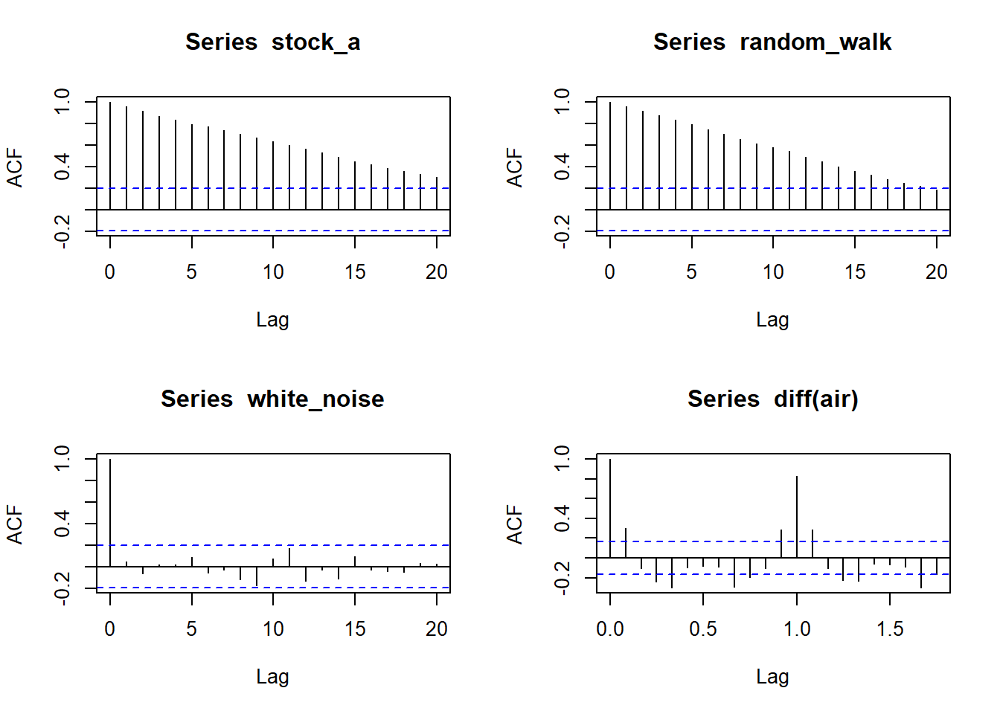<!-- -->

## The Autoregressive Model
In the autoregressive (AR) model today's values are correlated to previous values. For an AR(1) model with positive association this means that if yesterday's value was high, today's value is high as well and vice versa. 

Hence, AR processes exhibit a pattern which is predictable to a certain degree. It is common to work with the mean-centered version of the model:

$$Y_t - \mu = \phi(Y_{t-1} - \mu) + \epsilon_t $$
where $\phi$ is the slope coefficient, $\mu$ the mean and, in addition, we have the variance of $\epsilon$, denoted by $\sigma^2_{\epsilon}$.

**Case 1: ** If the slope $\phi = 0$, then:
$$Y_t = \mu + \epsilon_t $$
And $Y_t$ is simply a white noise ($\mu, \sigma^2_{\epsilon}$) process. Hence, this process is a random walk and $Y_t$ is not stationary. 

**Case 2:** The slope is $\phi \neq 0$, then $Y_t$ depends on $\epsilon_t$ and $Y_{t-1}$. Hence, the process $\{Y_t\}$ is autocorrelated and $Y_{t-1} - \mu$ is fed forward into $Y_t$.   

The value of $\phi$ determines the amount of feedback. Large values of $|\phi|$ result in more feedback, i.e. greater autocorrelation. Negative values result in oscillatory time series behavior

If $|\phi| < 1$, then: 

- $E(Y_t) = \mu$
- $Var(Y_t) = \sigma^2_Y = \frac{\sigma^2_{\epsilon}}{1-\phi^2}$
- $Corr(Y_t, Y_{t-h}) = \rho(h) = \phi^{|h|}$ for all h. 

If $\mu=0$ and $\phi = 1$, then 
$$ Y_t = Y_{t-1} + \epsilon_t$$
which is a *random walk* and, thus, not stationary. 


```r
# Simulate an AR model with 0.1 slope
w <- arima.sim(model=list(ar=0.1), n=100)

# Simulate an AR model with 0.5 slope
x <- arima.sim(model = list(ar = 0.5), n = 100)

# Simulate an AR model with 0.95 slope
y <- arima.sim(model=list(ar=0.95), n=100)

# Simulate an AR model with -0.75 slope
z <- arima.sim(model=list(ar=-0.75), n=100)

# Plot simulated data
par(mfrow=c(2,2))
ts.plot(w)
ts.plot(x)
ts.plot(y)
ts.plot(z)
```

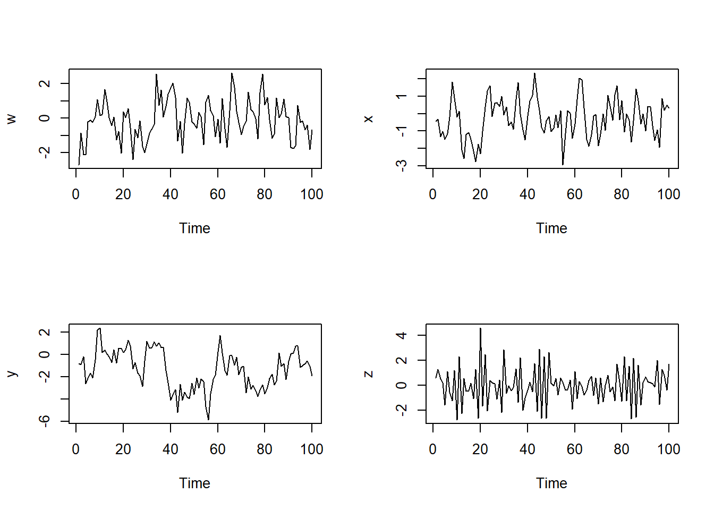<!-- -->

```r
# Check acf for all series
par(mfrow=c(2,2))
acf(w)
acf(x)
acf(y)
acf(z)
```

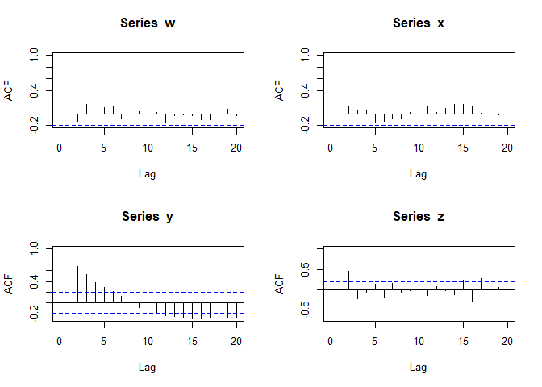<!-- -->

```r
# Simulate AR model with different slopes
w <- arima.sim(model=list(ar=0.25), n=200)
x <- arima.sim(model = list(ar=0.9), n = 200)
y <- arima.sim(model=list(ar=0.985), n=200)

# Simulate RW model
z <- arima.sim(model=list(order=c(0,1,0)), n=200)


# Plot the simulated series
par(mfrow=c(2,2))
ts.plot(w)
abline(h = mean(w), lty=3, col="blue")
ts.plot(x)
abline(h = mean(x), lty=3, col="blue")
ts.plot(y)
abline(h = mean(y), lty=3, col="blue")
ts.plot(z)
abline(h = mean(z), lty=3, col="blue")
```

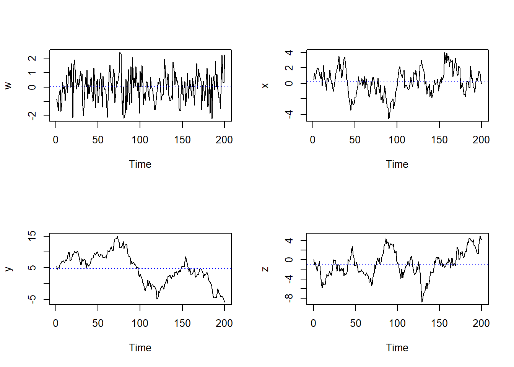<!-- -->

```r
# Plot the acf of the series
par(mfrow=c(2,2))
acf(w)
acf(x)
acf(y)
acf(z)
```

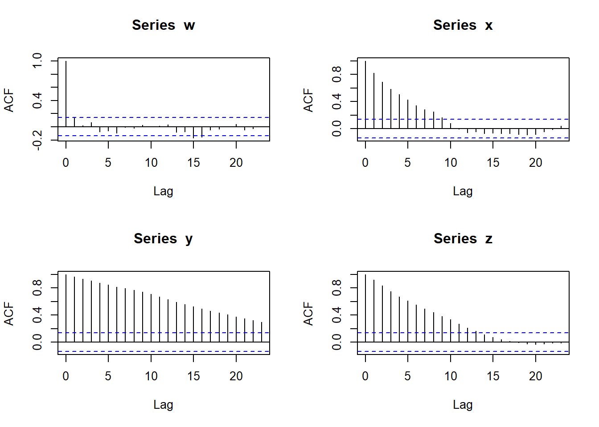<!-- -->

### AR Model Estimation
Use new data of inflation rate to estimate and forecast with an AR model. 


```r
# Load data: Data is annualized and reported in percent
data(Mishkin, package="Ecdat")
inflation <- as.ts(Mishkin[,1])

# Basic information
periodicity(inflation)
```

```
## Monthly periodicity from Feb 1950 to Dec 1990
```

```r
summary(inflation)
```

```
##    Min. 1st Qu.  Median    Mean 3rd Qu.    Max. 
##  -7.565   1.364   3.589   4.006   6.118  19.570
```

```r
# Plot and acf on data
ts.plot(inflation)
abline(h = mean(inflation), col="blue", lty=3)
```

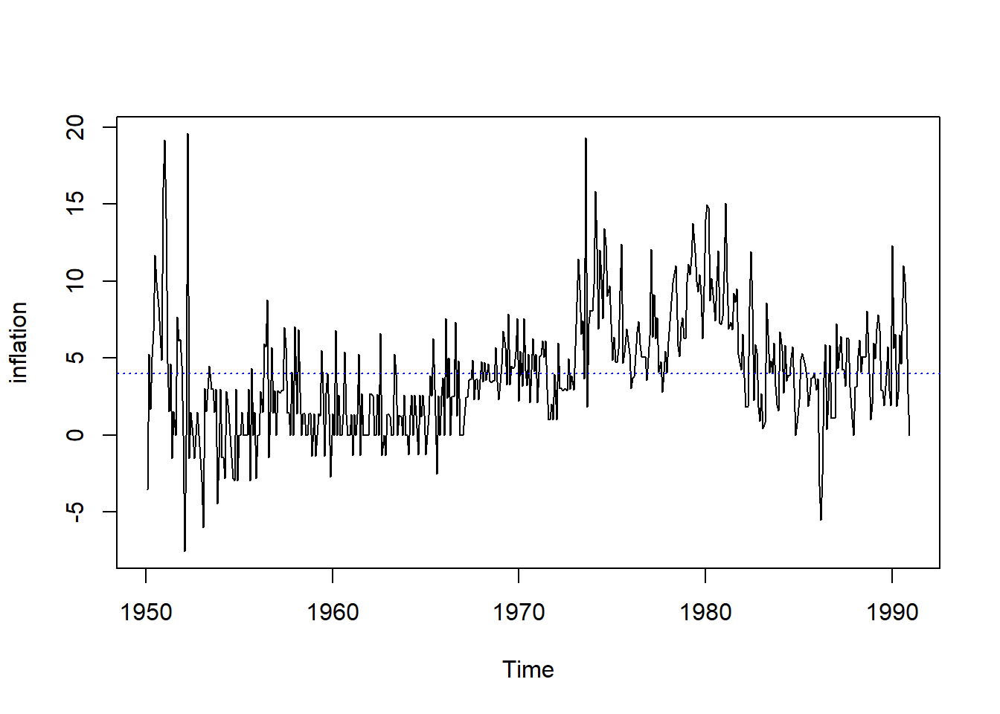<!-- -->

```r
acf(inflation)
```

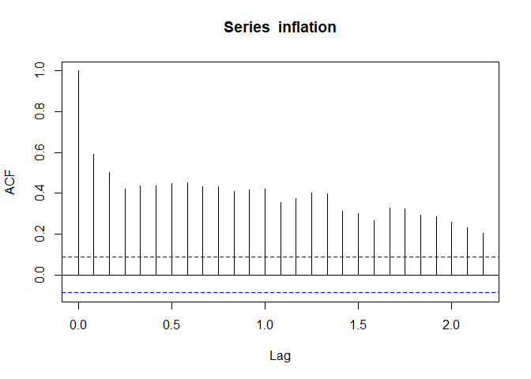<!-- -->

Inflation seems to be usually positively valued and persistent, indicating autocorrelation.  


```r
inflation_ar <- arima(inflation, order=c(1, 0, 0))
print(inflation_ar)
```

```
## 
## Call:
## arima(x = inflation, order = c(1, 0, 0))
## 
## Coefficients:
##          ar1  intercept
##       0.5960     3.9745
## s.e.  0.0364     0.3471
## 
## sigma^2 estimated as 9.713:  log likelihood = -1255.05,  aic = 2516.09
```

Hence, the estimated values are: 

- AR coefficient $\hat{\phi} =$  0.596
- Intercept $\hat{\mu} = $  3.9745
- Variance of white noise process $\hat{\sigma}^2_{\epsilon} = $ 9.7127

Estimated AR-equation is: 
$$\hat{Y_t} = \hat{\mu} + \hat{\phi}(Y_{t-1} - \hat{\mu})$$
and residuals:
$$\hat{\epsilon}_t = Y_t - \hat{Y_t} $$


```r
# Plot observed and fitted values
ts.plot(inflation)
inflation_ar_fitted <- inflation - inflation_ar$residuals
points(inflation_ar_fitted, type="l", col="red", lty=2)
```

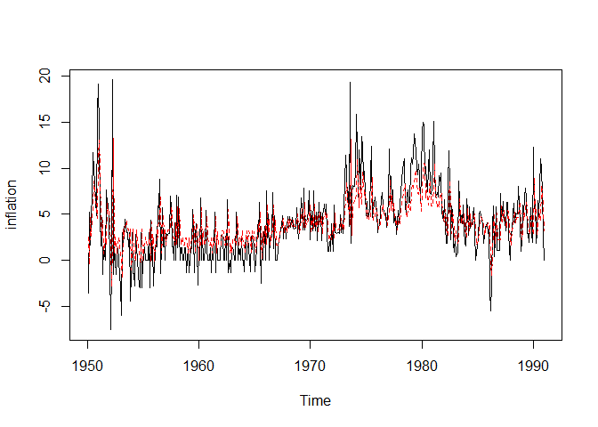<!-- -->

### Forecasting
Use predict function to predict h steps ahead

```r
# 1-step ahead
predict(inflation_ar)
```

```
## $pred
##           Jan
## 1991 1.605797
## 
## $se
##           Jan
## 1991 3.116526
```

```r
# 12 steps ahead
inflation_fc12 <- predict(inflation_ar, n.ahead = 12)

ts.plot(window(inflation, 1975))
points(inflation_fc12$pred, type="l", col="red", lty=2)
```

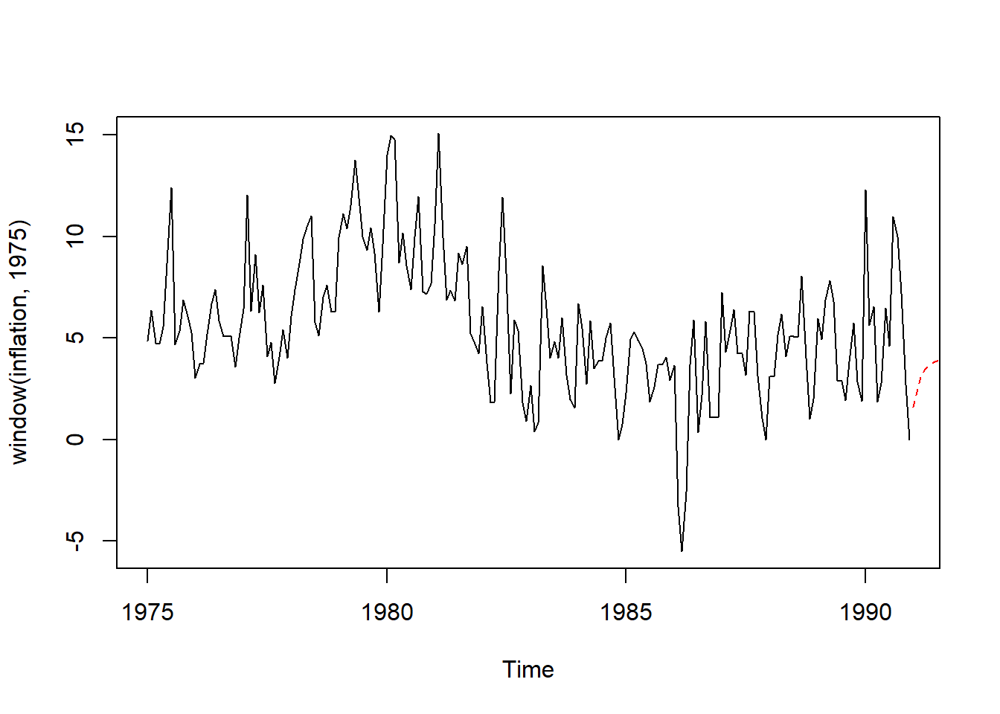<!-- -->

Repeat this using the Nile data


```r
# Fit an AR model to Nile
AR_fit <- arima(Nile, order  = c(1,0,0))
print(AR_fit)
```

```
## 
## Call:
## arima(x = Nile, order = c(1, 0, 0))
## 
## Coefficients:
##          ar1  intercept
##       0.5063   919.5685
## s.e.  0.0867    29.1410
## 
## sigma^2 estimated as 21125:  log likelihood = -639.95,  aic = 1285.9
```

```r
# Use predict() to make a 1-step forecast
predict_AR <- predict(AR_fit)

# Obtain the 1-step forecast using $pred[1]
predict_AR$pred[1]
```

```
## [1] 828.6576
```

```r
# Use predict to make 1-step through 10-step forecasts
predict(AR_fit, n.ahead = 10)
```

```
## $pred
## Time Series:
## Start = 1971 
## End = 1980 
## Frequency = 1 
##  [1] 828.6576 873.5426 896.2668 907.7715 913.5960 916.5448 918.0377
##  [8] 918.7935 919.1762 919.3699
## 
## $se
## Time Series:
## Start = 1971 
## End = 1980 
## Frequency = 1 
##  [1] 145.3439 162.9092 167.1145 168.1754 168.4463 168.5156 168.5334
##  [8] 168.5380 168.5391 168.5394
```

```r
# Run to plot the Nile series plus the forecast and 95% prediction intervals
ts.plot(Nile, xlim = c(1871, 1980))
AR_forecast <- predict(AR_fit, n.ahead = 10)$pred
AR_forecast_se <- predict(AR_fit, n.ahead = 10)$se
points(AR_forecast, type = "l", col = 2)
points(AR_forecast - 2*AR_forecast_se, type = "l", col = 2, lty = 2)
points(AR_forecast + 2*AR_forecast_se, type = "l", col = 2, lty = 2)
```

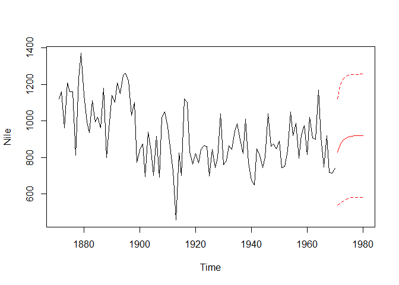<!-- -->

### AR Case study: Global Temperature Deviations

```r
data(gtemp, package="astsa")
ts.plot(gtemp)
```

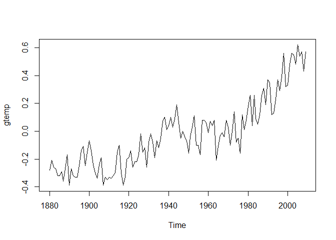<!-- -->

## Ch. 5: Moving Average Model
Models with autocorrelation can be constructed from white noise. A weighted sum of current and previous noise is called a **simple moving average process**. Note that *simple* indicates that we are dealing with the simplest, first oder case. Formally, this can be described as: 
$$Y_t = \mu + \epsilon_t + \theta \epsilon_{t-1}$$
$\epsilon_t$ is mean zero white noise. Respective parameters of the process are: 

- Mean $\mu$
- Slope $\theta$
- White noise variance $\sigma^2_\epsilon$

If the slope $\theta = 0$ Y_t is White Noise $(\mu, \sigma^2_\epsilon)$. If $\theta \neq 0$ then $Y_t(\epsilon_t, \epsilon_{t-1})$ and the process is autocorrelated. 

The MA process has autocorrelation as determined by the slope parameter $\theta$. However, it only has autocorrelation for lag 1 (one period). Note:

- Only lag 1 autocorrelation is non-zero for the MA model.


```r
# Simulate MA(1) model with differen slopes
w <- arima.sim(model = list(ma = 0.5), n=100)
x <- arima.sim(model = list(ma = 0.9), n=100)
y <- arima.sim(model = list(ma = -0.5), n=100)
z <- arima.sim(model = list(ma = 0), n=100)

par(mfrow=c(2,2))
ts.plot(w)
abline(h=mean(w), lty=3, col="blue")

ts.plot(x)
abline(h=mean(x), lty=3, col="blue")

ts.plot(y)
abline(h=mean(y), lty=3, col="blue")

ts.plot(z)
abline(h=mean(z), lty=3, col="blue")
```

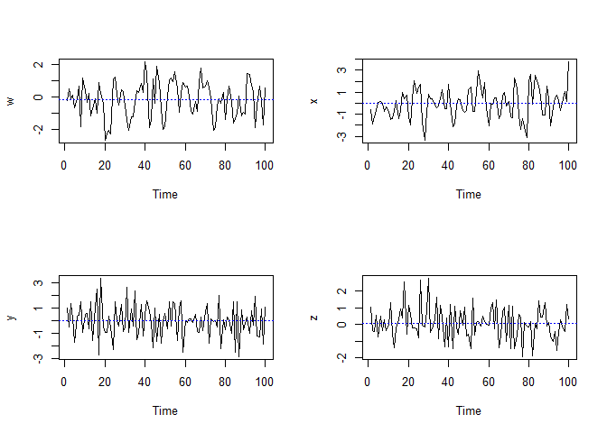<!-- -->

```r
# Calculate ACF
par(mfrow=c(2,2))
acf(w)
acf(x)
acf(y)
acf(z)
```

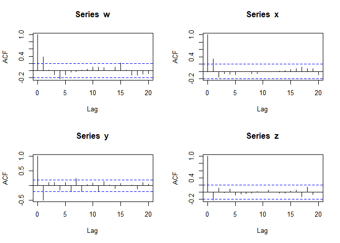<!-- -->

```r
# Calculate PACF
par(mfrow=c(2,2))
pacf(w)
pacf(x)
pacf(y)
pacf(z)
```

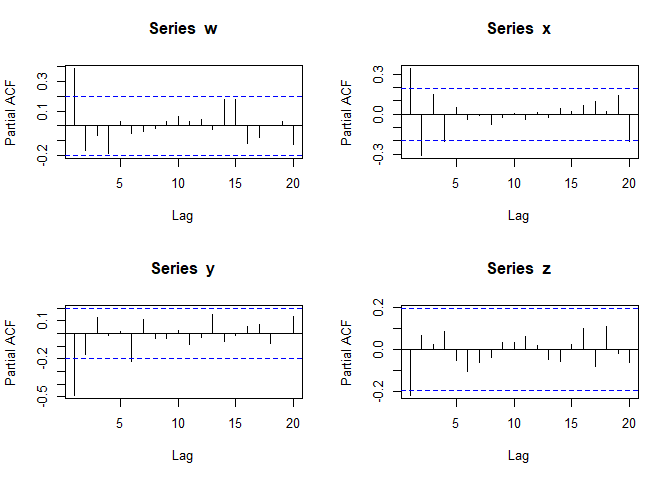<!-- -->

 Next we will apply the MA model to changes in inflation rate of the mishigan data that we already used before. 
 

```r
data(Mishkin, package = "Ecdat")
inflation <- as.ts(Mishkin[,1])
inflation_diff <- diff(inflation)
ts.plot(inflation)
```

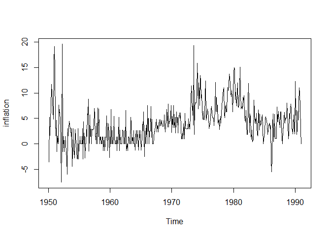<!-- -->

```r
ts.plot(inflation_diff)
abline(h = mean(inflation_diff), col="blue", lty=2)
```

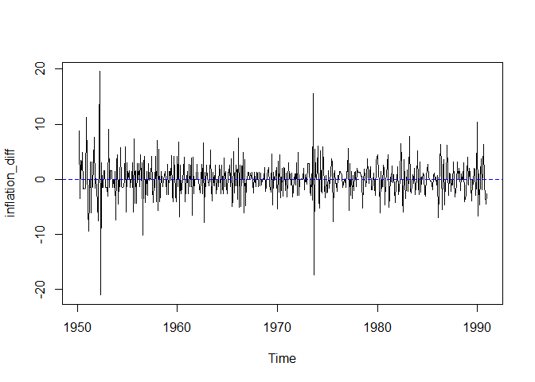<!-- -->

```r
acf(inflation_diff)
```

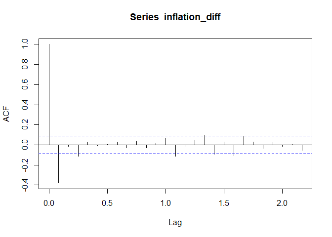<!-- -->

Series exhibits a strong negative autocorrelation at lag 1 and estimates from lag 1 onwards are not significantly different from 0. Using the `arima()` function the following model will be estimated: 
$$Y_t = \mu + \epsilon_t + \theta \epsilon_{t-1}$$
with $\epsilon_t \sim WN(0, \sigma^2_\epsilon)$. 


```r
# Estimate MA model using arima()
inflation_diff_ma <- arima(inflation_diff, order=c(0, 0, 1))
print(inflation_diff_ma)
```

```
## 
## Call:
## arima(x = inflation_diff, order = c(0, 0, 1))
## 
## Coefficients:
##           ma1  intercept
##       -0.7932     0.0010
## s.e.   0.0355     0.0281
## 
## sigma^2 estimated as 8.882:  log likelihood = -1230.85,  aic = 2467.7
```
Again, we want to extract fitted values and compare them to our observerd values. The estimated model is: 
$$\hat{Y_t} = \hat{\mu} + \hat{\theta} \hat{\epsilon}_{t-1}$$
Using the estimated residuals $\hat{\epsilon_t}$ we get the fitted values using the following equation
$$\hat{Y_t} = Y_t - \hat{\epsilon}_t$$ 


```r
# Get fitted values: Difference y_t and residuals
# using residuals() function or $residuals
inflation_diff_ma_fitted <- inflation_diff - inflation_diff_ma$residuals

# All data, fitted values
ts.plot(inflation_diff)
points(inflation_diff_ma_fitted, type="l", col="red", lty=2)
```

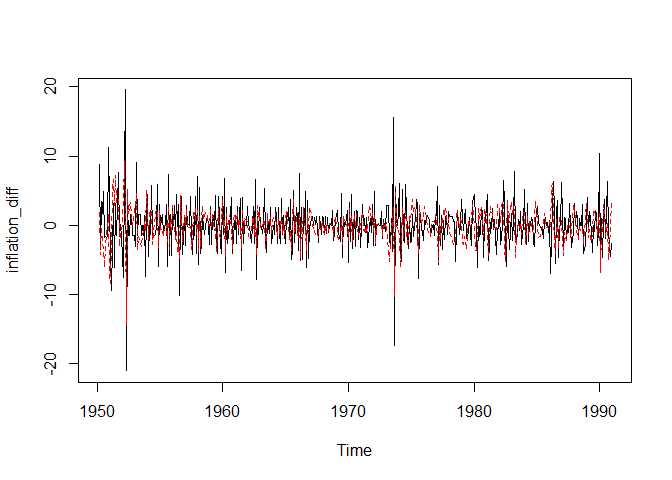<!-- -->

```r
# Last 100 observations, fitted values
ts.plot(as.ts(tail(inflation_diff,100)))
points(tail(inflation_diff_ma_fitted,100), type="l", col="red", lty=2)
```

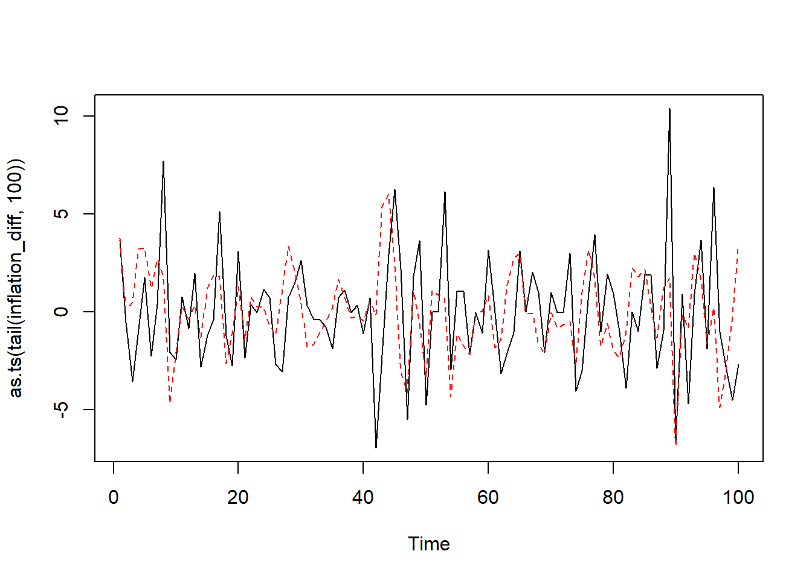<!-- -->

There is a close relationship between fitted values and observed values indicating that even this simple MA model explains a lot of the variations in the data, which is nice. However, of course this can be fine-tuned even further with more sophisticated techniques. However, expect that even highly advanced models are only a moderate improvement. As in the AR model it can be noted that these rather simplistic models which take in only previous values and no external information are amazingly accurate. This means that a time series itself contains a lot of information on how this process continues. 

Next: Predictions!


```r
# using predict() function
inflation_diff_ma_fc12 <-predict(inflation_diff_ma, 12)

fc12_se <- inflation_diff_ma_fc12$se

# plot the data, forecast and 95% intervals
ts.plot(window(inflation_diff, 1975))
points(inflation_diff_ma_fc12$pred, type="l", col="red", lty=1)
points(inflation_diff_ma_fc12$pred + 2*fc12_se, type="l", col="red", lty=2)
points(inflation_diff_ma_fc12$pred - 2*fc12_se, type="l", col="red", lty=2)
```

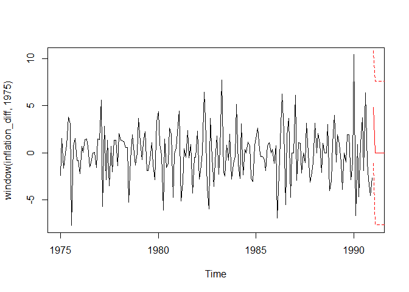<!-- -->

For January 1991 we predict an inflation change $\Delta Y_{1991:1}$ of 4.8316 with a standard deviation $\sigma_\epsilon =$ 2.9802. Note that following predictions are all close to 0. The model "lives" from exogenous shocks which it absorbs. The model has only memory (or autocorrelation) for one time length

In this model there are no shocks beyond January and, thus, it predicts almost no change in the absence of any external shocks. 

## Compare MA and AR processes
Similar but different. Both have WN errors. In MA model we regress today's value on yesterday's noise. In the AR model we regress today's value on yesterday's observation. 

However, the MA(1) model only has autocorrelation at one lag but the AR model has autocorrelation at many lags. 


```r
# 
w <- arima.sim(model = list(ma = 0.75), n= 100)
x <- arima.sim(model = list(ma = -0.75), n= 100)
y <- arima.sim(model = list(ar = 0.48), n = 100)
z <- arima.sim(model = list(ar = -0.48), n = 100)

par(mfrow=c(2,2))
acf(w)
acf(x)
acf(y)
acf(z)
```

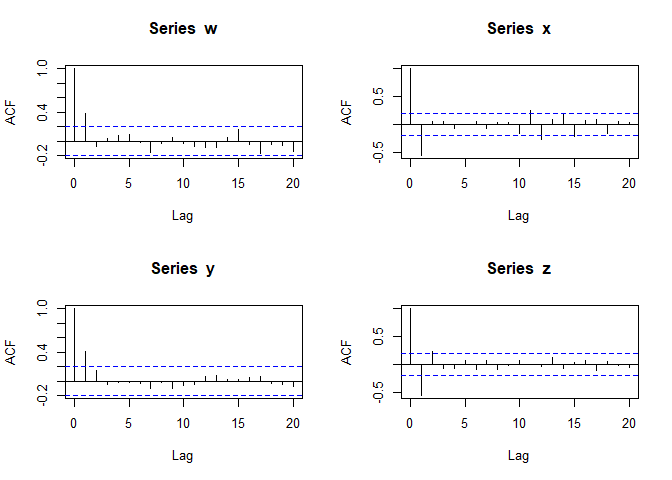<!-- -->

Estimating these models results in autocorrelation coefficients of approximately $\pm 0.48$.

In the MA model this positive/negative shock runs out after just one period and autocorrelation is close to zero for all subsequent periods. 

In the AR case the autocorrelation is more persistent. If there is positive autocorrelation the autocorrelation decreases steadily, whereas with negative autocorrelation coefficient there is an oscillatory pattern, changing between positive and negative in the acf. 


```r
# Fitting an AR and MA model for last 100 observations of inflation
inflation24_diff <- as.ts(tail(diff(inflation), 24))

inflation24_diff_ar <- arima(inflation24_diff, order=c(1,0,0))
inflation24_diff_ar_fitted <- inflation24_diff - inflation24_diff_ar$residuals

inflation24_diff_ma <- arima(inflation24_diff, order=c(0,0,1))
inflation24_diff_ma_fitted <- inflation24_diff - inflation24_diff_ma$residuals

ts.plot(cbind(inflation24_diff, inflation24_diff_ar_fitted, inflation24_diff_ma_fitted), lty=c(2,1,1), col=c(1,"red","blue"))
```

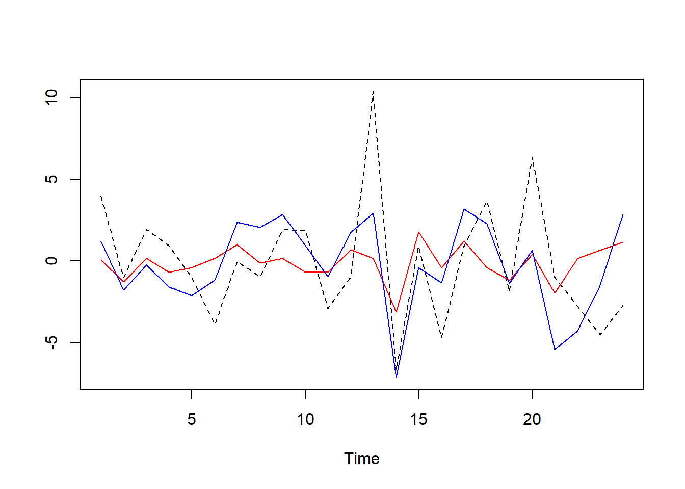<!-- -->

```r
# Estimate full model and compare using AIC, BIC
inflation_diff_ar <- arima(inflation_diff, order=c(1,0,0))
AIC(inflation_diff_ar)
```

```
## [1] 2542.679
```

```r
BIC(inflation_diff_ar)
```

```
## [1] 2555.262
```

```r
inflation_diff_ma <- arima(inflation_diff, order=c(0,0,1))
AIC(inflation_diff_ma)
```

```
## [1] 2467.703
```

```r
BIC(inflation_diff_ma)
```

```
## [1] 2480.286
```

Information criteria can be used to determine model performance. Most commonly used are the akaike information criterion (aic) and the bayesian-schwartz information criterion (bic). In both cases (aic and bic) the MA model performs better as it has a lower value for both criteria. We prefer the fit of the MA model here.


