# ARIMA Modeling


We start with some examples of time series and show various qualities. For example the `AirPassengers` data from Box and Jenkins shows seasonality, trend and heteroscedasticity... In a later step we'd like to capture those characteristics with a model in order to be able to predict future values. 


```r
# load required packages
library(astsa)
library(xts)

# Johnson Johnson
ts.plot(jj, main= "JJ Quarterly Earnings per share")
text(jj, labels= 1:4, col= 1:4)
```

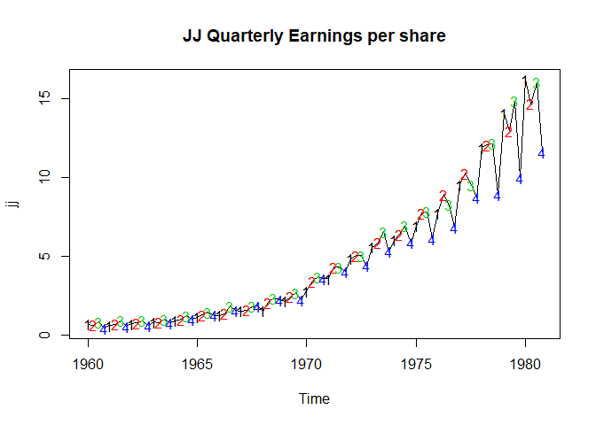<!-- -->

```r
# global temperature
plot(globtemp, main="Global Temperature Deviations", type= "o")
```

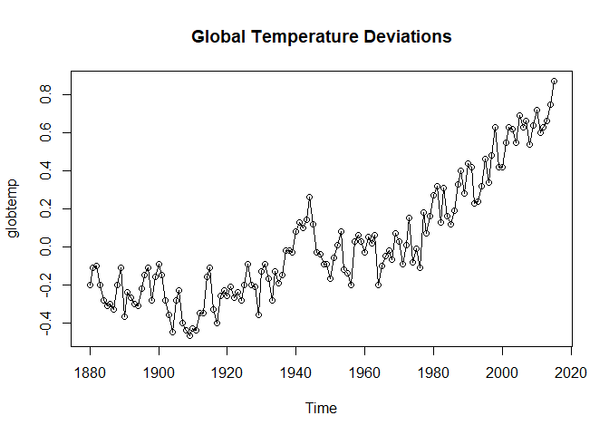<!-- -->

```r
# SP 500 weekly returns
plot(sp500w, main= "S&P 500 Weekly Returns")
```

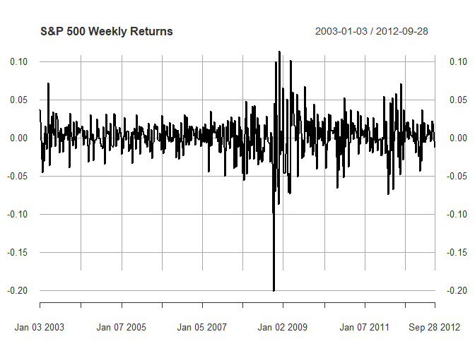<!-- -->

```r
# Classic Box Jenkins data
plot(AirPassengers)
```

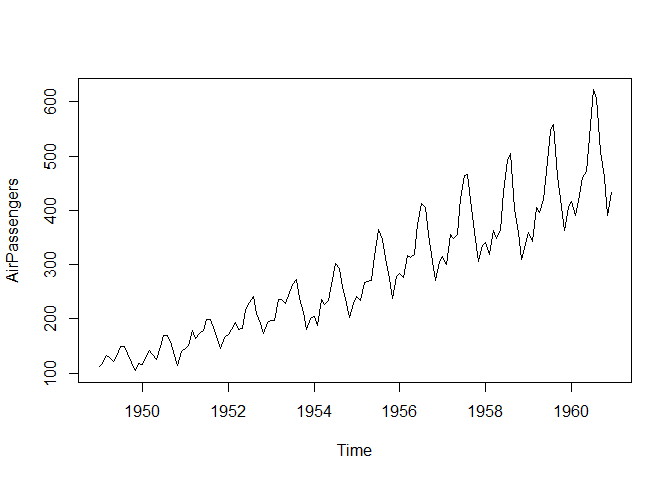<!-- -->
 

 
## Chapter 1: Time Series Data and Models 
Recall from usual regression model: 
$$Y_i = \beta X_i + \epsilon_i$$, where errors $\epsilon_i$ are: 

- independent 
- normal 
- homoskedastic

Hence, they are *White Noise* which is an important concept in time series modeling. Simple autoregression model: 

$$X_t = \phi X_{t-1} + \epsilon_t$$
where $\epsilon_t$ is white noise. In addition, we also may have the problems that the errors are correlated. To overcome this problem a moving average model can be used:
$$\epsilon_t = W_t + \theta W_{t-1}$$
with $W_t$ as white noise. Putting both elements together leads to the ARMA model:
$$X_t = \phi X_{t-1} + W_t + \theta W_{t-1}$$
This model has autoregression with autocorrelated errors. 

### Stationarity and Nonstationarity
A time series is stationary when it is *stable*, meaning: 

- Mean is constant over time (no trend)
- Correlation structure remains constant over time

If the mean is constant we can estiamte it by the sample mean $\overline{x}$. Pairs `(x1, x2), (x2,x3), ...` can be used to estimate correlation on different lags (here for lag 1  correlation). 

For some nonstationary series it is enough take first differences to make the series stationary (works for trend as well). In case that a series has a trend an changes in variability use a combination of log and differencing. First log, then difference. Logging can stabilize the variance, differencing detrends the data subsequently.

#### Dealing with trend and heteroscedasticity
Data generating process can often be described in the following way:
$$X_t = (1+p_t) X_{t-1}$$
It can be shown that the growth rate $p_t$ can be approximated by:
$$Y_t = log X_t - log X_{t-1} \approx p_t$$


```r
# Plot GNP series (gnp) and its growth rate
par(mfrow = c(2,1))
plot(gnp)
plot(diff(log(gnp)))
```

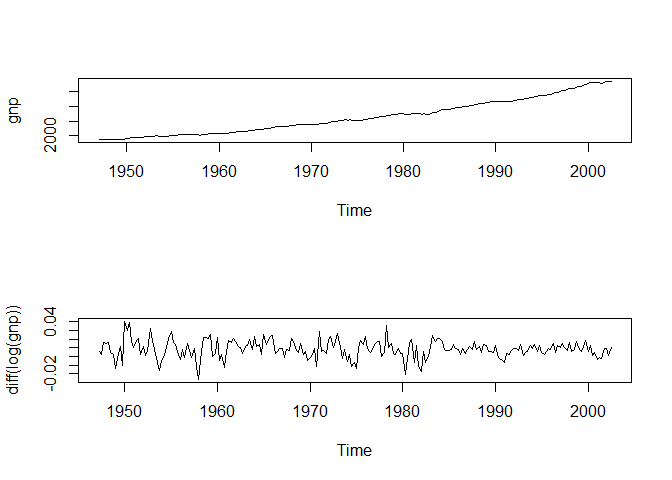<!-- -->

```r
# Plot DJIA closings (djia$Close) and its returns
par(mfrow = c(2,1))
plot(djia$Close)
plot(diff(log(djia$Close)))
```

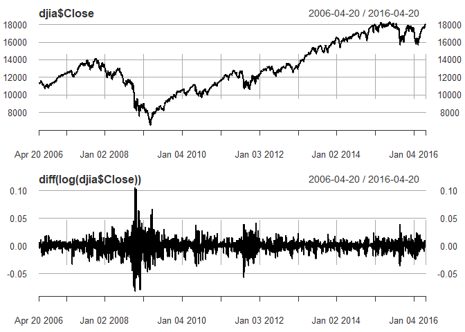<!-- -->

### Stationary Time Series: ARMA
Why ARMA models for stationary time series? Wold proved that any stationary time series may be represented as a linear combination of white noise. This is called the **Wold Decomposition**:
$$ X_t = W_t + a_1 W_{t-1} + a_2 W_{t-2} + ...$$
with constants $a_1, a_2,...$. Any ARMA model has this form, which means they are well suited to model stationary time series. 

The function `arima.sim()`can be used to simulate ARMA models.


```r
# Generate and plot white noise
WN <- arima.sim(model = list(order = c(0,0,0)), n = 200)
plot(WN)
```

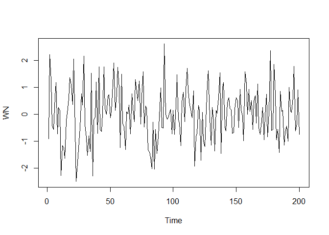<!-- -->

```r
# Generate and plot an MA(1) with parameter .9 
MA <- arima.sim(model = list(order = c(0,0,1), ma=0.9), n= 200)
plot(MA)
```

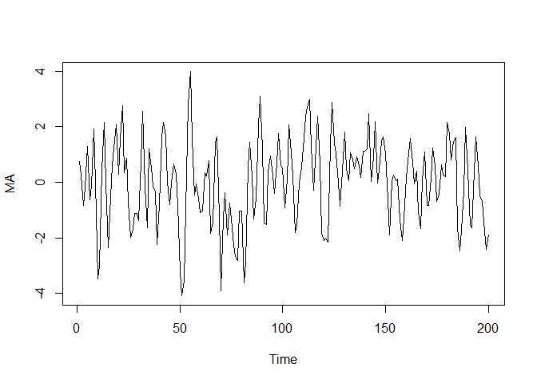<!-- -->

```r
# Generate and plot an AR(2) with parameters 1.5 and -.75
AR <- arima.sim(model = list(order = c(2,0,0), ar=c(1.5, -0.75)), n= 200)
plot(AR)
```

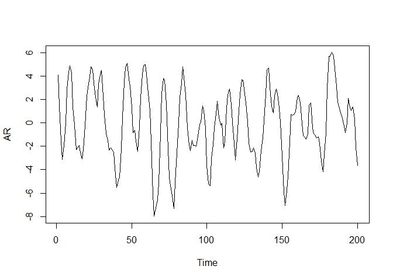<!-- -->

## Chapter 2: Fitting ARMA models
Identifying right specification of ARMA models from data is difficult as they often look very similar. You can not identify the model simply by looking at the data. The tools that are used are the autocorrelation function (ACF) and Partial autocorrelation function (PACF).

| Function  | AR(p)          | MA(q)          | ARMA(p,q)  |
|-----------|----------------|----------------|------------|
| ACF       | Tails off      | cuts off lag q | Tails off  |
| PACF      | Cuts off lag p | Tails off      | Tails  off |


```r
AR <- arima.sim(model = list(order = c(2,0,0), ar=c(0.7,-0.7)), n= 2000)

plot(ts(sample(AR, 100)))
```

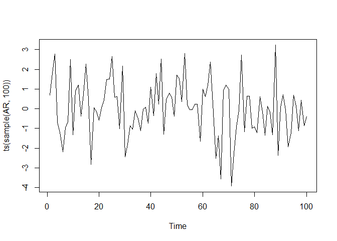<!-- -->

```r
par(mfrow=c(1,2))
acf(AR)
pacf(AR)
```

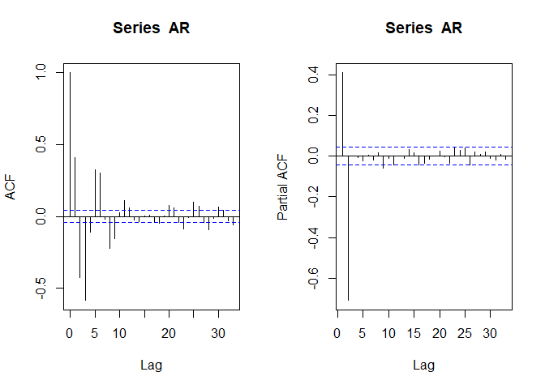<!-- -->

The PACF cuts off after 2 lags of the AR(2) process and tails off in the ACF. 


```r
MA <- arima.sim(model = list(order = c(0,0,1),ma = c(0.5)), n= 2000)
plot(ts(sample(MA, 100)))
```

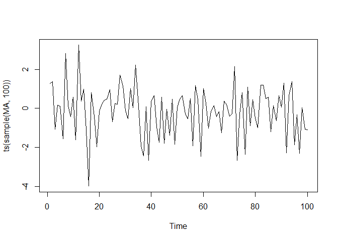<!-- -->

```r
par(mfrow=c(1,2))
acf(MA)
pacf(MA)
```

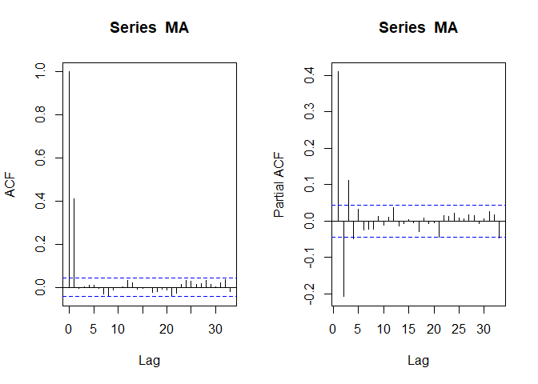<!-- -->

ACF cuts off after lag 1 and PACF tails off. If both ACF and PACF tail off, then we probably deal with an ARMA model. 

Estimation for time series is similar to OLS for regression. 


```r
x <- arima.sim(list(order=c(2, 0, 0),
               ar = c(1.5, -0.75)),
               n = 200) + 50

arima(x, order = c(2,0,0))
```

```
## 
## Call:
## arima(x = x, order = c(2, 0, 0))
## 
## Coefficients:
##          ar1      ar2  intercept
##       1.5222  -0.7213    49.8923
## s.e.  0.0484   0.0486     0.3286
## 
## sigma^2 estimated as 0.8591:  log likelihood = -270.1,  aic = 548.2
```

```r
# Generate 100 observations from the AR(1) model
x <- arima.sim(model = list(order = c(1, 0, 0), ar = .9), n = 100) 

# Plot the generated data 
plot(x)
```

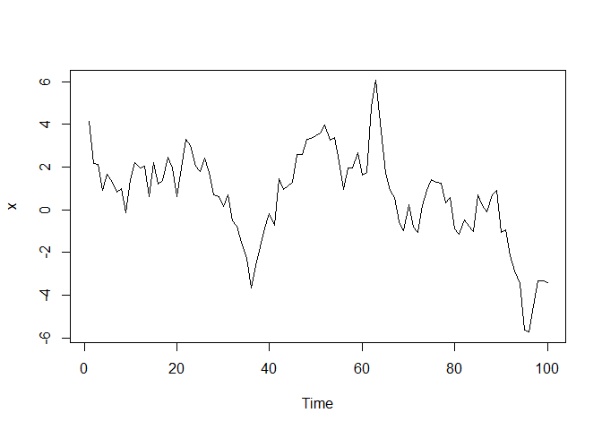<!-- -->

```r
# Plot the sample P/ACF pair
acf2(x,)
```

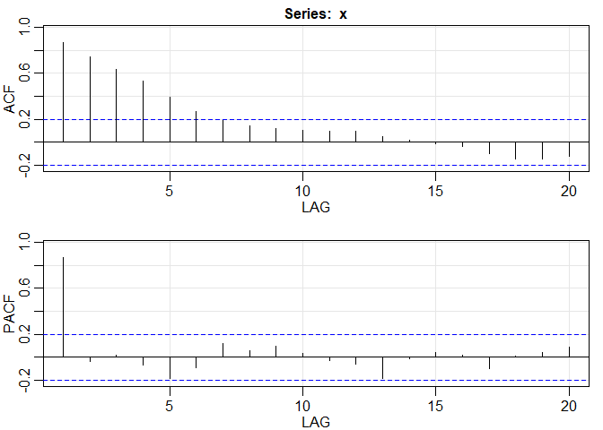<!-- -->

```
##         ACF  PACF
##  [1,]  0.87  0.87
##  [2,]  0.74 -0.03
##  [3,]  0.64  0.02
##  [4,]  0.53 -0.07
##  [5,]  0.40 -0.18
##  [6,]  0.26 -0.09
##  [7,]  0.19  0.12
##  [8,]  0.14  0.06
##  [9,]  0.12  0.09
## [10,]  0.10  0.03
## [11,]  0.10 -0.03
## [12,]  0.10 -0.06
## [13,]  0.05 -0.18
## [14,]  0.02 -0.01
## [15,] -0.01  0.04
## [16,] -0.04  0.02
## [17,] -0.10 -0.10
## [18,] -0.14  0.01
## [19,] -0.14  0.04
## [20,] -0.12  0.09
```

```r
# Fit an AR(1) to the data and examine the t-table
sarima(x, p=1, d=0, q=0, details = FALSE)$ttable
```

```
##       Estimate     SE t.value p.value
## ar1     0.9098 0.0437 20.8295  0.0000
## xmean   0.6069 0.9854  0.6159  0.5394
```

### AR and MA together: ARMA
Have a look at an ARMA(1,1) model:
$$X_t = \phi X_{t-1} + W_t + \theta W_{t-1}$$
It can be thought of as auto-regression with correlated errors. 


```r
x <- arima.sim(model = list(order=c(1,0,1), 
                            ar = 0.9,
                            ma = -0.4), 
                            n=500)

plot(x, main= "ARMA(1,1)")
```

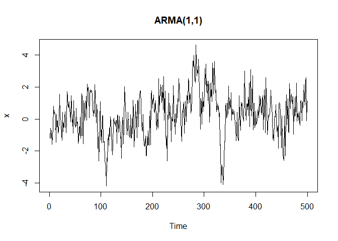<!-- -->

```r
acf2(x)
```

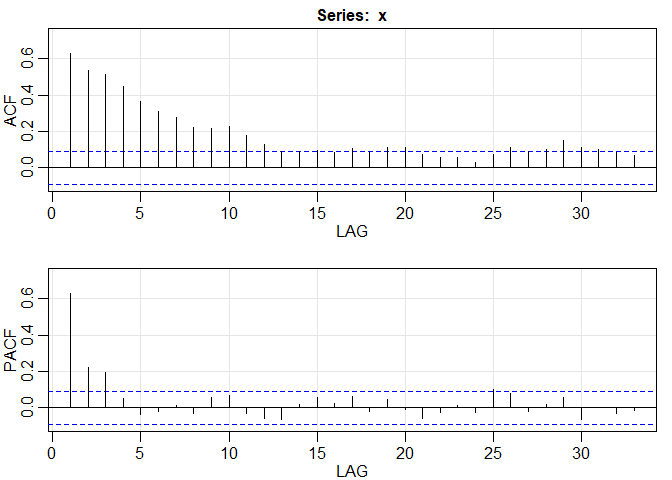<!-- -->

```
##        ACF  PACF
##  [1,] 0.63  0.63
##  [2,] 0.53  0.22
##  [3,] 0.51  0.19
##  [4,] 0.45  0.05
##  [5,] 0.36 -0.03
##  [6,] 0.31 -0.02
##  [7,] 0.28  0.02
##  [8,] 0.22 -0.03
##  [9,] 0.22  0.06
## [10,] 0.23  0.07
## [11,] 0.18 -0.03
## [12,] 0.13 -0.06
## [13,] 0.09 -0.06
## [14,] 0.09  0.02
## [15,] 0.10  0.06
## [16,] 0.08  0.03
## [17,] 0.11  0.07
## [18,] 0.09 -0.02
## [19,] 0.11  0.04
## [20,] 0.11 -0.01
## [21,] 0.07 -0.06
## [22,] 0.06 -0.02
## [23,] 0.06  0.01
## [24,] 0.03 -0.03
## [25,] 0.07  0.10
## [26,] 0.11  0.08
## [27,] 0.09 -0.02
## [28,] 0.10  0.02
## [29,] 0.15  0.06
## [30,] 0.11 -0.07
## [31,] 0.10  0.00
## [32,] 0.09 -0.03
## [33,] 0.07 -0.02
```

For an ARMA(p,q) model both functions of ACF as well as PACF tail off (PACF decreases fast). Note that you can not determine neither p nor q based on these graphics, just that is an ARMA model. Best thing to do: 

- Start with a small model and compare the performance when adding p and/or q terms


```r
x <- arima.sim(list(order = c(1,0,1),
                    ar = 0.9,
                    ma = -0.4),
               n= 500) + 50
x_fit <- sarima(x, p = 1, d = 0, q = 1, details = FALSE)
x_fit$ttable
```

```
##       Estimate     SE  t.value p.value
## ar1     0.8747 0.0300  29.1790       0
## ma1    -0.4587 0.0538  -8.5237       0
## xmean  49.9092 0.1891 263.8863       0
```

### Model Choice and Residual Analysis
In general it is a good idea to fit several models and compare their performance before choosing one. The two most populat measures to decide which model is the best are the **Akaike Information criterion (AIC)** and the **Bayes-Schwartz Information criterion (BIC)**.

In general, the error decreases as more parameters are added regardless of additional variables are adding value to the model. AIC and BIC measure the error and penalize (different penalty terms) for adding parameters. The BIC has a bigger penalty than the AIC, i.e.:

- AIC: `k = 2`
- BIC: `k = log(n)`


```r
# growth rate gnp
gnpgr <- diff(log(gnp))

# Compare AR(1) vs. MA(2)
fit1 <- sarima(gnpgr, p=1, d= 0, q = 0, details = FALSE)
fit1$AIC
```

```
## [1] -8.294403
```

```r
fit1$BIC
```

```
## [1] -9.263748
```

```r
fit2 <- sarima(gnpgr, p=0, d= 0, q = 2, details = FALSE)
fit2$AIC
```

```
## [1] -8.297695
```

```r
fit2$BIC
```

```
## [1] -9.251712
```

The AIC and BIC for the first, simpler AR(1) model is lower (more negative) than the second one. Hence, this model is preferred over the MA(2) model.

Using the `sarima()` function with default `display = TRUE` outputs additional information on the residuals. 

1. The standardized residual plot should be suspected for patterns. They should behave as a white noise sequence with mean zero variance one. 
2. ACF of residuals should look like that of white noise. If the model is correct residuals ought to be white noise. Values should be between blue dashed lines
3. QQ plot assesses normality. Examine qq plot for departures from normality and to identify outliers. 
4. Use Q-statistic plot to help test for departures from whiteness of the residuals. The p-values for the Ljung box statistic should be above the blue line so you can assume the residuals is white noise. If many points are below the line then another model should be considered as there is still some correlation left in the residuals. 

In particular, you should be wary in case there are obvious patterns of autocorrelation in the residual plot, ACF of the residuals has large, significant values and Q-statistic has all points below line. 


```r
# Analysis Oil
ts.plot(oil)
```

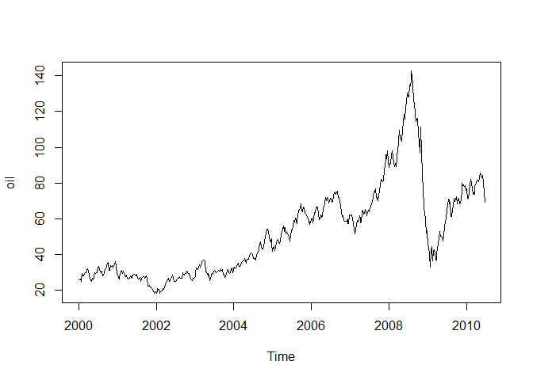<!-- -->

```r
# Calculate approximate oil returns
oil_returns <- diff(log(oil))

# Plot oil_returns. Notice the outliers.
plot(oil_returns)
```

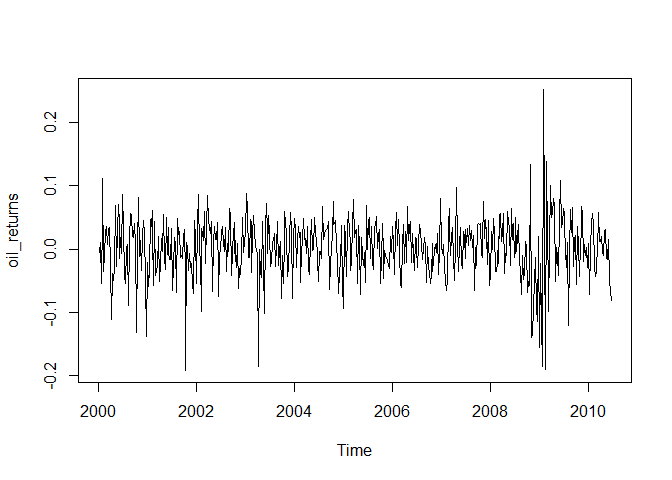<!-- -->

```r
# Plot the P/ACF pair for oil_returns
par(mfrow=c(1,2))
acf(oil_returns)
pacf(oil_returns)
```

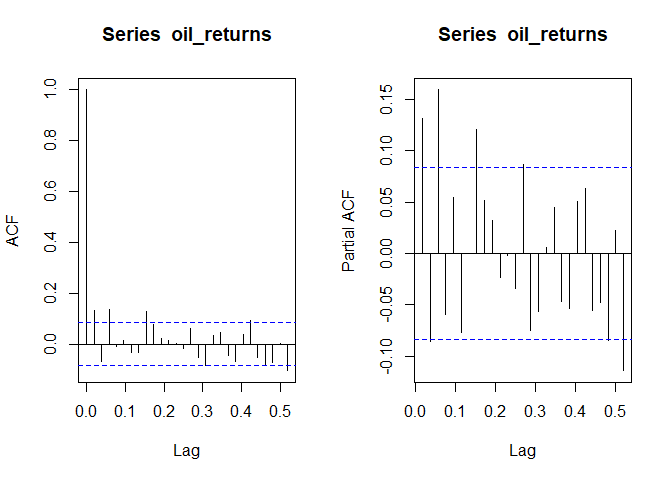<!-- -->

```r
# acf2(oil_returns)

# Assuming both P/ACF are tailing, fit a model to oil_returns
sarima(oil_returns, p=1, d=0, q=1)
```

```
## initial  value -3.057594 
## iter   2 value -3.061420
## iter   3 value -3.067360
## iter   4 value -3.067479
## iter   5 value -3.071834
## iter   6 value -3.074359
## iter   7 value -3.074843
## iter   8 value -3.076656
## iter   9 value -3.080467
## iter  10 value -3.081546
## iter  11 value -3.081603
## iter  12 value -3.081615
## iter  13 value -3.081642
## iter  14 value -3.081643
## iter  14 value -3.081643
## iter  14 value -3.081643
## final  value -3.081643 
## converged
## initial  value -3.082345 
## iter   2 value -3.082345
## iter   3 value -3.082346
## iter   4 value -3.082346
## iter   5 value -3.082346
## iter   5 value -3.082346
## iter   5 value -3.082346
## final  value -3.082346 
## converged
```

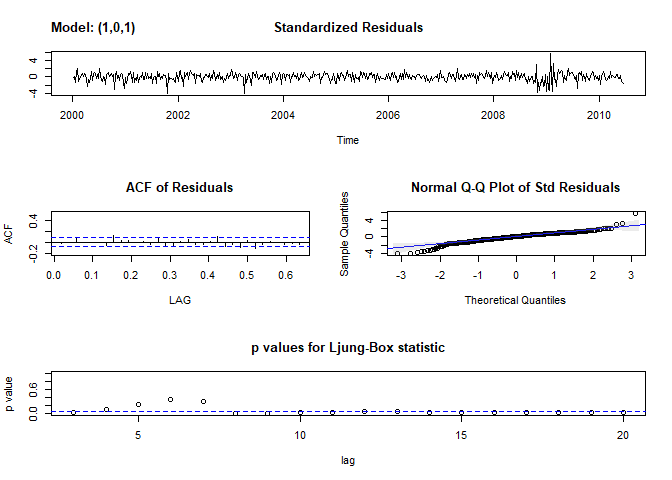<!-- -->

```
## $fit
## 
## Call:
## stats::arima(x = xdata, order = c(p, d, q), seasonal = list(order = c(P, D, 
##     Q), period = S), xreg = xmean, include.mean = FALSE, optim.control = list(trace = trc, 
##     REPORT = 1, reltol = tol))
## 
## Coefficients:
##           ar1     ma1   xmean
##       -0.5264  0.7146  0.0018
## s.e.   0.0871  0.0683  0.0022
## 
## sigma^2 estimated as 0.002102:  log likelihood = 904.89,  aic = -1801.79
## 
## $degrees_of_freedom
## [1] 541
## 
## $ttable
##       Estimate     SE t.value p.value
## ar1    -0.5264 0.0871 -6.0422  0.0000
## ma1     0.7146 0.0683 10.4699  0.0000
## xmean   0.0018 0.0022  0.7981  0.4252
## 
## $AIC
## [1] -5.153838
## 
## $AICc
## [1] -5.150025
## 
## $BIC
## [1] -6.130131
```

## Ch. 3 ARIMA
A time series exhibits ARIMA behavior if the differenced data has ARMA behavior.


```r
# Simulation ARIMA
x <- arima.sim(list(order = c(1,1,0), ar=0.9), n=200)
plot(x, main = "ARIMA(1,1,0)")
```

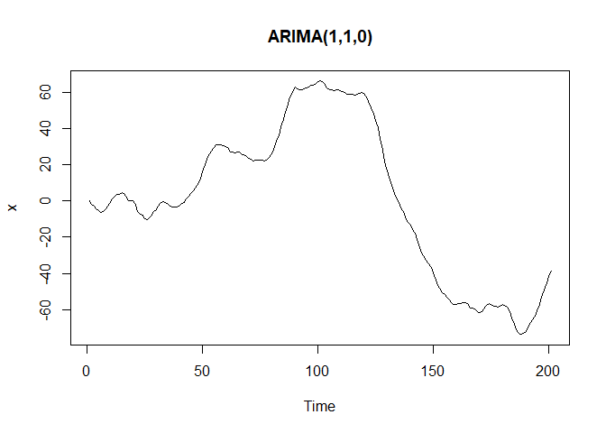<!-- -->

```r
plot(diff(x), main ="ARMA (1,0,0)")
```

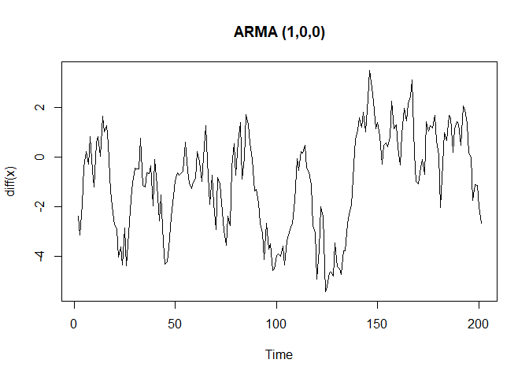<!-- -->

```r
# ACF and PCF of an integratged ARMA
acf2(x)
```

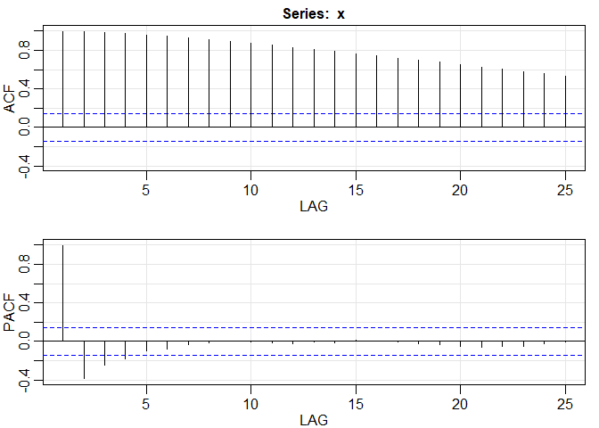<!-- -->

```
##        ACF  PACF
##  [1,] 0.99  0.99
##  [2,] 0.98 -0.02
##  [3,] 0.97 -0.02
##  [4,] 0.96 -0.02
##  [5,] 0.95 -0.03
##  [6,] 0.94 -0.03
##  [7,] 0.93 -0.03
##  [8,] 0.92 -0.03
##  [9,] 0.90 -0.02
## [10,] 0.89 -0.02
## [11,] 0.88 -0.03
## [12,] 0.86 -0.02
## [13,] 0.85 -0.02
## [14,] 0.84 -0.03
## [15,] 0.82 -0.02
## [16,] 0.81 -0.02
## [17,] 0.79 -0.02
## [18,] 0.78 -0.01
## [19,] 0.76 -0.01
## [20,] 0.75  0.00
## [21,] 0.73  0.00
## [22,] 0.72  0.01
## [23,] 0.70  0.00
## [24,] 0.69  0.00
## [25,] 0.67 -0.01
```

```r
acf2(diff(x))
```

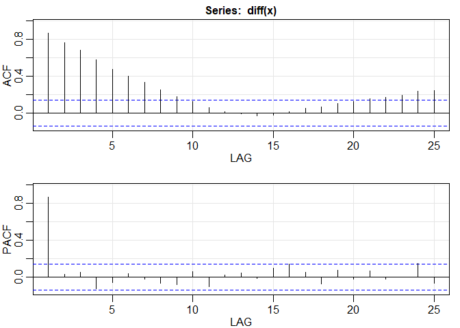<!-- -->

```
##         ACF  PACF
##  [1,]  0.87  0.87
##  [2,]  0.76  0.03
##  [3,]  0.68  0.05
##  [4,]  0.58 -0.13
##  [5,]  0.48 -0.06
##  [6,]  0.40  0.04
##  [7,]  0.33 -0.02
##  [8,]  0.25 -0.06
##  [9,]  0.18 -0.08
## [10,]  0.13  0.06
## [11,]  0.06 -0.10
## [12,]  0.01  0.02
## [13,] -0.01  0.05
## [14,] -0.03 -0.01
## [15,] -0.03  0.10
## [16,]  0.02  0.14
## [17,]  0.06  0.05
## [18,]  0.07 -0.08
## [19,]  0.10  0.07
## [20,]  0.13 -0.02
## [21,]  0.15  0.07
## [22,]  0.17 -0.02
## [23,]  0.19  0.00
## [24,]  0.24  0.15
## [25,]  0.25 -0.06
```

The P/ACF of the differenced series indicates an AR(1) model as the partial correlation cuts off after one lag, whereas the autocorrelation slowly fades off. Let's look at real data now (global temperatures in astsa package).

ARIMA diagnostics are the same as in the ARMA case (we used differenced series most of the time anyway). Hence, statements about P/ACF, AIC, BIC, etc. apply in the same way. 


```r
# Plot the sample P/ACF pair of the differenced data 
acf2(diff(globtemp))
```

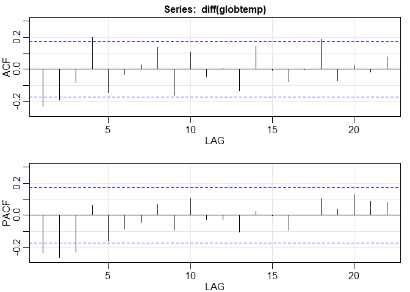<!-- -->

```
##         ACF  PACF
##  [1,] -0.24 -0.24
##  [2,] -0.19 -0.26
##  [3,] -0.08 -0.23
##  [4,]  0.20  0.06
##  [5,] -0.15 -0.16
##  [6,] -0.03 -0.09
##  [7,]  0.03 -0.05
##  [8,]  0.14  0.07
##  [9,] -0.16 -0.09
## [10,]  0.11  0.11
## [11,] -0.05 -0.03
## [12,]  0.00 -0.02
## [13,] -0.13 -0.10
## [14,]  0.14  0.02
## [15,] -0.01  0.00
## [16,] -0.08 -0.09
## [17,]  0.00  0.00
## [18,]  0.19  0.11
## [19,] -0.07  0.04
## [20,]  0.02  0.13
## [21,] -0.02  0.09
## [22,]  0.08  0.08
```

```r
# Fit an ARIMA(1,1,1) model to globtemp
sarima(globtemp, p=1, d=1, q=1)
```

```
## initial  value -2.218917 
## iter   2 value -2.253118
## iter   3 value -2.263750
## iter   4 value -2.272144
## iter   5 value -2.282786
## iter   6 value -2.296777
## iter   7 value -2.297062
## iter   8 value -2.297253
## iter   9 value -2.297389
## iter  10 value -2.297405
## iter  11 value -2.297413
## iter  12 value -2.297413
## iter  13 value -2.297414
## iter  13 value -2.297414
## iter  13 value -2.297414
## final  value -2.297414 
## converged
## initial  value -2.305504 
## iter   2 value -2.305800
## iter   3 value -2.305821
## iter   4 value -2.306655
## iter   5 value -2.306875
## iter   6 value -2.306950
## iter   7 value -2.306955
## iter   8 value -2.306955
## iter   8 value -2.306955
## final  value -2.306955 
## converged
```

<!-- -->

```
## $fit
## 
## Call:
## stats::arima(x = xdata, order = c(p, d, q), seasonal = list(order = c(P, D, 
##     Q), period = S), xreg = constant, optim.control = list(trace = trc, REPORT = 1, 
##     reltol = tol))
## 
## Coefficients:
##          ar1      ma1  constant
##       0.3549  -0.7663    0.0072
## s.e.  0.1314   0.0874    0.0032
## 
## sigma^2 estimated as 0.009885:  log likelihood = 119.88,  aic = -231.76
## 
## $degrees_of_freedom
## [1] 132
## 
## $ttable
##          Estimate     SE t.value p.value
## ar1        0.3549 0.1314  2.7008  0.0078
## ma1       -0.7663 0.0874 -8.7701  0.0000
## constant   0.0072 0.0032  2.2738  0.0246
## 
## $AIC
## [1] -3.572642
## 
## $AICc
## [1] -3.555691
## 
## $BIC
## [1] -4.508392
```

```r
# Fit an ARIMA(0,1,2) model to globtemp. Which model is better?
sarima(globtemp, p=0, d=1, q=2)
```

```
## initial  value -2.220513 
## iter   2 value -2.294887
## iter   3 value -2.307682
## iter   4 value -2.309170
## iter   5 value -2.310360
## iter   6 value -2.311251
## iter   7 value -2.311636
## iter   8 value -2.311648
## iter   9 value -2.311649
## iter   9 value -2.311649
## iter   9 value -2.311649
## final  value -2.311649 
## converged
## initial  value -2.310187 
## iter   2 value -2.310197
## iter   3 value -2.310199
## iter   4 value -2.310201
## iter   5 value -2.310202
## iter   5 value -2.310202
## iter   5 value -2.310202
## final  value -2.310202 
## converged
```

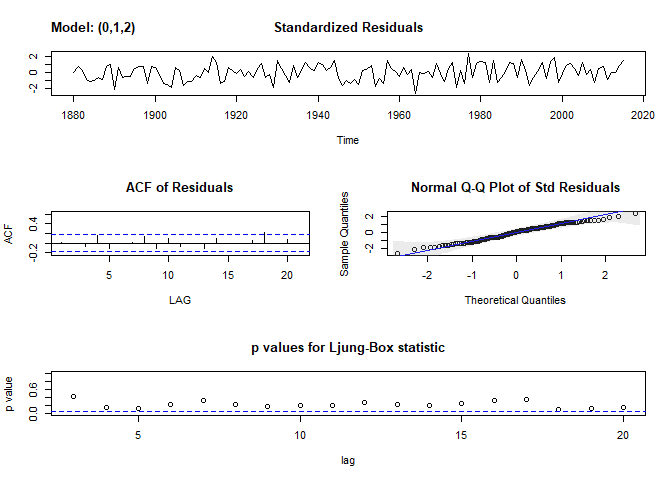<!-- -->

```
## $fit
## 
## Call:
## stats::arima(x = xdata, order = c(p, d, q), seasonal = list(order = c(P, D, 
##     Q), period = S), xreg = constant, optim.control = list(trace = trc, REPORT = 1, 
##     reltol = tol))
## 
## Coefficients:
##           ma1      ma2  constant
##       -0.3984  -0.2173    0.0072
## s.e.   0.0808   0.0768    0.0033
## 
## sigma^2 estimated as 0.00982:  log likelihood = 120.32,  aic = -232.64
## 
## $degrees_of_freedom
## [1] 132
## 
## $ttable
##          Estimate     SE t.value p.value
## ma1       -0.3984 0.0808 -4.9313  0.0000
## ma2       -0.2173 0.0768 -2.8303  0.0054
## constant   0.0072 0.0033  2.1463  0.0337
## 
## $AIC
## [1] -3.579224
## 
## $AICc
## [1] -3.562273
## 
## $BIC
## [1] -4.514974
```

Forecasting can be done using the `sarima.for()` function. Here, the forecast horizon has to be specified. 


```r
# Use the weekly data for oil prices

# Subset for forecasting 
oil <- window(astsa::oil, end=2006)

# full data do be displayed
oilf <- window(astsa::oil, end = 2007)

# Now: Do the forecast 52 weeks ahead
sarima.for(oil, n.ahead = 52, p=1, d=1, q=1)
```

```
## $pred
## Time Series:
## Start = c(2006, 2) 
## End = c(2007, 1) 
## Frequency = 52 
##  [1] 60.71882 60.43909 60.74214 60.75455 60.91190 60.99696 61.11808
##  [8] 61.22122 61.33332 61.44095 61.55081 61.65956 61.76887 61.87790
## [15] 61.98706 62.09616 62.20529 62.31441 62.42353 62.53265 62.64177
## [22] 62.75089 62.86001 62.96913 63.07825 63.18737 63.29649 63.40561
## [29] 63.51473 63.62385 63.73297 63.84209 63.95121 64.06033 64.16945
## [36] 64.27857 64.38769 64.49681 64.60593 64.71505 64.82417 64.93329
## [43] 65.04241 65.15153 65.26065 65.36977 65.47889 65.58801 65.69713
## [50] 65.80625 65.91537 66.02449
## 
## $se
## Time Series:
## Start = c(2006, 2) 
## End = c(2007, 1) 
## Frequency = 52 
##  [1]  1.430557  2.270997  2.776644  3.245575  3.636008  3.996918  4.323903
##  [8]  4.629671  4.915600  5.186193  5.443159  5.688620  5.923876  6.150160
## [15]  6.368398  6.579407  6.783853  6.982317  7.175292  7.363212  7.546454
## [22]  7.725351  7.900198  8.071258  8.238767  8.402937  8.563961  8.722013
## [29]  8.877251  9.029820  9.179855  9.327476  9.472797  9.615922  9.756948
## [36]  9.895965 10.033055 10.168297 10.301764 10.433524 10.563640 10.692173
## [43] 10.819180 10.944712 11.068821 11.191554 11.312955 11.433067 11.551931
## [50] 11.669584 11.786062 11.901401
```

```r
lines(oilf)
```

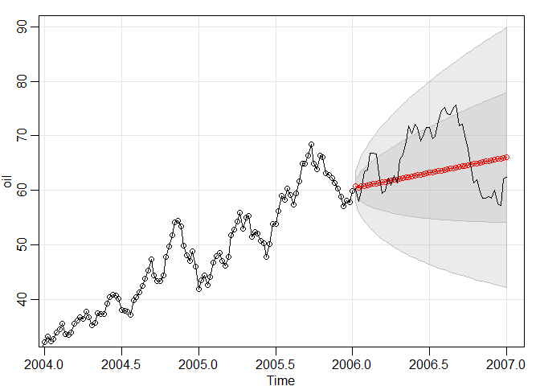<!-- -->

```r
###
# Fit an ARIMA(0,1,2) to globtemp and check the fit
sarima(globtemp, p=0, d=1, q=2)
```

```
## initial  value -2.220513 
## iter   2 value -2.294887
## iter   3 value -2.307682
## iter   4 value -2.309170
## iter   5 value -2.310360
## iter   6 value -2.311251
## iter   7 value -2.311636
## iter   8 value -2.311648
## iter   9 value -2.311649
## iter   9 value -2.311649
## iter   9 value -2.311649
## final  value -2.311649 
## converged
## initial  value -2.310187 
## iter   2 value -2.310197
## iter   3 value -2.310199
## iter   4 value -2.310201
## iter   5 value -2.310202
## iter   5 value -2.310202
## iter   5 value -2.310202
## final  value -2.310202 
## converged
```

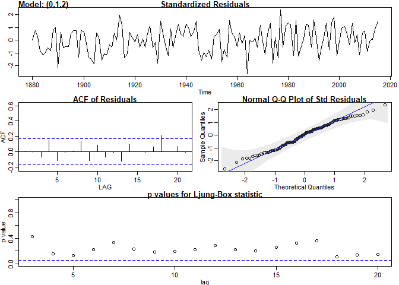<!-- -->

```
## $fit
## 
## Call:
## stats::arima(x = xdata, order = c(p, d, q), seasonal = list(order = c(P, D, 
##     Q), period = S), xreg = constant, optim.control = list(trace = trc, REPORT = 1, 
##     reltol = tol))
## 
## Coefficients:
##           ma1      ma2  constant
##       -0.3984  -0.2173    0.0072
## s.e.   0.0808   0.0768    0.0033
## 
## sigma^2 estimated as 0.00982:  log likelihood = 120.32,  aic = -232.64
## 
## $degrees_of_freedom
## [1] 132
## 
## $ttable
##          Estimate     SE t.value p.value
## ma1       -0.3984 0.0808 -4.9313  0.0000
## ma2       -0.2173 0.0768 -2.8303  0.0054
## constant   0.0072 0.0033  2.1463  0.0337
## 
## $AIC
## [1] -3.579224
## 
## $AICc
## [1] -3.562273
## 
## $BIC
## [1] -4.514974
```

```r
# Forecast data 35 years into the future
sarima.for(globtemp, n.ahead=35, p=0, d=1, q=2)
```

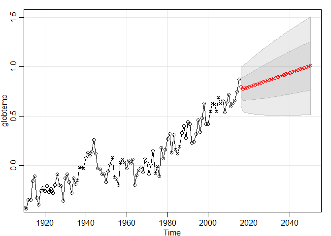<!-- -->

```
## $pred
## Time Series:
## Start = 2016 
## End = 2050 
## Frequency = 1 
##  [1] 0.7995567 0.7745381 0.7816919 0.7888457 0.7959996 0.8031534 0.8103072
##  [8] 0.8174611 0.8246149 0.8317688 0.8389226 0.8460764 0.8532303 0.8603841
## [15] 0.8675379 0.8746918 0.8818456 0.8889995 0.8961533 0.9033071 0.9104610
## [22] 0.9176148 0.9247687 0.9319225 0.9390763 0.9462302 0.9533840 0.9605378
## [29] 0.9676917 0.9748455 0.9819994 0.9891532 0.9963070 1.0034609 1.0106147
## 
## $se
## Time Series:
## Start = 2016 
## End = 2050 
## Frequency = 1 
##  [1] 0.09909556 0.11564576 0.12175580 0.12757353 0.13313729 0.13847769
##  [7] 0.14361964 0.14858376 0.15338730 0.15804492 0.16256915 0.16697084
## [13] 0.17125943 0.17544322 0.17952954 0.18352490 0.18743511 0.19126540
## [19] 0.19502047 0.19870459 0.20232164 0.20587515 0.20936836 0.21280424
## [25] 0.21618551 0.21951471 0.22279416 0.22602604 0.22921235 0.23235497
## [31] 0.23545565 0.23851603 0.24153763 0.24452190 0.24747019
```

## Ch. 4: Seasonal Models
Often data have known seasonal components (cyclic behavior). E.g. yearly cycles (1 cycle every S=12 months), quarterly cycles (1 cycle every S=4 quarters), etc. 

### Pure Seasonal Models

It is instructed to start with pure seasonal models (although not always realistic). These types of models are typically formalized as: 
$$X_t = \phi X_{t-12} + W_t$$
which is an AR(1) model at seasonal level of 12 lags. This model describes today's value as being determined by the weighted value 12 months ago and some noise. The behavior of these models is exactly as before (see table) but we are now operating on the level of the cycle.

### Mixed Seasonal Model
Mixed model: $$SARIMA(p,d,q) \times (P, D, Q)_s $$
where lowercase letters indicate the nonseasonal components, capital letters indicate seasonal components, and s indicates the season length. 

Use the `AirPassengers` data for analysis of the seasonal behavior:


```r
x <- AirPassengers

ts.plot(x)
```

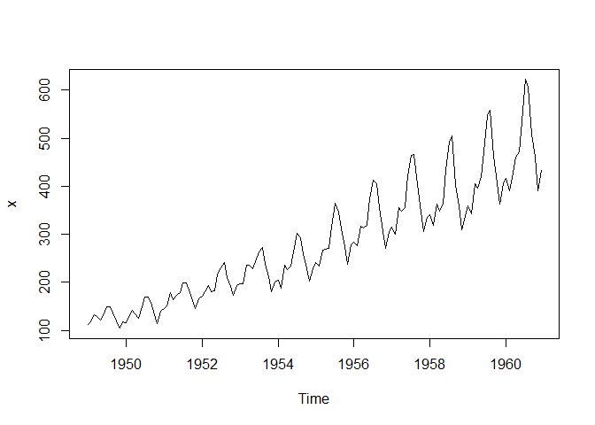<!-- -->

```r
# Stabilize var by logging
ts.plot(log(x))
```

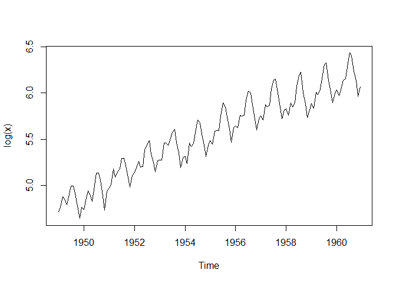<!-- -->

```r
# detrend by taking first difference
ts.plot(diff(log(x)))
```

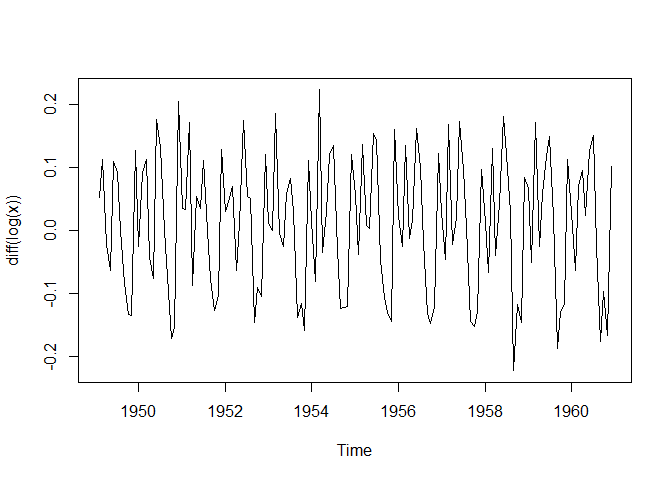<!-- -->

```r
# Seasonal persistence. Note that we take the diff of differences
ts.plot(diff(diff(log(x)),12))
```

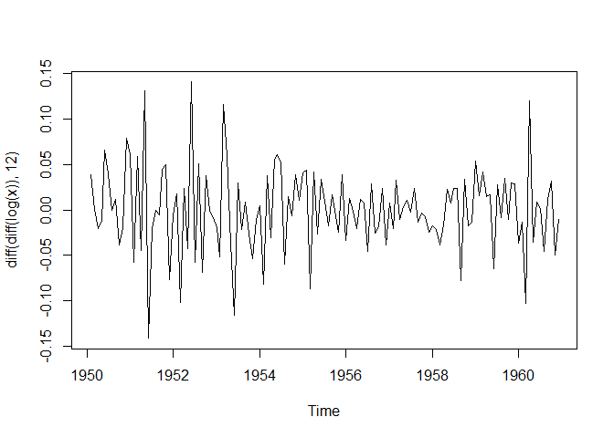<!-- -->

```r
acf2(diff(diff(log(x)),12))
```

<!-- -->

Observations: 
- Seasonal: ACF cutting off at lag 1s (S=12) and PACF tailing off lags 1s, 2s, 3s...
 - Suggests seasonal MA(1) -> P=0,Q=1
- Nonseasonal: ACF and PACF both tailing off.
 - Suggests p=1, q=1

Appropriate model seems to be a model with:

 - p=1, d=1, q=1, P=0, D=1, Q=1, S=12
 

```r
fit1 <- sarima(log(x), 
       p=1, d=1, q=1, 
       P=0, D=1, Q=1, S=12, details = FALSE)
fit1$ttable
```

```
##      Estimate     SE t.value p.value
## ar1    0.1960 0.2475  0.7921  0.4298
## ma1   -0.5784 0.2132 -2.7127  0.0076
## sma1  -0.5643 0.0747 -7.5544  0.0000
```


```r
# Take out ar component because it is not significant
sarima(log(x), 
       p=1, d=1, q=1, 
       P=0, D=1, Q=1, S=12, details=FALSE)
```
 

```r
# Plot unemp 
plot(unemp)
```

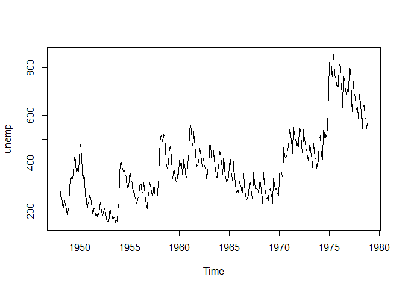<!-- -->

```r
# Difference your data and plot it
d_unemp <- diff(unemp)
plot(d_unemp)
```

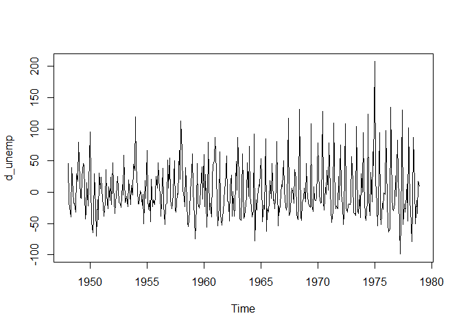<!-- -->

```r
# Seasonally difference d_unemp and plot it
dd_unemp <- diff(d_unemp, lag = 12)  
plot(dd_unemp)
```

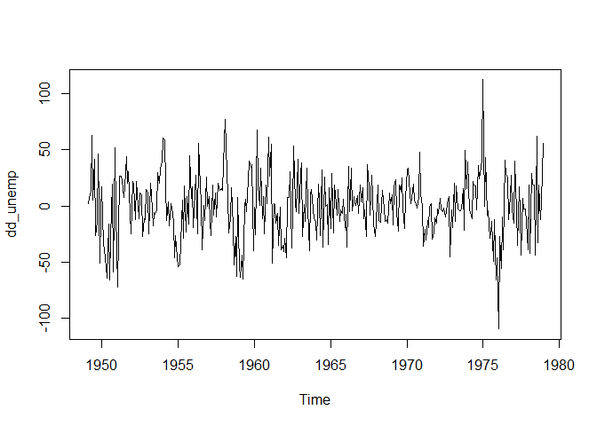<!-- -->

```r
# Plot P/ACF pair of fully differenced data to lag 60
dd_unemp <- diff(diff(unemp), lag = 12)

# Look at P/ACF and deduce what model seems appropriate
acf2(dd_unemp)
```

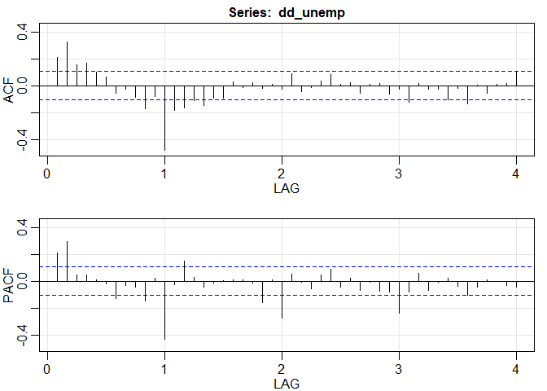<!-- -->

```r
# Fit an appropriate model
sarima(unemp, p=2, d=1, q=0, P=0, D=1, Q=1, S=12)
```

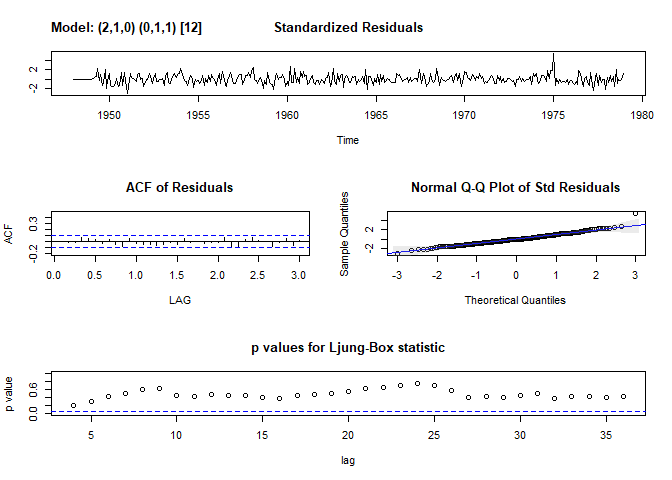<!-- -->

Short explanation (compare to `dd_unemp`):
- Seasonal: ACF cuts off after one lag (Q=1), PACF tails off (P=0).
- Non-seasonal: ACF tails off (q=0), PACF cuts off after 2 lags (p=2)
- Hence, using `unemp` with a `SARIMA(p=2, d=1, q=0, P=0, D=1, Q=1, S=12) seeems reasonable.


```r
# Fit data to a commidity: Chicken
plot(chicken)
```

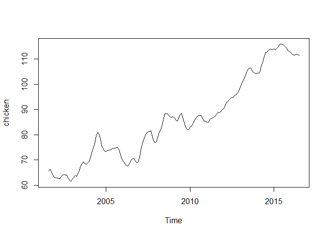<!-- -->

```r
# Plot differenced chicken
plot(diff(chicken))
```

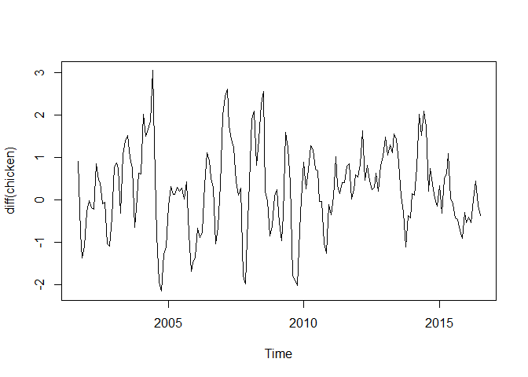<!-- -->

```r
# Plot P/ACF pair of differenced data to lag 60
acf2(diff(chicken), max.lag=60)
```

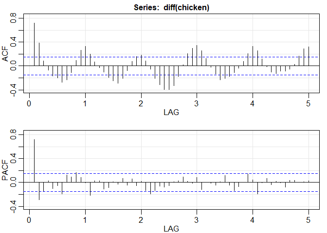<!-- -->

```r
# Fit ARIMA(2,1,0) to chicken - not so good
sarima(chicken, p=2, d=1, q=0)
```

<!-- -->

```r
# Fit SARIMA(2,1,0,1,0,0,12) to chicken - that works
sarima(chicken, p=2, d=1, q=0, P=1, D=0, Q=0, S=12)
```

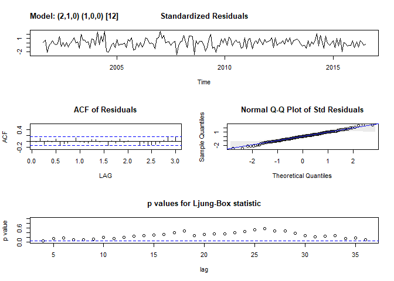<!-- -->

Website with various commodity prices: [index mundi](https://www.indexmundi.com/commodities/)

Forecasting ARIMA Processes can simply be done using the `sarima.for()`function. 


```r
# Recall SARIMA (0,1,1)x(0,1,1)_12 model for the AirPassenger data
x <- AirPassengers

x_mat <- matrix(data = c(diff(x)[1],diff(x)), ncol=12, byrow=TRUE)
plot(x = colMeans(x_mat), type="b", main="Monthly means", xlab="month", ylab="mean")
abline(h = mean(diff(x)), col="blue", lty=2)
```

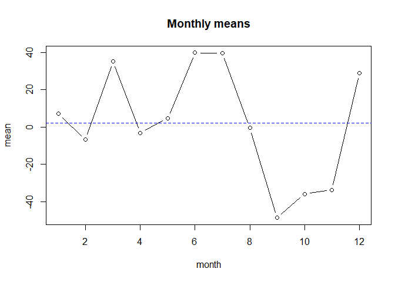<!-- -->

```r
# 24 months forecast.
sarima.for(log(AirPassengers), n.ahead=24,
           0,1,1,
           0,1,1,12)
```

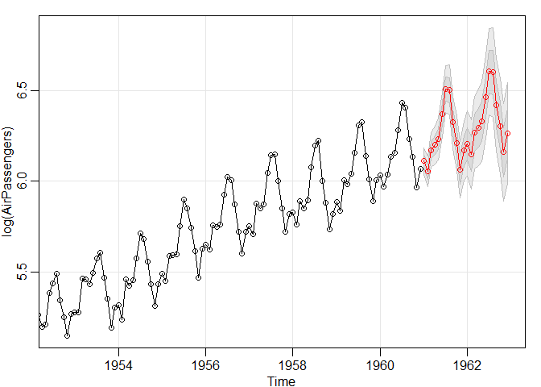<!-- -->

```r
## Forecast for unemp
# Fit your previous model to unemp and check the diagnostics
sarima(unemp, 2,1,0,0,1,1,12)
```

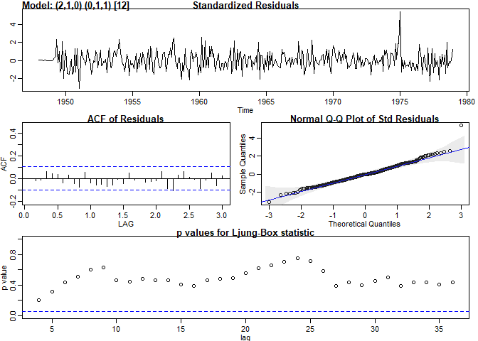<!-- -->

```r
# Forecast the data 3 years into the future
sarima.for(unemp, n.ahead=36, 2,1,0,  0,1,1,  12)
```

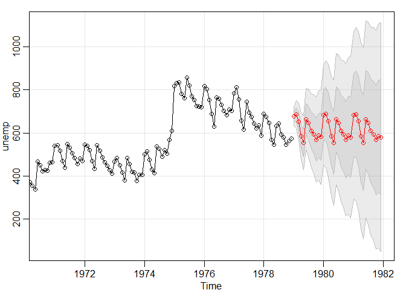<!-- -->


```r
# Forecasting commodities: Chicken
sarima.for(chicken, n.ahead= 60, p=2, d=1, q=0, P=1, D=0, Q=0, S=12 )
```

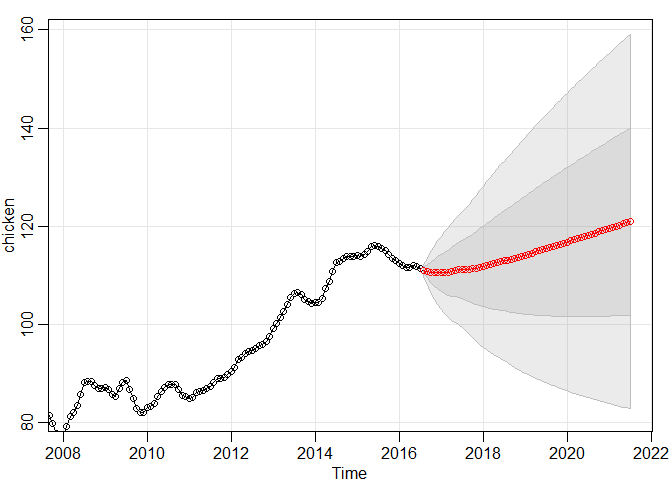<!-- -->


