```r
library("astsa")
library("ggplot2")
library("forecast")
library("fpp2")
```

# Forecasting

## Ch. 1: Exploring and Visualizing Time Series
Start with exploring and visualizing some time series which are included in the packages and will be used throughout. To get additional information on the data, just use `?dataset` in console and consult the documentation.

### Introducing data and basic plots


```r
# Time Series
data(gnp, package = "astsa")
grgnp <- diff(log(gnp))
eu_stocks <- EuStockMarkets

# Visualizing
autoplot(eu_stocks, facets = TRUE)
```

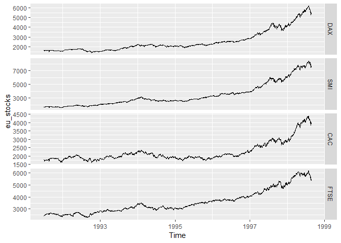<!-- -->

```r
autoplot(eu_stocks, facets = FALSE)
```

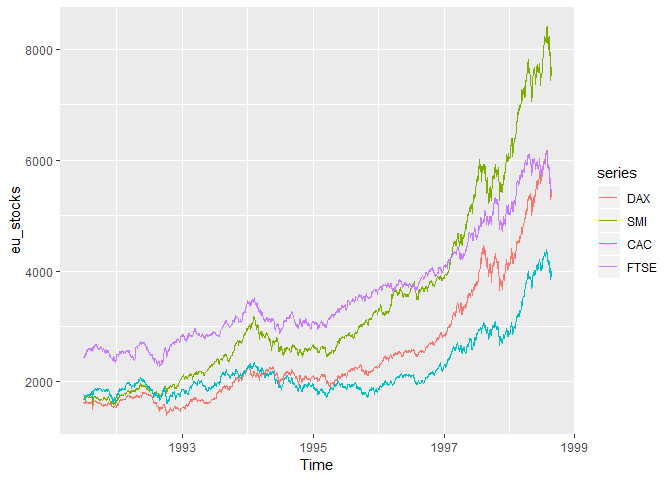<!-- -->

```r
# Plot the three main series to be used 
autoplot(gold)
```

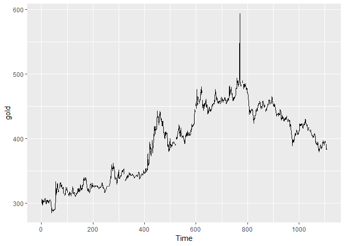<!-- -->

```r
autoplot(woolyrnq)
```

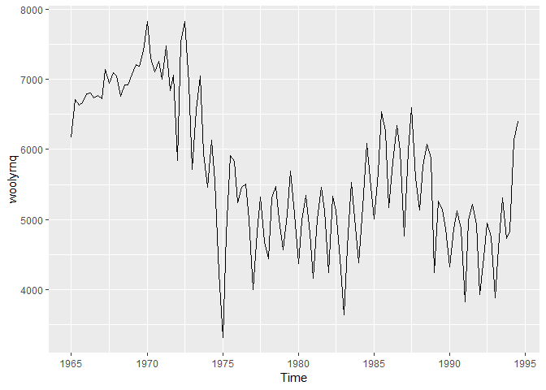<!-- -->

```r
autoplot(gas)
```

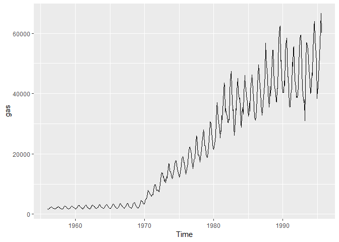<!-- -->

```r
# Seasonal frequencies of the three series
frequency(gold)
```

```
## [1] 1
```

```r
frequency(woolyrnq)
```

```
## [1] 4
```

```r
frequency(gas)
```

```
## [1] 12
```


```r
# More data, more plots
autoplot(a10)
```

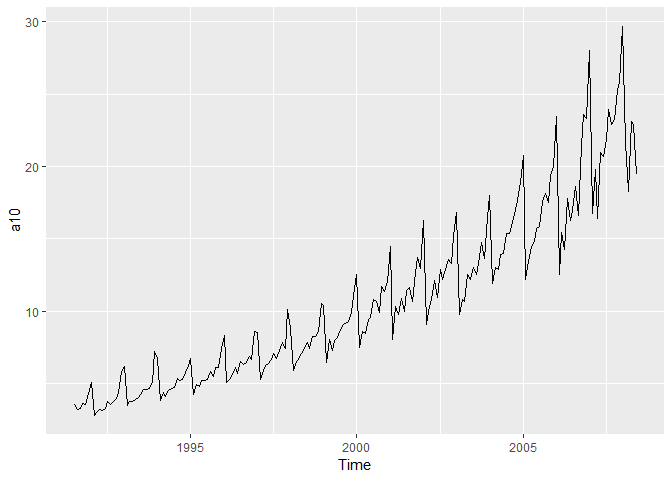<!-- -->

```r
# Seasonalplot + seasonplot polar form
ggseasonplot(a10)
```

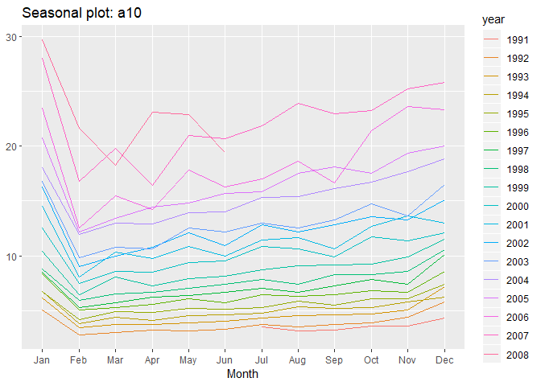<!-- -->

```r
ggseasonplot(a10, polar=TRUE)
```

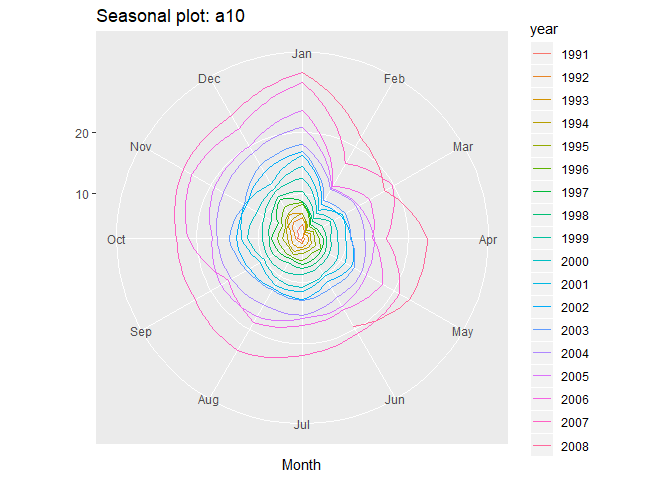<!-- -->

```r
# Beer data (subset)
beer <- window(ausbeer, start=1992)
autoplot(beer)
```

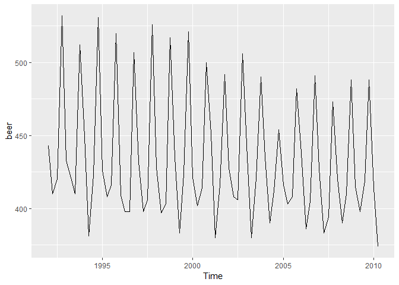<!-- -->

```r
ggseasonplot(beer)
```

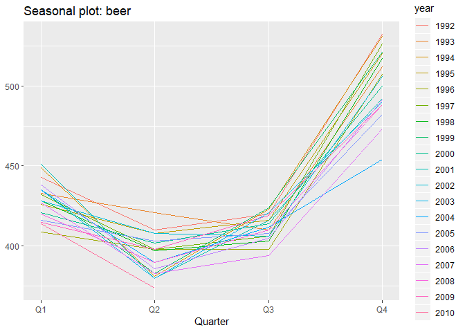<!-- -->

```r
ggsubseriesplot(beer)
```

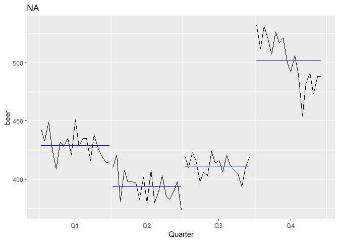<!-- -->

### Trends, seasonality, and cyclicity
Time series patterns can be divided into trend, seasonal, cyclic:

- Trend: Long-trerm increase or decrease in the data
- Seasonal: Periodic pattern exits due to calendar (quarter, month, day of the week)
- Cyclic: Data exhihibts rises and falls that are not of fixed period 

Also, there are important differences between seasonal and cyclic patterns:

- Seasonal pattern has constant length vs. cyclic pattern has a varying length.
- Average length of cycle longer than length of seasonal pattern


```r
autoplot(oil)
```

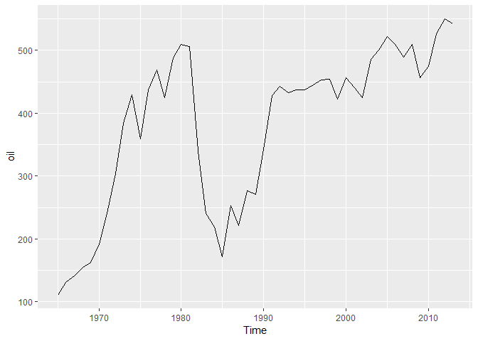<!-- -->

```r
gglagplot(oil)
```

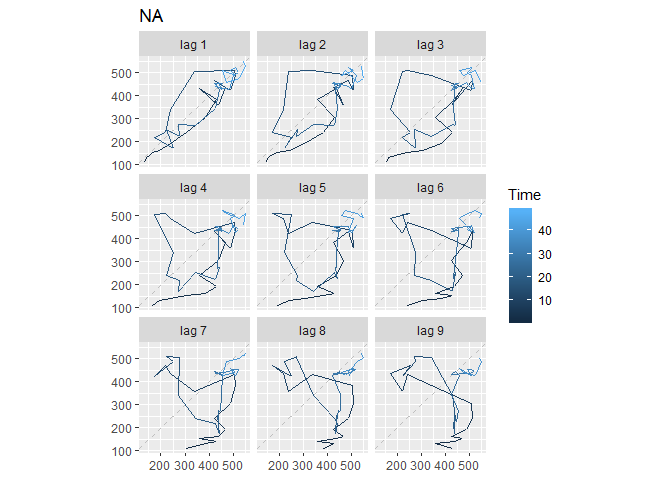<!-- -->

```r
ggAcf(oil)
```

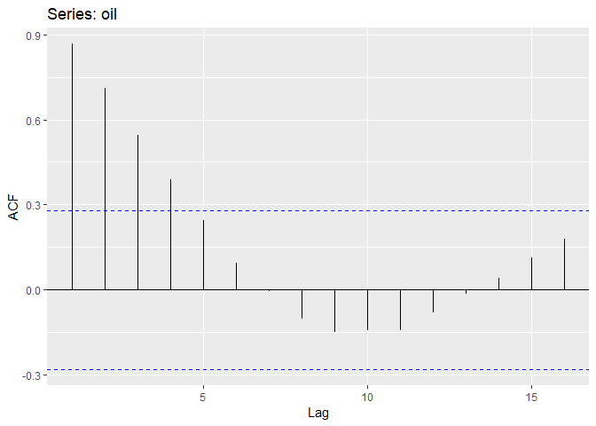<!-- -->

```r
ggPacf(oil)
```

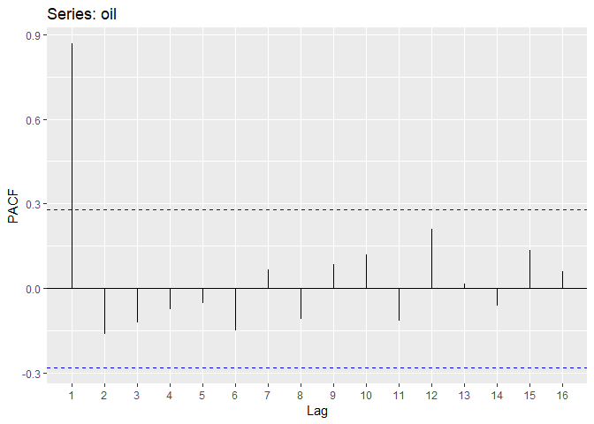<!-- -->


```r
# Plot the annual sunspot numbers
autoplot(sunspot.year)
```

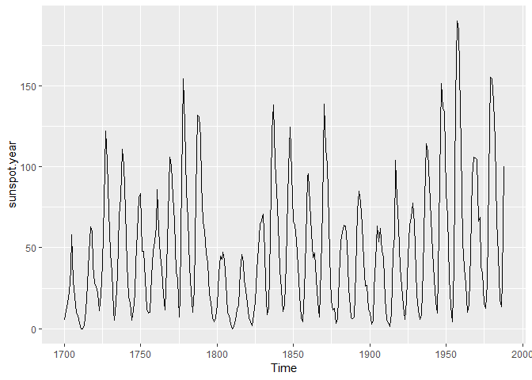<!-- -->

```r
ggAcf(sunspot.year)
```

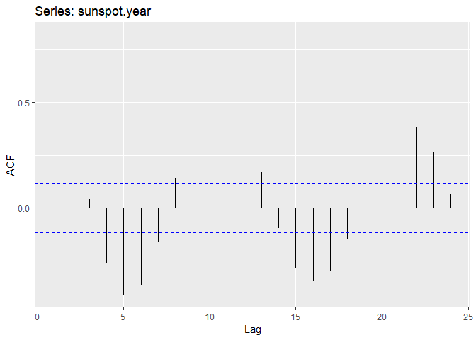<!-- -->

```r
# Save the lag corresponding to maximum autocorrelation
maxlag_sunspot <- 1

# Plot the traffic on the Hyndsight blog
autoplot(hyndsight)
```

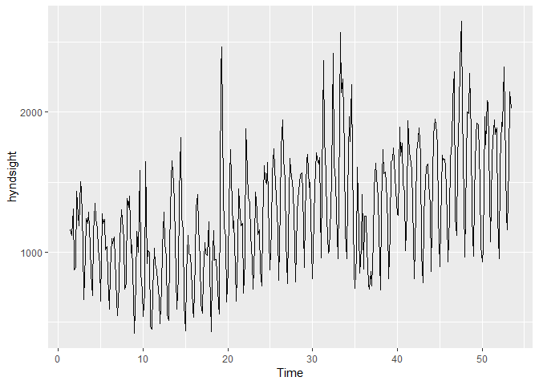<!-- -->

```r
ggAcf(hyndsight)
```

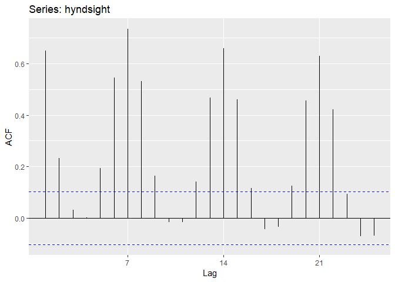<!-- -->

```r
# Save the lag corresponding to maximum autocorrelation
maxlag_hyndsight <- 7
```

### White Noise and Autocorrelation
White Noise indicates that there is no significant autocorrelation in the data that could be used to forecast a time series. ACF plots show autocorrelation for some lags. There should be no significant values in the ACF for white noise. 

To test for autocorrealation altogether we can use a **Ljung-Box Test**. This test considers the first h autocorrelation values together. A significant test (small p-value) indicates the data are probably not white noise. Null hypothesis is white noise and rejecting the null hypothesis indicates that data is likely not WN. 

To summarize: 

- White Noise is a purely random time series
- Test white noise by looking at an ACF plot or by doing a Ljung-Box test.


```r
# Plot the original series
autoplot(goog)
```

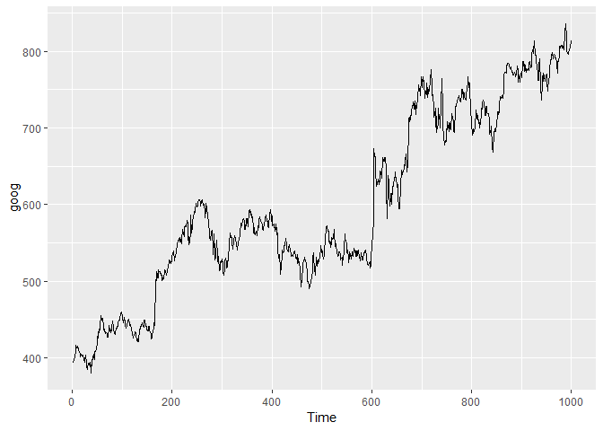<!-- -->

```r
# Plot the differenced series
autoplot(diff(goog))
```

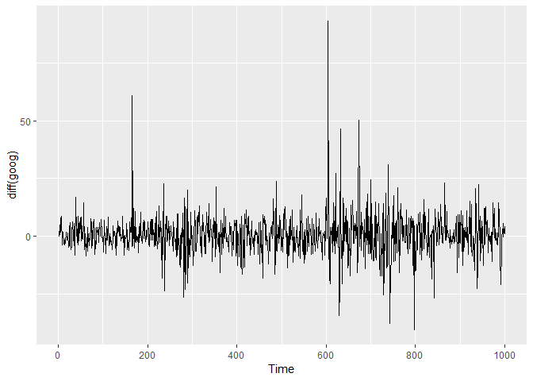<!-- -->

```r
# ACF of the differenced series
ggAcf(diff(goog))
```

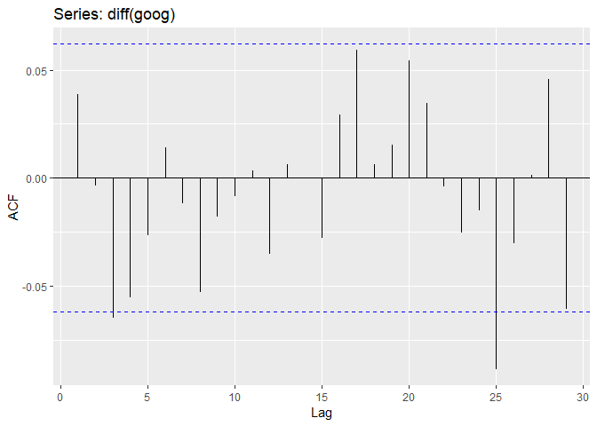<!-- -->

```r
# Ljung-Box test of the differenced series
Box.test(diff(goog), lag = 10, type = "Ljung")
```

```
## 
## 	Box-Ljung test
## 
## data:  diff(goog)
## X-squared = 13.123, df = 10, p-value = 0.2169
```

## Ch. 2: Benchmark methods and forecast accuracy


```r
# naive and seasonal naive forecasts...
# Use naive() to forecast the goog series
fcgoog <- naive(goog, 20)

# Plot and summarize the forecasts
autoplot(fcgoog)
```

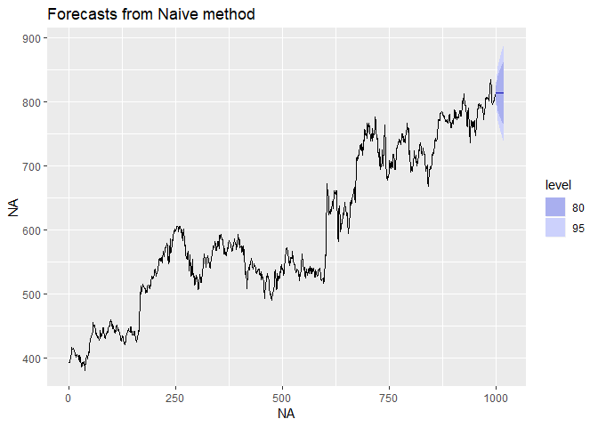<!-- -->

```r
summary(fcgoog)
```

```
## 
## Forecast method: Naive method
## 
## Model Information:
## Call: naive(y = goog, h = 20) 
## 
## Residual sd: 8.7285 
## 
## Error measures:
##                     ME     RMSE      MAE        MPE      MAPE MASE
## Training set 0.4212612 8.734286 5.829407 0.06253998 0.9741428    1
##                    ACF1
## Training set 0.03871446
## 
## Forecasts:
##      Point Forecast    Lo 80    Hi 80    Lo 95    Hi 95
## 1001         813.67 802.4765 824.8634 796.5511 830.7889
## 1002         813.67 797.8401 829.4999 789.4602 837.8797
## 1003         813.67 794.2824 833.0576 784.0192 843.3208
## 1004         813.67 791.2831 836.0569 779.4322 847.9078
## 1005         813.67 788.6407 838.6993 775.3910 851.9490
## 1006         813.67 786.2518 841.0882 771.7374 855.6025
## 1007         813.67 784.0549 843.2850 768.3777 858.9623
## 1008         813.67 782.0102 845.3298 765.2505 862.0895
## 1009         813.67 780.0897 847.2503 762.3133 865.0266
## 1010         813.67 778.2732 849.0667 759.5353 867.8047
## 1011         813.67 776.5456 850.7944 756.8931 870.4469
## 1012         813.67 774.8948 852.4452 754.3684 872.9715
## 1013         813.67 773.3115 854.0285 751.9470 875.3930
## 1014         813.67 771.7880 855.5520 749.6170 877.7230
## 1015         813.67 770.3180 857.0220 747.3688 879.9711
## 1016         813.67 768.8962 858.4437 745.1944 882.1455
## 1017         813.67 767.5183 859.8217 743.0870 884.2530
## 1018         813.67 766.1802 861.1597 741.0407 886.2993
## 1019         813.67 764.8789 862.4610 739.0505 888.2895
## 1020         813.67 763.6114 863.7286 737.1120 890.2280
```

```r
# Use snaive() to forecast the ausbeer series
fcbeer <- snaive(ausbeer, 16)

# Plot and summarize the forecasts
autoplot(fcbeer)
```

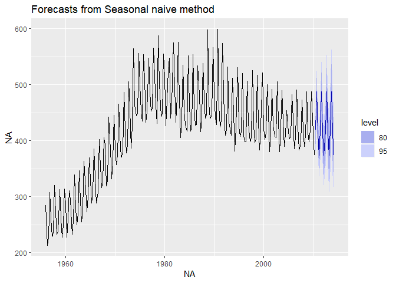<!-- -->

```r
summary(fcbeer)
```

```
## 
## Forecast method: Seasonal naive method
## 
## Model Information:
## Call: snaive(y = ausbeer, h = 16) 
## 
## Residual sd: 19.1207 
## 
## Error measures:
##                    ME     RMSE      MAE      MPE    MAPE MASE       ACF1
## Training set 3.098131 19.32591 15.50935 0.838741 3.69567    1 0.01093868
## 
## Forecasts:
##         Point Forecast    Lo 80    Hi 80    Lo 95    Hi 95
## 2010 Q3            419 394.2329 443.7671 381.1219 456.8781
## 2010 Q4            488 463.2329 512.7671 450.1219 525.8781
## 2011 Q1            414 389.2329 438.7671 376.1219 451.8781
## 2011 Q2            374 349.2329 398.7671 336.1219 411.8781
## 2011 Q3            419 383.9740 454.0260 365.4323 472.5677
## 2011 Q4            488 452.9740 523.0260 434.4323 541.5677
## 2012 Q1            414 378.9740 449.0260 360.4323 467.5677
## 2012 Q2            374 338.9740 409.0260 320.4323 427.5677
## 2012 Q3            419 376.1020 461.8980 353.3932 484.6068
## 2012 Q4            488 445.1020 530.8980 422.3932 553.6068
## 2013 Q1            414 371.1020 456.8980 348.3932 479.6068
## 2013 Q2            374 331.1020 416.8980 308.3932 439.6068
## 2013 Q3            419 369.4657 468.5343 343.2438 494.7562
## 2013 Q4            488 438.4657 537.5343 412.2438 563.7562
## 2014 Q1            414 364.4657 463.5343 338.2438 489.7562
## 2014 Q2            374 324.4657 423.5343 298.2438 449.7562
```

### Fitted values and residuals

A **fitted value** is the forecast of an observation using all previous observations:

- They are one-step forecasts 
- Often not true forecasts since parameters are estimated on all data.

A **residual** is the difference between an observation and its fitted value:

- That is, they are one-step forecast errors

Residuals should look, and behave, like white Noise. Essential assumptions are:

- They should be uncorrelated
- They should have mean zero (unbiased)

Useful properties (for computing prediction intervals):

- They should have constant variance
- They should be normally distributed

Assumptions can be checked using the `checkresiduals()` function.


```r
library(magrittr)

# Use pipe to check residuals
goog %>% naive() %>% checkresiduals()
```

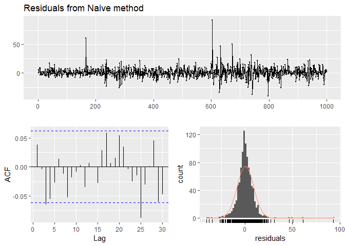<!-- -->

```
## 
## 	Ljung-Box test
## 
## data:  Residuals from Naive method
## Q* = 13.123, df = 10, p-value = 0.2169
## 
## Model df: 0.   Total lags used: 10
```

```r
# Check the residuals from the naive forecasts applied to the goog series
goog %>% naive() %>% checkresiduals()
```

<!-- -->

```
## 
## 	Ljung-Box test
## 
## data:  Residuals from Naive method
## Q* = 13.123, df = 10, p-value = 0.2169
## 
## Model df: 0.   Total lags used: 10
```

```r
# Do they look like white noise (TRUE or FALSE)
googwn <- TRUE

# Check the residuals from the seasonal naive forecasts applied to the ausbeer series
ausbeer %>% snaive() %>% checkresiduals()
```

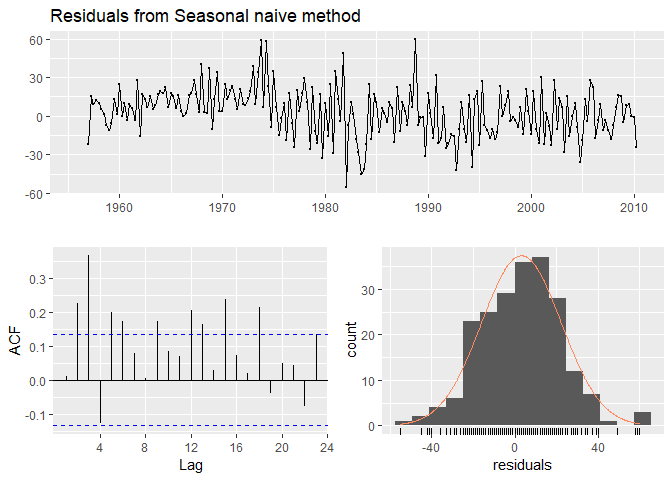<!-- -->

```
## 
## 	Ljung-Box test
## 
## data:  Residuals from Seasonal naive method
## Q* = 60.535, df = 8, p-value = 3.661e-10
## 
## Model df: 0.   Total lags used: 8
```

```r
# Do they look like white noise (TRUE or FALSE)
beerwn <- FALSE
```

### Training and test sets

Construct a test set, where some of the last data is hidden from the modeling part. Split into training and test dataset. 

- Test set must not be used for any aspect of calculating forecasts.
- Build forecasts using training set
- A model which fits the training data well will not necessarilty forecast well. 

**Forecast errors** are the difference between observed value and its forecast in the test set. They are errors based on the test set and may have a different forecast horizon.

**Measures of forecast accuracy** are based on the forecast error:

$$e_t = y_t - \overline{y}_t$$

Commonly used measures are:

- Mean Absolute Arror (MAE) = $average(|e_t|)$
- Mean Squared Error (MSE) = $average(e^2_t)$
- Mean Absolute Percentage Error (MAPE) = $100 \cdot (|e_t / y_t|) $
- Mean Absolute Scaled Error (MASE) = $MAE / Q$

The `accuracy()` command can calculate these measures. 


```r
# Create the training data as train
train <- subset(gold, end = 1000)

# Compute naive forecasts and save to naive_fc
# Can be done with snaive in the same way
naive_fc <- naive(train, h = 108)

# Compute mean forecasts and save to mean_fc
mean_fc <- meanf(train, h = 108)

# Use accuracy() to compute RMSE statistics
accuracy(naive_fc, gold)
```

```
##                      ME      RMSE      MAE        MPE      MAPE     MASE
## Training set  0.1079897  6.358087  3.20366  0.0201449 0.8050646 1.014334
## Test set     -6.5383495 15.842361 13.63835 -1.7462269 3.4287888 4.318139
##                    ACF1 Theil's U
## Training set -0.3086638        NA
## Test set      0.9793153  5.335899
```

```r
accuracy(mean_fc, gold)
```

```
##                         ME     RMSE      MAE       MPE      MAPE      MASE
## Training set -4.239671e-15 59.17809 53.63397 -2.390227 14.230224 16.981449
## Test set      1.319363e+01 19.55255 15.66875  3.138577  3.783133  4.960998
##                   ACF1 Theil's U
## Training set 0.9907254        NA
## Test set     0.9793153  6.123788
```

```r
# Assign one of the two forecasts as bestforecasts
bestforecasts <- naive_fc
```

### Time series cross-validation
Forecast evaluation on a rolling origin can be used to cross-validate how good a time series model performs for a specified forecast horizon. `tsCV` function performs MSE using time series cross-validation. 


```r
# Using the tsCV function
sq <- function(u){u^2}

for (h in 1:10){
  oil %>%
    tsCV(forecastfunction = naive, h = h) %>% 
    sq() %>% 
    mean(na.rm=TRUE) %>% 
    print()
}
```

```
## [1] 2355.753
## [1] 4027.511
## [1] 5924.514
## [1] 7950.841
## [1] 9980.589
## [1] 12072.91
## [1] 14054.23
## [1] 15978.92
## [1] 17687.33
## [1] 19058.95
```

Applying cross-validation without a loop:


```r
# Compute cross-validated errors for up to 8 steps ahead
e <- tsCV(goog, forecastfunction = naive, h = 8)

# Compute the MSE values and remove missing values
mse <- colMeans(e^2, na.rm = TRUE)

# Plot the MSE values against the forecast horizon
data.frame(h = 1:8, MSE = mse) %>%
  ggplot(aes(x = h, y = MSE)) + geom_point()
```

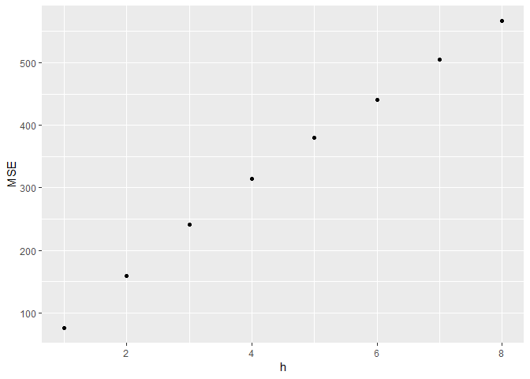<!-- -->

## Ch. 3 Exponential Smoothing
Most simplistic methods of forecasting are the `Mean`-method and the `naive`-Method. **Exponentially weighted forecasts** are somewhere in between these two methods as the weighting decreases with distance to current period. The **simple exponential** forecast can be determined by the following equation: 

$$\hat{y}_{t+h|t} = \alpha y_t + \alpha (1-\alpha)y_{t-1} + \alpha (1-\alpha)^2 y_{t-2} + ... $$
with $0 \leq \alpha \leq 1$. This can also be expressed as:

- Forecast equation: $\hat{y}_{t+h|t} = \ell_t $
- Smoothing equation: $\ell_t = \alpha y_t + (1-\alpha) \ell_{t-1}$

with $\ell_t$ as the level (or the smoothed value) of the series at time t. $\alpha$ and $\ell_0$ are chosen by minimizing SSE:

$$SSE = \sum_{t=1}^T (y_t - \hat{y}_{t|t-1})^2$$


```r
oildata <- window(oil, start = 1996)  # Subset oil data
ts.plot(oildata)
```

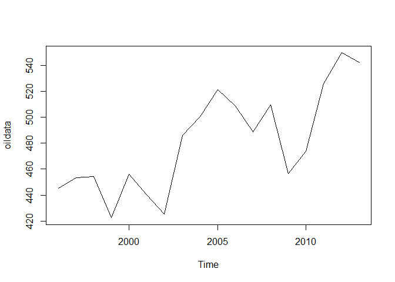<!-- -->

```r
fc <- ses(oildata, h=5)               # Simple exp. smoothing
summary(fc)
```

```
## 
## Forecast method: Simple exponential smoothing
## 
## Model Information:
## Simple exponential smoothing 
## 
## Call:
##  ses(y = oildata, h = 5) 
## 
##   Smoothing parameters:
##     alpha = 0.8339 
## 
##   Initial states:
##     l = 446.5868 
## 
##   sigma:  29.8282
## 
##      AIC     AICc      BIC 
## 178.1430 179.8573 180.8141 
## 
## Error measures:
##                    ME     RMSE     MAE      MPE     MAPE      MASE
## Training set 6.401975 28.12234 22.2587 1.097574 4.610635 0.9256774
##                     ACF1
## Training set -0.03377748
## 
## Forecasts:
##      Point Forecast    Lo 80    Hi 80    Lo 95    Hi 95
## 2014       542.6806 504.4541 580.9070 484.2183 601.1429
## 2015       542.6806 492.9073 592.4539 466.5589 618.8023
## 2016       542.6806 483.5747 601.7864 452.2860 633.0752
## 2017       542.6806 475.5269 609.8343 439.9778 645.3834
## 2018       542.6806 468.3452 617.0159 428.9945 656.3667
```

```r
# plotting fc
autoplot(fc) + 
  ylab("Oil (millions of tonnes)") + 
  xlab("Year")
```

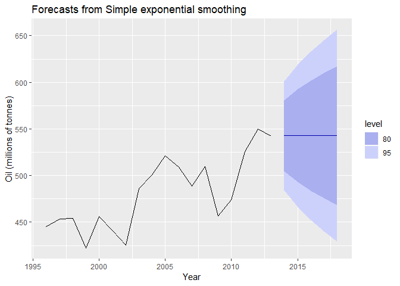<!-- -->

```r
# Use ses() to forecast the next 10 years of winning times
fc <- ses(marathon, h = 10)

# Use summary() to see the model parameters
summary(fc)
```

```
## 
## Forecast method: Simple exponential smoothing
## 
## Model Information:
## Simple exponential smoothing 
## 
## Call:
##  ses(y = marathon, h = 10) 
## 
##   Smoothing parameters:
##     alpha = 0.3457 
## 
##   Initial states:
##     l = 167.1741 
## 
##   sigma:  5.519
## 
##      AIC     AICc      BIC 
## 988.4474 988.6543 996.8099 
## 
## Error measures:
##                      ME     RMSE      MAE        MPE     MAPE      MASE
## Training set -0.8874349 5.472771 3.826294 -0.7097395 2.637644 0.8925685
##                     ACF1
## Training set -0.01211236
## 
## Forecasts:
##      Point Forecast    Lo 80    Hi 80    Lo 95    Hi 95
## 2017       130.3563 123.2835 137.4292 119.5394 141.1733
## 2018       130.3563 122.8727 137.8399 118.9111 141.8015
## 2019       130.3563 122.4833 138.2293 118.3156 142.3970
## 2020       130.3563 122.1123 138.6003 117.7482 142.9644
## 2021       130.3563 121.7573 138.9553 117.2053 143.5074
## 2022       130.3563 121.4164 139.2963 116.6839 144.0288
## 2023       130.3563 121.0880 139.6247 116.1816 144.5310
## 2024       130.3563 120.7708 139.9418 115.6966 145.0161
## 2025       130.3563 120.4639 140.2488 115.2271 145.4856
## 2026       130.3563 120.1661 140.5466 114.7717 145.9409
```

```r
# Use autoplot() to plot the forecasts
autoplot(fc)
```

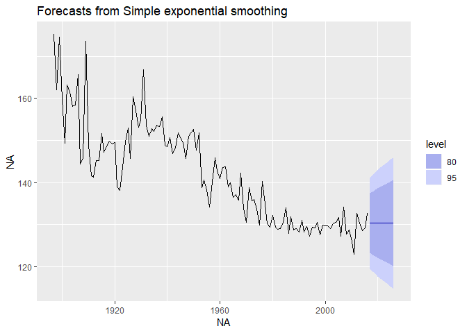<!-- -->

```r
# Add the one-step forecasts for the training data to the plot
autoplot(fc) + autolayer(fitted(fc))
```

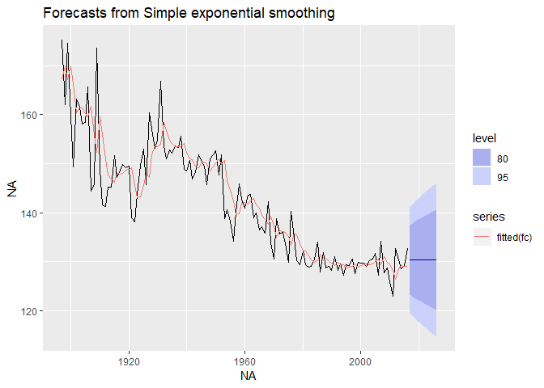<!-- -->

```r
# Create a training set using subset()
train <- subset(marathon, end = length(marathon) - 20)

# Compute SES and naive forecasts, save to fcses and fcnaive
fcses <- ses(train, h = 20)
fcnaive <- naive(train, h = 20)

# Calculate forecast accuracy measures
accuracy(fcses, marathon)
```

```
##                      ME     RMSE      MAE        MPE     MAPE      MASE
## Training set -1.0851741 5.863790 4.155948 -0.8603998 2.827993 0.8990906
## Test set      0.4574579 2.493971 1.894237  0.3171919 1.463862 0.4097960
##                     ACF1 Theil's U
## Training set -0.01595953        NA
## Test set     -0.12556096 0.6870735
```

```r
accuracy(fcnaive, marathon)
```

```
##                      ME     RMSE      MAE        MPE     MAPE      MASE
## Training set -0.4638047 6.904742 4.622391 -0.4086317 3.123559 1.0000000
## Test set      0.2266667 2.462113 1.846667  0.1388780 1.429608 0.3995047
##                    ACF1 Theil's U
## Training set -0.3589323        NA
## Test set     -0.1255610 0.6799062
```

```r
# Save the best forecasts as fcbest
fcbest <- fcnaive
```

### Exponential smoothing methods with trend
In case the underlying data exhibits a trend we have to add a trend component to the simple exponential smoothing. This is called **Holt's linear trend** and can be expressed as adding a trend equation, such that we get: 

- Forecast: $\hat{y}_{t+h|t} = \ell_t $
- Level: $\ell_t = \alpha y_t + (1-\alpha) \ell_{t-1}$
- Trend: $b_t = \beta^* (\ell_t - \ell_{t-1}) + (1- \beta^*) b_{t-1} $

with the two smoothing parameters $\alpha$ and $\beta^*$. 


```r
# Holt's method in R
marathon %>% 
  holt(h=5) %>% 
  autoplot()
```

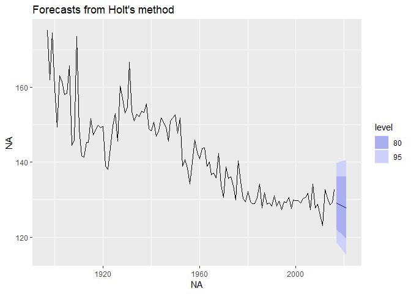<!-- -->

Another, closely related, method is the **Damped trend method** which has a damping parameter $0 < \phi < 1$:

- $\hat{y}_{t+h|t} = \ell_t + (\phi + phi^2 + ... + \phi^h) b_t$
- $\ell_t = \alpha y_t + (1-\alpha)(\ell_{t-1} + \phi b_{t-1})$
- $b_t = \beta^* (\ell_t - \ell_{t-1}) + (1- \beta^*)\phi b_{t-1} $

If $\phi = 1$, this is identical to Holt's method.


```r
# Produce 10 year forecasts of austa using holt()
fcholt <- holt(austa, h=10, PI=FALSE)
fcholt_d <- holt(austa, h=10, damped = TRUE, PI =FALSE) 

# Look at fitted model using summary()
summary(fcholt)
```

```
## 
## Forecast method: Holt's method
## 
## Model Information:
## Holt's method 
## 
## Call:
##  holt(y = austa, h = 10, PI = FALSE) 
## 
##   Smoothing parameters:
##     alpha = 0.9999 
##     beta  = 0.0085 
## 
##   Initial states:
##     l = 0.656 
##     b = 0.1706 
## 
##   sigma:  0.1952
## 
##      AIC     AICc      BIC 
## 17.14959 19.14959 25.06719 
## 
## Error measures:
##                      ME      RMSE       MAE       MPE     MAPE      MASE
## Training set 0.00372838 0.1840662 0.1611085 -1.222083 5.990319 0.7907078
##                   ACF1
## Training set 0.2457733
## 
## Forecasts:
##      Point Forecast
## 2016       7.030683
## 2017       7.202446
## 2018       7.374209
## 2019       7.545972
## 2020       7.717736
## 2021       7.889499
## 2022       8.061262
## 2023       8.233025
## 2024       8.404788
## 2025       8.576552
```

```r
summary(fcholt_d)
```

```
## 
## Forecast method: Damped Holt's method
## 
## Model Information:
## Damped Holt's method 
## 
## Call:
##  holt(y = austa, h = 10, damped = TRUE, PI = FALSE) 
## 
##   Smoothing parameters:
##     alpha = 0.9999 
##     beta  = 0.3722 
##     phi   = 0.9155 
## 
##   Initial states:
##     l = 0.8185 
##     b = 0.0097 
## 
##   sigma:  0.2084
## 
##      AIC     AICc      BIC 
## 22.70137 25.59792 32.20249 
## 
## Error measures:
##                      ME     RMSE       MAE      MPE     MAPE     MASE
## Training set 0.05346145 0.193374 0.1591405 1.970448 5.154104 0.781049
##                    ACF1
## Training set 0.05294818
## 
## Forecasts:
##      Point Forecast
## 2016       7.175836
## 2017       7.465970
## 2018       7.731594
## 2019       7.974778
## 2020       8.197418
## 2021       8.401248
## 2022       8.587859
## 2023       8.758705
## 2024       8.915118
## 2025       9.058317
```

```r
# Plot the forecasts
autoplot(austa) + 
  autolayer(fcholt, series="Linear Trend") +
  autolayer(fcholt_d, series="Damped Trend")
```

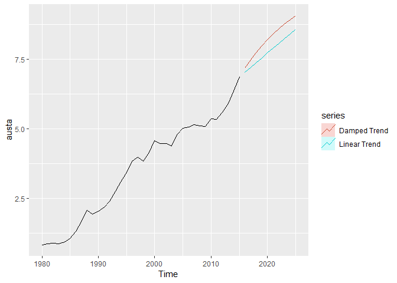<!-- -->

```r
# Check that the residuals look like white noise
checkresiduals(fcholt)
```

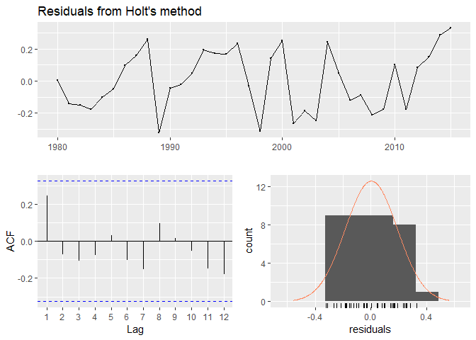<!-- -->

```
## 
## 	Ljung-Box test
## 
## data:  Residuals from Holt's method
## Q* = 4.8886, df = 3.2, p-value = 0.2022
## 
## Model df: 4.   Total lags used: 7.2
```

### Holt-Winter's method with trend and seasonality
Additional seasonal component to Holt's method. 

**Holt-Winter's additive method**:

- Forecast: $\hat{y}_{t+h|t} = \ell_t + hb_t + s_{t-m+ h_{m}^+}$
- Level: $\ell_t = \alpha (y_t - s_{t-m}) + (1-\alpha)( \ell_{t-1} + b_{t-1})$
- Trend: $b_t = \beta^* (\ell_t - \ell_{t-1}) + (1- \beta^*) b_{t-1} $
- Seasonal: $\gamma(y_t - l_{t-1} - b_{t-1} + (1-\gamma) s_{t-m}$

$m=$ period of seasonality (e.g. 4 for quarterly data)

There is also a multiplicative version of Holt-Winter's method, which is preferred in case where the seasonal variation increases with level of the series (greater variance). This is often the case. 


```r
aust <- window(austourists, start=2005)
fc1 <- hw(aust, seasonal="additive", PI=FALSE)
fc2 <- hw(aust, seasonal = "multiplicative", PI=FALSE)

autoplot(aust) +
  autolayer(fc1, series="additive") +
  autolayer(fc2, series="multiplicative")
```

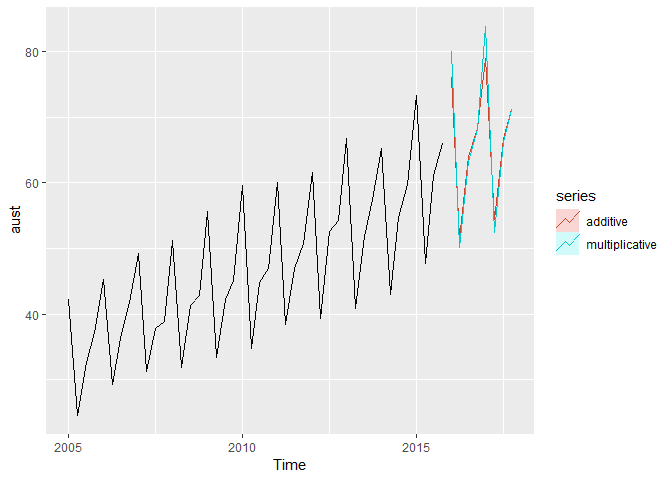<!-- -->

```r
# Plot the data
autoplot(a10)
```

<!-- -->

```r
# Produce 3 year forecasts
fc <- hw(a10, seasonal = "multiplicative", h = 36)

# Check if residuals look like white noise
checkresiduals(fc)
```

<!-- -->

```
## 
## 	Ljung-Box test
## 
## data:  Residuals from Holt-Winters' multiplicative method
## Q* = 75.764, df = 8, p-value = 3.467e-13
## 
## Model df: 16.   Total lags used: 24
```

```r
whitenoise <- FALSE

# Plot forecasts
autoplot(fc)
```

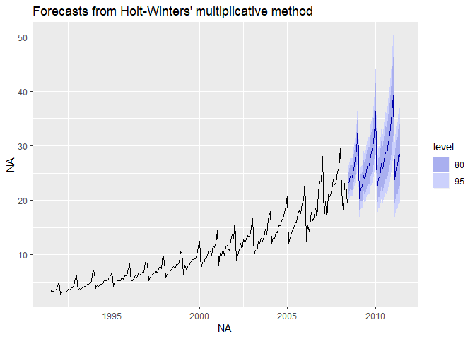<!-- -->

```r
# Create training data with subset()
train <- subset(hyndsight, end = length(hyndsight) - (4*7))

# Holt-Winters additive forecasts as fchw
fchw <- hw(train, seasonal = "additive", h = (4*7))

# Seasonal naive forecasts as fcsn
fcsn <- snaive(train, 28)

# Find better forecasts with accuracy()
accuracy(fchw, hyndsight)
```

```
##                     ME     RMSE      MAE       MPE    MAPE      MASE
## Training set -3.976241 228.2440 165.0244 -2.407211 13.9955 0.7492131
## Test set     -3.999460 201.7656 152.9584 -3.218292 10.5558 0.6944332
##                   ACF1 Theil's U
## Training set 0.1900853        NA
## Test set     0.3013328 0.4868701
```

```r
accuracy(fcsn, hyndsight)
```

```
##                 ME     RMSE      MAE        MPE     MAPE      MASE
## Training set 10.50 310.3282 220.2636 -2.1239387 18.01077 1.0000000
## Test set      0.25 202.7610 160.4643 -0.6888732 10.25880 0.7285101
##                   ACF1 Theil's U
## Training set 0.4255730        NA
## Test set     0.3089795  0.450266
```

```r
# Plot the better forecasts
autoplot(fchw)
```

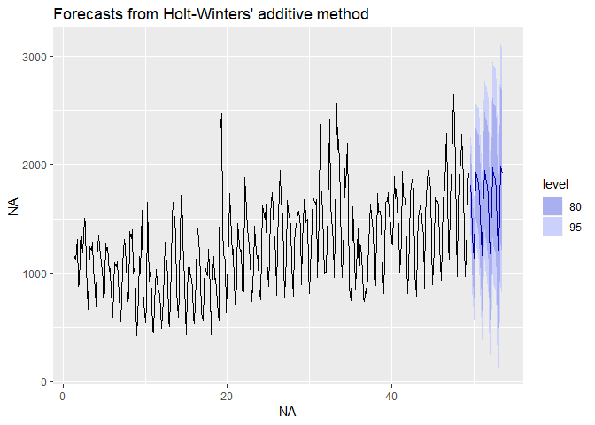<!-- -->

### State space models for exponential smoothing
Each exponential smoothing method can be written as an **innovations state space model**. In genereal, there are 18 possible state space models: 

- Trend = {None, Adittive, Additive_dampened}
- Seasonal = {None, Additive, Multiplicative}

which result in 9 possible exponential smoothing methods and 

- Error = {Addittive, Multiplicative}

leading to 18 possible state space models. These are called ETS models (Error, Trend, Seasonal). Parameters of ETS models can be estimated using **Maximum Likelihood Estimation**, which is the probability of the data arising from the specified model. For models with additive errors, this is equivalent to minimizing SSE. Choose the best model by minimizing a corrected version of Akaike's Information Criterion (AIC_c). The function `ets()` does this internally yielding to the best model fit. This function gives you the best model without forecasting. Hence, it has to be handed to the forecasting function. 


```r
# ETS model on ausair
ausair %>%
  ets() %>% 
  forecast() %>% 
  autoplot()
```

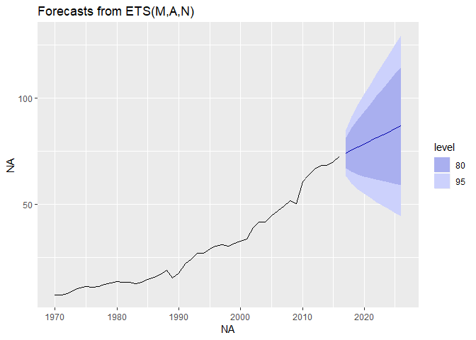<!-- -->

```r
h02 %>% 
  ets() %>% 
  forecast() %>% 
  autoplot()
```

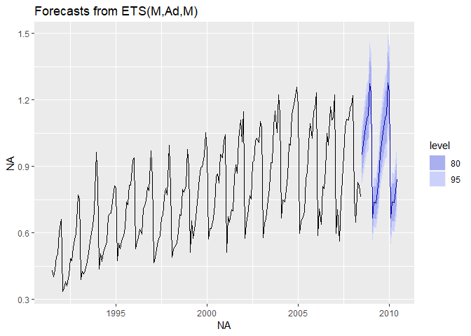<!-- -->

Type of model is chosen for you in the ets() function. 


```r
# Fit ETS model to austa in fitaus
fitaus <- ets(austa)

# Check residuals
checkresiduals(fitaus)
```

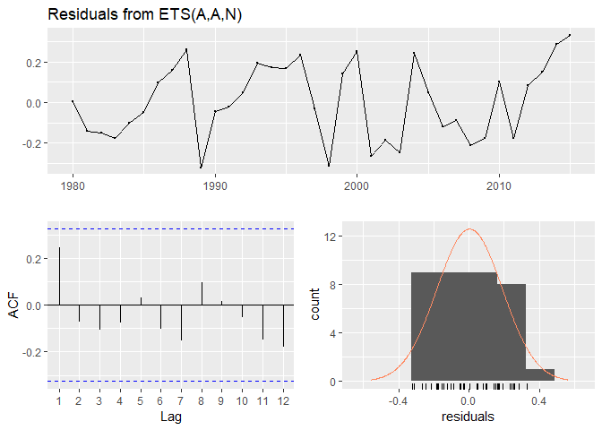<!-- -->

```
## 
## 	Ljung-Box test
## 
## data:  Residuals from ETS(A,A,N)
## Q* = 4.8886, df = 3.2, p-value = 0.2022
## 
## Model df: 4.   Total lags used: 7.2
```

```r
# Plot forecasts
autoplot(forecast(fitaus))
```

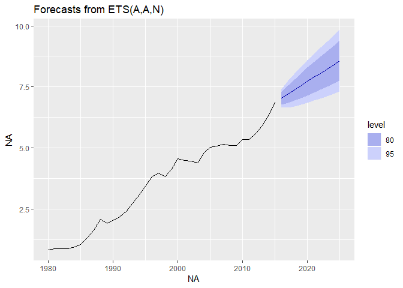<!-- -->

```r
# Repeat for hyndsight data in fiths
fiths <- ets(hyndsight)
checkresiduals(fiths)
```

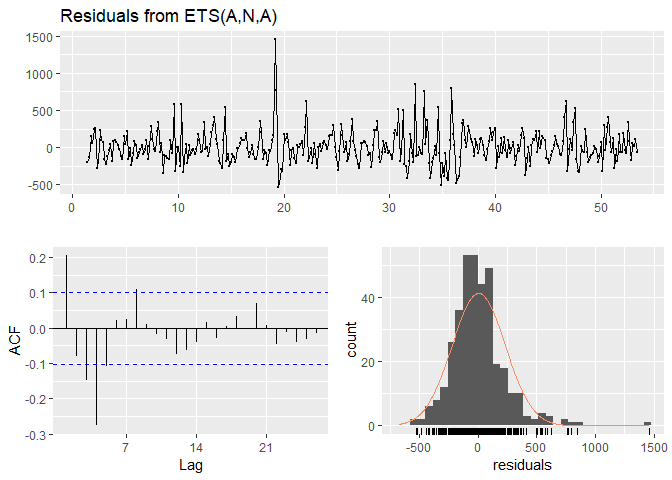<!-- -->

```
## 
## 	Ljung-Box test
## 
## data:  Residuals from ETS(A,N,A)
## Q* = 68.616, df = 5, p-value = 1.988e-13
## 
## Model df: 9.   Total lags used: 14
```

```r
autoplot(forecast(fiths))
```

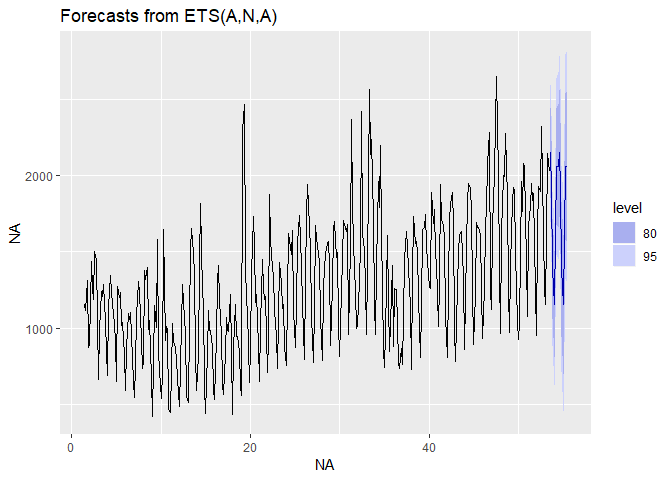<!-- -->

The null hypothesis of independently distributed residuals can not be rejected for the first model but can be rejected for the second one. Hence, the residuals of the ETS model on `hyndsight` exhibts serial correlation. 


```r
autoplot(austres)
```

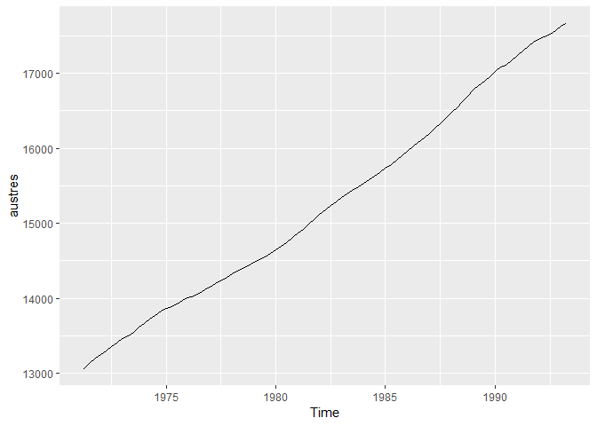<!-- -->

```r
# Function to return ETS forecasts
fets <- function(y, h) {
  forecast(ets(y), h = h)
}

# Apply tsCV() for both methods
e1 <- tsCV(austres, fets, h = 4)
e2 <- tsCV(austres, snaive, h = 4)

# Compute MSE of resulting errors (watch out for missing values)
mean(e1^2, na.rm=TRUE)
```

```
## [1] 1658.267
```

```r
mean(e2^2, na.rm=TRUE)
```

```
## [1] 44629.08
```

It is important to realize that ETS doesn't work for all cases (because...):


```r
# Plot the lynx series
autoplot(lynx)
```

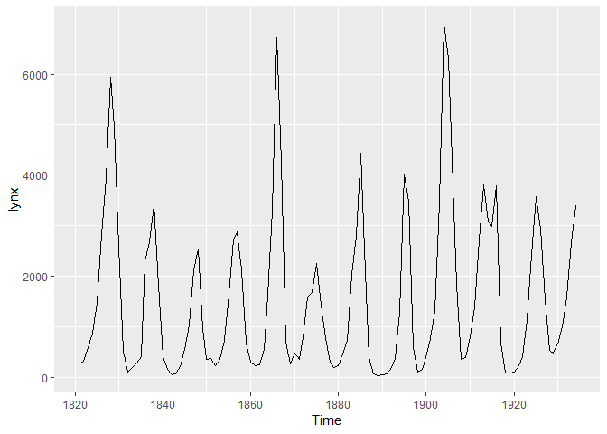<!-- -->

```r
# Use ets() to model the lynx series
fit <- ets(lynx)

# Use summary() to look at model and parameters
summary(fit)
```

```
## ETS(M,N,N) 
## 
## Call:
##  ets(y = lynx) 
## 
##   Smoothing parameters:
##     alpha = 0.9999 
## 
##   Initial states:
##     l = 2372.8047 
## 
##   sigma:  0.9594
## 
##      AIC     AICc      BIC 
## 2058.138 2058.356 2066.346 
## 
## Training set error measures:
##                    ME     RMSE      MAE       MPE     MAPE     MASE
## Training set 8.975647 1198.452 842.0649 -52.12968 101.3686 1.013488
##                   ACF1
## Training set 0.3677583
```

```r
forecast(fit, 20)
```

```
##      Point Forecast         Lo 80       Hi 80        Lo 95       Hi 95
## 1935       3395.926     -779.2712    7571.123    -2989.487    9781.339
## 1936       3395.926    -3738.6446   10530.497    -7515.458   14307.310
## 1937       3395.926    -7335.8303   14127.682   -13016.879   19808.731
## 1938       3395.926   -12050.0589   18841.911   -20226.670   27018.522
## 1939       3395.926   -18411.0740   25202.926   -29955.002   36746.855
## 1940       3395.926   -27109.2707   33901.123   -43257.746   50049.599
## 1941       3395.926   -39081.0825   45872.935   -61567.053   68358.905
## 1942       3395.926   -55612.7533   62404.605   -86850.061   93641.913
## 1943       3395.926   -78479.4932   85271.345  -121821.722  128613.574
## 1944       3395.926  -110136.4415  116928.294  -170236.846  177028.699
## 1945       3395.926  -153982.3894  160774.242  -237293.437  244085.289
## 1946       3395.926  -214724.7304  221516.583  -330190.831  336982.683
## 1947       3395.926  -298884.8721  305676.724  -458902.661  465694.513
## 1948       3395.926  -415498.3931  422290.245  -637247.651  644039.503
## 1949       3395.926  -577085.1204  583876.973  -884373.225  891165.077
## 1950       3395.926  -800993.2803  807785.132 -1226811.204 1233603.057
## 1951       3395.926 -1111262.0338 1118053.886 -1701326.315 1708118.167
## 1952       3395.926 -1541202.3624 1547994.215 -2358863.305 2365655.157
## 1953       3395.926 -2136973.3913 2143765.243 -3270016.466 3276808.318
## 1954       3395.926 -2962538.1116 2969329.964 -4532608.750 4539400.603
```

## Ch. 4: Forecasting with ARIMA models

### Transformations for variance stabilization
If the data show increasing variation as the level of the series increases, then a transformation can be useful. Some common transformations to stabilize the vartiation are: 

- Square root: $w_t = \sqrt{y_t}$
- Cube root: $w_t = \sqrt[3]{y_t}$
- Logarithm: $w_t = log(y_t)$
- Inverse: $w_t = -y_t^{-1}$


```r
autoplot(usmelec) +
  xlab("Year") +
  ylab("") +
  ggtitle("US monthly net electricity generation")
```

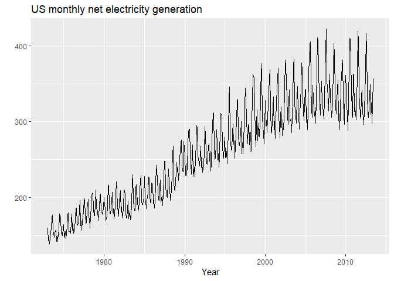<!-- -->

```r
autoplot(log(usmelec)) +
  xlab("Year") +
  ylab("") +
  ggtitle("Log electricity generation")
```

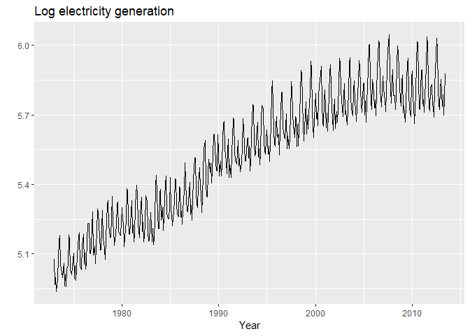<!-- -->

```r
autoplot(-1/usmelec) +
  xlab("Year") +
  ylab("") +
  ggtitle("Log electricity generation")
```

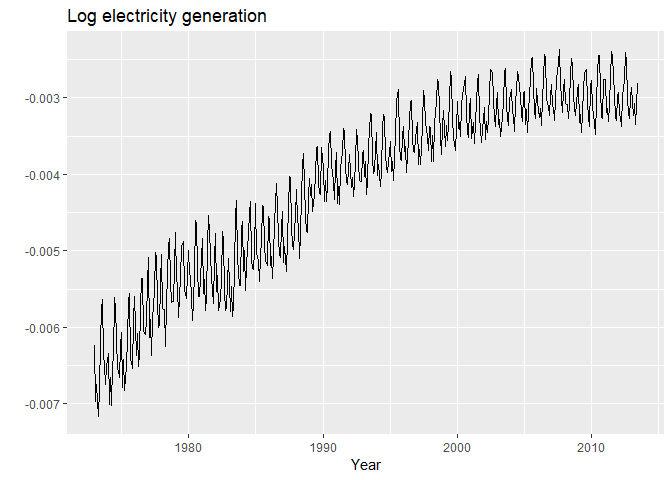<!-- -->

From the three transformations it seems as if we'd like to have something in between the `log`-transformation and the `inverse`-transformation. This is where the family of **Box-Cox transformations** come into play.

The **Box-Cox transformation** has a single parameter, $\lambda$, which controls how strong the transformation is: 

- $w_t = log(y_t)$,if $\lambda = 0$ 
- $w_t = (y_t^\lambda - 1) / \lambda$, if $\lambda \neq 0$

This leads to the following transformations for different parameters of $lambda$.

- $\lambda = 1$: No substantive transformation (subtracting 1 from every observation)
- $\lambda = \frac{1}{2}$: Square root plus linear transformation
- $\lambda = \frac{1}{3}$: Cube root plus linear transformation

An estimate of lambda, which roughly balances the variance can be obtained using the `BoxCox.lambda()` function. 


```r
# Estimate for lambda
lmd <- BoxCox.lambda(usmelec)

autoplot(BoxCox(usmelec, lmd)) +
  xlab("Year") +
  ylab("") +
  ggtitle("Box-Cox: Electricity generation")
```

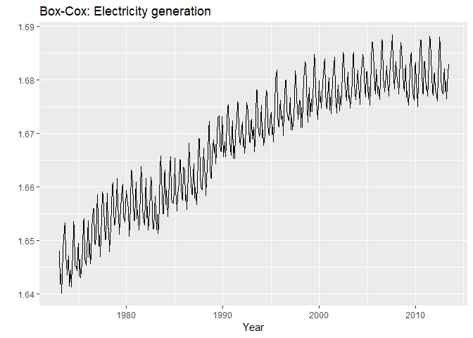<!-- -->

```r
# Apply this to ets function
usmelec %>% 
  ets(lambda = lmd) %>% 
  forecast(h = 60) %>% 
  autoplot()
```

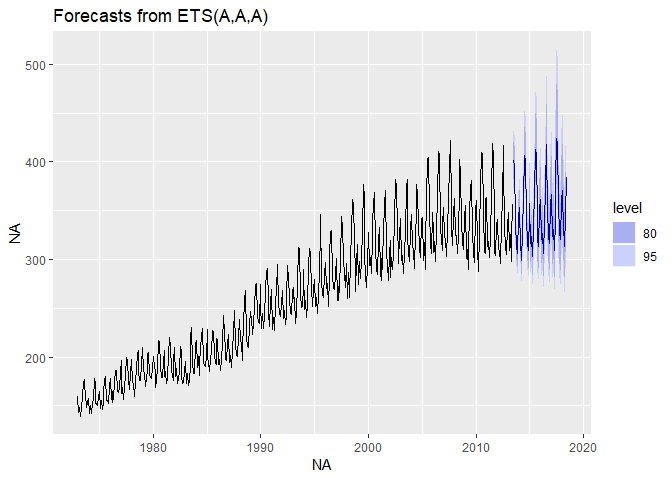<!-- -->

Here, R uses lmd for the Box-Cox transformation applies this to the chosen model and fits the model. Then, it passes this to the forecast function together with inforamtion on the transformation yielding in back-transformed forecasts for the series. Note that the ets function itself can take care of the varying fluctuations and that the combination of ets and Box-Cox transformation is not taht common.


```r
# Plot the data
autoplot(h02)
```

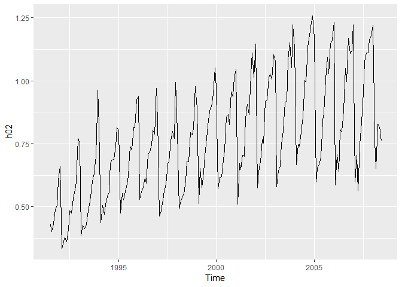<!-- -->

```r
# Take logs and seasonal differences of h02
difflogh02 <- diff(log(h02), lag = 12)

# Plot difflogh02
autoplot(difflogh02)
```

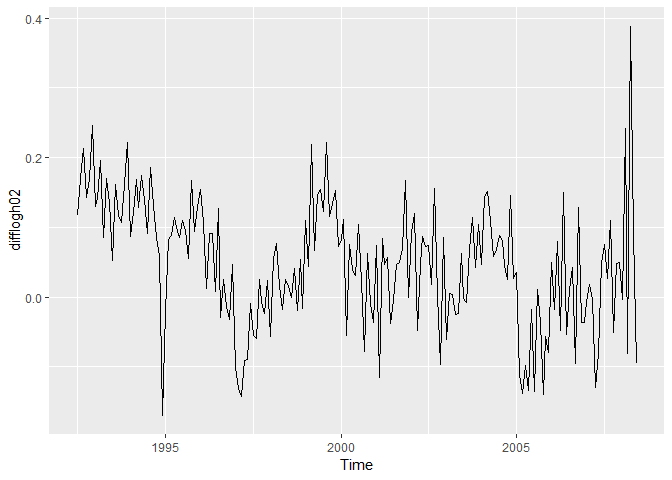<!-- -->

```r
# Take another difference and plot
ddifflogh02 <- diff(difflogh02)
autoplot(ddifflogh02)
```

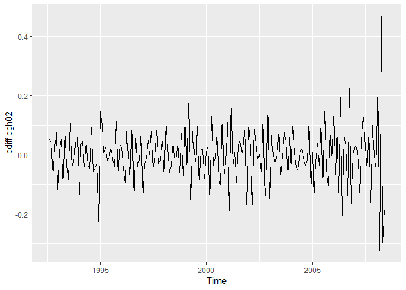<!-- -->

```r
# Plot ACF of ddifflogh02
ggAcf(ddifflogh02)
```

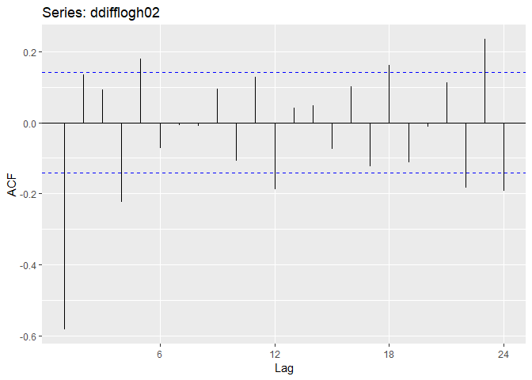<!-- -->

### ARIMA models
AR(p) models are multiple regression with p lagged observations as predictors and MA(q) models are multiple regression with q lagged errors as predictors. More information see Course 2 and Course 3. Together they are called ARMA(p,q) model as multiple regression with p lagged observations and q lagged errors as predictors. ARMA(p,q) works only with stationary data. That's where the I in ARIMA comes into play. A model that is integrated of order d is an ARIMA(p,d,q) model. 

```r
autoplot(usnetelec) +
  xlab("Year") +
  ylab("billion kwh") +
  ggtitle("US net electricity generation")
```

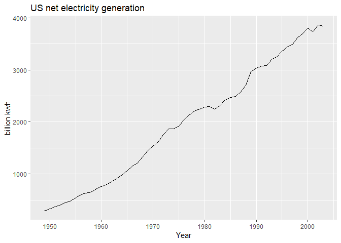<!-- -->

The `auto.arima()`function chooses an ARIMA function on its own:


```r
fit <- auto.arima(usnetelec)
summary(fit)
```

```
## Series: usnetelec 
## ARIMA(2,1,2) with drift 
## 
## Coefficients:
##           ar1      ar2     ma1     ma2    drift
##       -1.3032  -0.4332  1.5284  0.8340  66.1585
## s.e.   0.2122   0.2084  0.1417  0.1185   7.5595
## 
## sigma^2 estimated as 2262:  log likelihood=-283.34
## AIC=578.67   AICc=580.46   BIC=590.61
## 
## Training set error measures:
##                      ME     RMSE     MAE        MPE     MAPE      MASE
## Training set 0.04640184 44.89414 32.3328 -0.6177064 2.101204 0.4581279
##                    ACF1
## Training set 0.02249247
```

```r
fit %>% 
  forecast(h=10) %>% 
  autoplot()
```

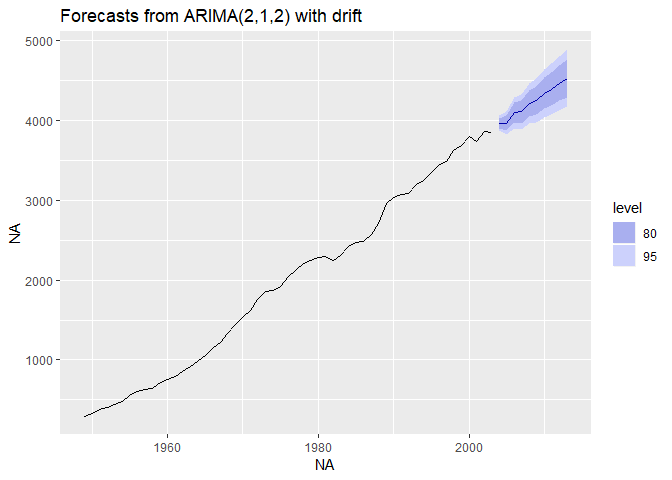<!-- -->

The `auto.arima()` function selects the number of differences d via unit root tests and afterwards select p and q by minimizin AICc. Parameters are estimated using maximum likelihood estimation. 


```r
# Fit an automatic ARIMA model to the austa series
fit <- auto.arima(austa)

# Check that the residuals look like white noise
checkresiduals(fit)
```

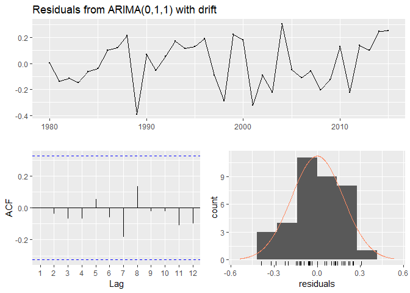<!-- -->

```
## 
## 	Ljung-Box test
## 
## data:  Residuals from ARIMA(0,1,1) with drift
## Q* = 2.297, df = 5.2, p-value = 0.8266
## 
## Model df: 2.   Total lags used: 7.2
```

```r
residualsok <- TRUE

# Summarize the model
summary(fit)
```

```
## Series: austa 
## ARIMA(0,1,1) with drift 
## 
## Coefficients:
##          ma1   drift
##       0.3006  0.1735
## s.e.  0.1647  0.0390
## 
## sigma^2 estimated as 0.03376:  log likelihood=10.62
## AIC=-15.24   AICc=-14.46   BIC=-10.57
## 
## Training set error measures:
##                        ME      RMSE       MAE       MPE     MAPE      MASE
## Training set 0.0008313383 0.1759116 0.1520309 -1.069983 5.513269 0.7461559
##                      ACF1
## Training set -0.000571993
```

```r
# Plot forecasts of fit
fit %>% forecast(h = 10) %>% autoplot() 
```

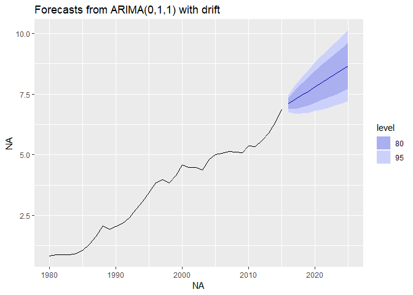<!-- -->

```r
# Plot forecasts from an ARIMA(0,1,1) model with no drift
austa %>% Arima(order = c(0,1,1), include.constant = FALSE) %>% forecast() %>% autoplot()
```

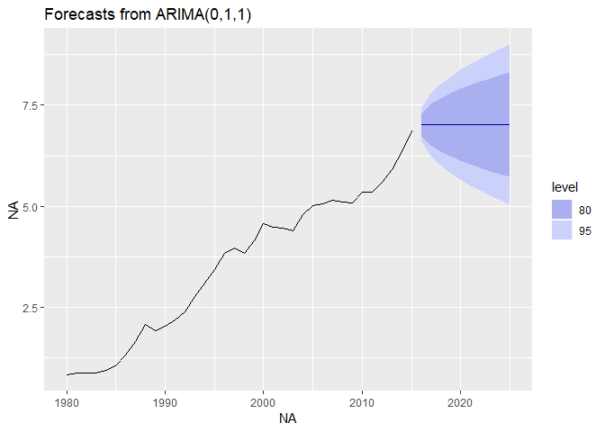<!-- -->

```r
# Plot forecasts from an ARIMA(2,1,3) model with drift
austa %>% Arima(order=c(2,1,3), include.constant=TRUE) %>% forecast() %>% autoplot()
```

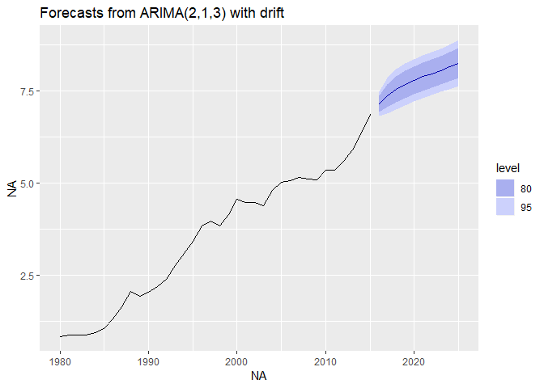<!-- -->

```r
# Plot forecasts from an ARIMA(0,0,1) model with a constant
austa %>% Arima(order=c(0,0,1), include.constant=TRUE) %>% forecast() %>% autoplot()
```

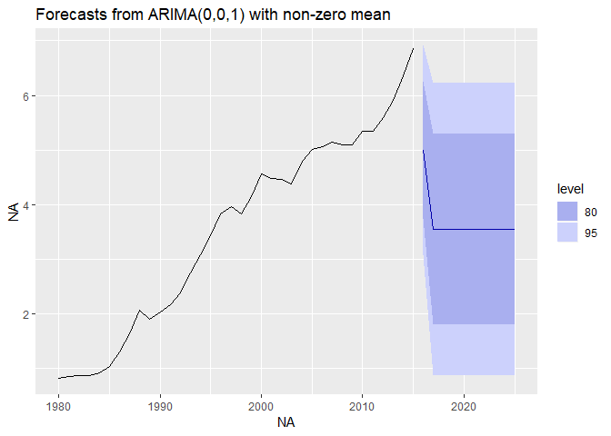<!-- -->

```r
# Plot forecasts from an ARIMA(0,2,1) model with no constant
austa %>% Arima(order=c(0,2,1), include.constant=FALSE) %>% forecast() %>% autoplot()
```

<!-- -->

The AICc statistic is useful for selecting between models in the same class. For example, you can use it to select an ETS model or to select an ARIMA model. However, you cannot use it to compare ETS and ARIMA models because they are in different model classes. Instead, you can use time series cross-validation to compare an ARIMA model and an ETS model on the austa data. Because tsCV() requires functions that return forecast objects, you will set up some simple functions that fit the models and return the forecasts. The arguments of tsCV() are a time series, forecast function, and forecast horizon h. 


```r
# Set up forecast functions for ETS and ARIMA models
fets <- function(x, h) {
  forecast(ets(x), h = h)
}
farima <- function(x, h) {
  forecast(auto.arima(x), h = h)
}

# Compute CV errors for ETS as e1
e1 <- tsCV(austa, fets, 1)

# Compute CV errors for ARIMA as e2
e2 <- tsCV(austa, farima, 1)

# Find MSE of each model class
mean(e1^2, na.rm=TRUE)
```

```
## [1] 0.05623684
```

```r
mean(e2^2, na.rm=TRUE)
```

```
## [1] 0.04336277
```

```r
# Plot 10-year forecasts using the best model class
austa %>% farima(h=10) %>% autoplot()
```

<!-- -->

### Seasonal ARIMA models


```r
# Seasonal arima with auto.arima()
autoplot(debitcards) +
  xlab("Year") + 
  ylab("million ISK") +
  ggtitle("Retail debit card usage in Iceland")
```

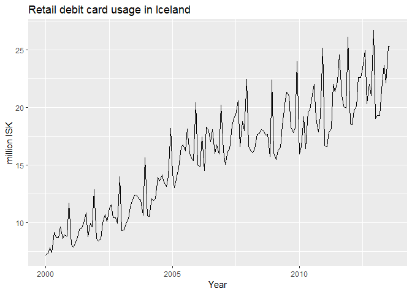<!-- -->

```r
# Increasing variation -> Box-Cox
lmd <- BoxCox.lambda(debitcards)
# Use auto.arima to fit seasonal model
fit <- auto.arima(debitcards, lambda = lmd)
fit
```

```
## Series: debitcards 
## ARIMA(0,1,2)(0,1,1)[12] 
## Box Cox transformation: lambda= 0.09078485 
## 
## Coefficients:
##           ma1     ma2     sma1
##       -0.8221  0.2106  -0.8311
## s.e.   0.0854  0.0948   0.1136
## 
## sigma^2 estimated as 0.003878:  log likelihood=199.12
## AIC=-390.25   AICc=-389.97   BIC=-378.18
```

```r
# Forecasting and plotting
fit %>% 
  forecast(h =36) %>% 
  autoplot() + xlab("Year")
```

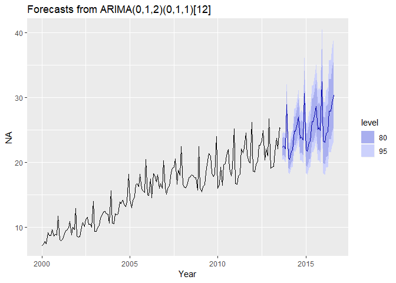<!-- -->

```r
### h02 data ###
# Check that the logged h02 data have stable variance
h02 %>% log() %>% autoplot()
```

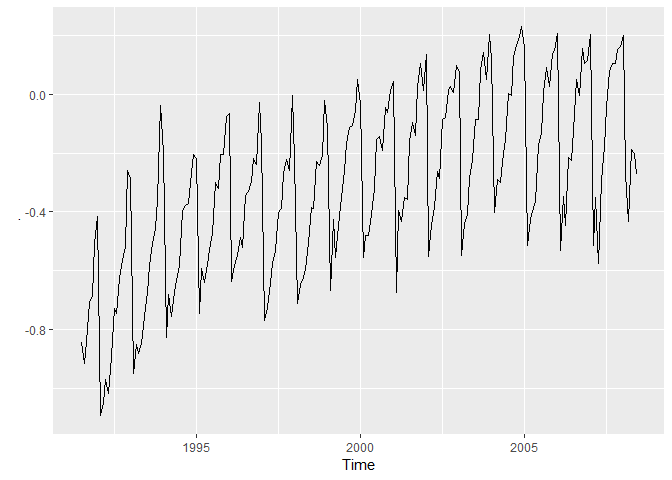<!-- -->

```r
# Fit a seasonal ARIMA model to h02 with lambda = 0
fit <- auto.arima(h02, lambda=0)

# Summarize the fitted model
summary(fit)
```

```
## Series: h02 
## ARIMA(2,1,1)(0,1,2)[12] 
## Box Cox transformation: lambda= 0 
## 
## Coefficients:
##           ar1      ar2     ma1     sma1     sma2
##       -1.1358  -0.5753  0.3683  -0.5318  -0.1817
## s.e.   0.1608   0.0965  0.1884   0.0838   0.0881
## 
## sigma^2 estimated as 0.004278:  log likelihood=248.25
## AIC=-484.51   AICc=-484.05   BIC=-465
## 
## Training set error measures:
##                        ME      RMSE        MAE        MPE     MAPE
## Training set -0.003931805 0.0501571 0.03629816 -0.5323365 4.611253
##                   MASE         ACF1
## Training set 0.5987988 -0.003740267
```

```r
# Record the amount of lag-1 differencing and seasonal differencing used
d <- 1
D <- 1

# Plot 2-year forecasts
fit %>% forecast(h=24) %>% autoplot()
```

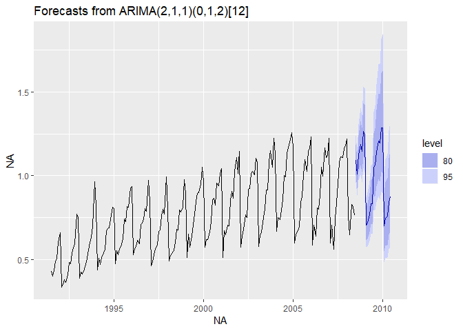<!-- -->

```r
### euretail ###
# Find an ARIMA model for euretail
fit1 <- auto.arima(euretail)

# Don't use a stepwise search
fit2 <- auto.arima(euretail, stepwise = FALSE)

# AICc of better model
AICc <- 68.39

# Compute 2-year forecasts from better model
fit2 %>% forecast(h=8) %>% autoplot()
```

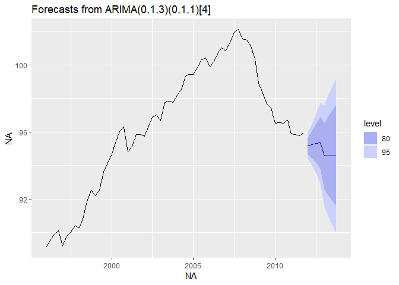<!-- -->

Comparing auto.arima() and ets() on seasonal data.


```r
# Use 20 years of the qcement data beginning in 1988
train <- window(qcement, start = c(1988,1), end = c(2007,4))

# Fit an ARIMA and an ETS model to the training data
fit1 <- auto.arima(train)
fit2 <- ets(train)

# Check that both models have white noise residuals
checkresiduals(fit1)
```

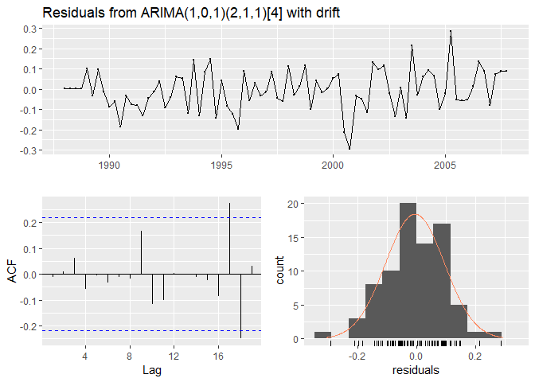<!-- -->

```
## 
## 	Ljung-Box test
## 
## data:  Residuals from ARIMA(1,0,1)(2,1,1)[4] with drift
## Q* = 3.3058, df = 3, p-value = 0.3468
## 
## Model df: 6.   Total lags used: 9
```

```r
checkresiduals(fit2)
```

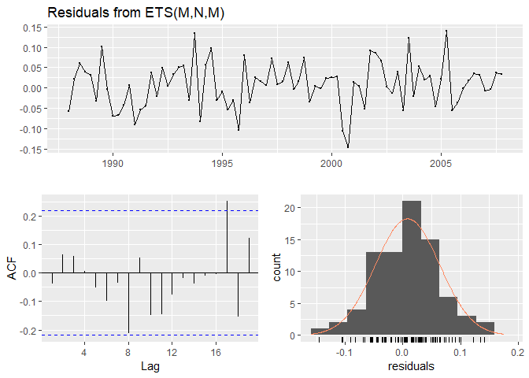<!-- -->

```
## 
## 	Ljung-Box test
## 
## data:  Residuals from ETS(M,N,M)
## Q* = 6.3457, df = 3, p-value = 0.09595
## 
## Model df: 6.   Total lags used: 9
```

```r
# Produce forecasts for each model
fc1 <- forecast(fit1, h = 25)
fc2 <- forecast(fit2, h = 25)

# Use accuracy() to find better model based on RMSE
accuracy(fc1, qcement)
```

```
##                        ME      RMSE        MAE        MPE     MAPE
## Training set -0.006205705 0.1001195 0.07988903 -0.6704455 4.372443
## Test set     -0.158835253 0.1996098 0.16882205 -7.3332836 7.719241
##                   MASE        ACF1 Theil's U
## Training set 0.5458078 -0.01133907        NA
## Test set     1.1534049  0.29170452 0.7282225
```

```r
accuracy(fc2, qcement)
```

```
##                       ME      RMSE        MAE        MPE     MAPE
## Training set  0.01406512 0.1022079 0.07958478  0.4938163 4.371823
## Test set     -0.13495515 0.1838791 0.15395141 -6.2508975 6.986077
##                   MASE        ACF1 Theil's U
## Training set 0.5437292 -0.03346295        NA
## Test set     1.0518075  0.53438371  0.680556
```

```r
bettermodel <- fit2
```

