```r
library("xts")
library("quantmod")
library("ggplot2")
```
# Time Series Visualization

## R Time Series Visualization Tools
(...)

## Univariate Time Series Analysis
Three basic properties univariate time series visualization should inform about:

- Location
- Dispersion 
- Distribution

Problem again (amazon stock price) is upward trend!


```r
# Indicate start and end date
start_date <- as.Date("2010-01-01")
end_date <- as.Date("2017-04-01")

# Acquire data for Dax
getSymbols("^GDAXI", from=start_date, to=end_date)
```

```
## Warning: ^GDAXI contains missing values. Some functions will not work if
## objects contain missing values in the middle of the series. Consider using
## na.omit(), na.approx(), na.fill(), etc to remove or replace them.
```

```
## [1] "GDAXI"
```

```r
# Focus on closing prices
data <- na.omit(Cl(GDAXI))
plot(data, main="DAX")
```

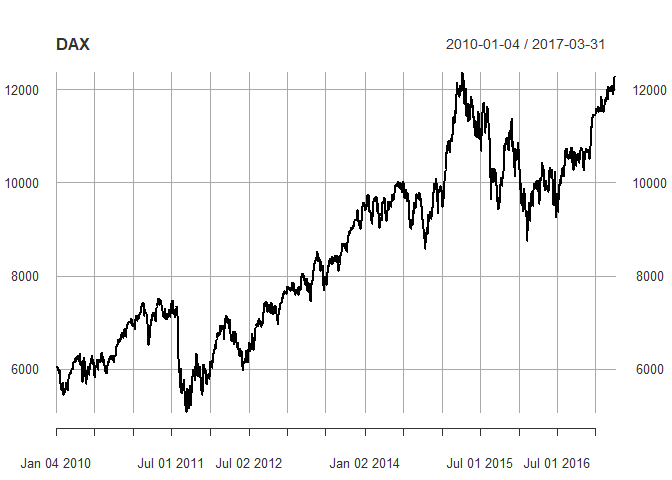<!-- -->

```r
# Get daily returns using ROC()
rtn <- ROC(data)

# plot data and rtn on 2x1 window
par(mfrow=c(2,1))
plot(data)
plot(rtn)
```

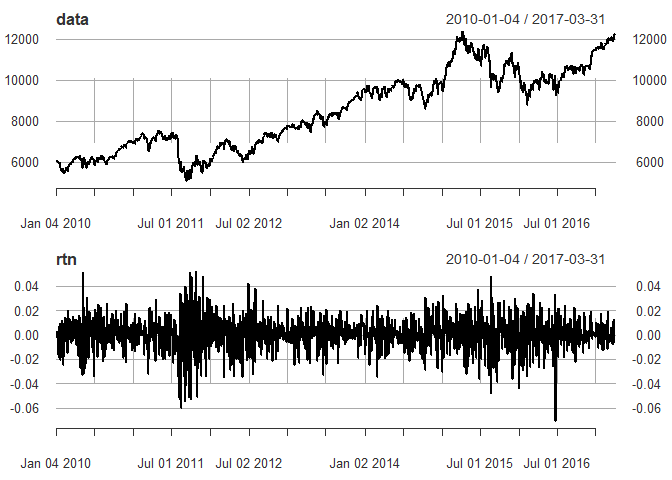<!-- -->

### Other visualization tools

- Histogram: represents first impression of the density of the data


```r
hist(rtn,
     breaks = 20,
     main = "AMAZON return distribution \n Jan. 2015 to Jan. 2017",
     xlab = "",
     probability = TRUE)
lines(density(na.omit(rtn)), lwd=2, col="red")
```

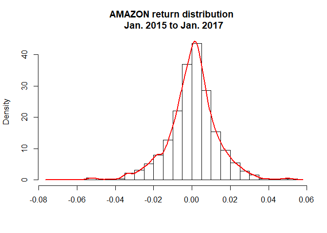<!-- -->

- Box and Whisker plot: Information regarding the shape, variability, and center (or median) oif a data set. 


```r
# Boxplot of daily returns
boxplot(as.numeric(rtn))
```

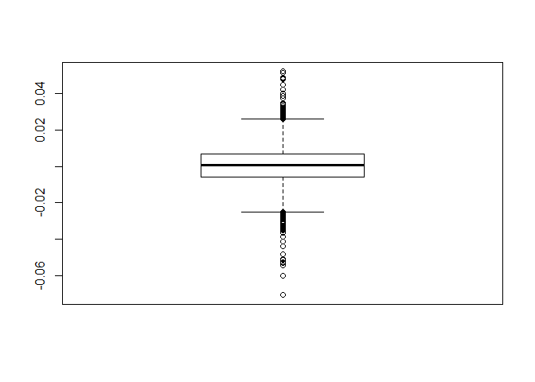<!-- -->

```r
# Boxplot of normal distribution
boxplot(rnorm(1000))
```

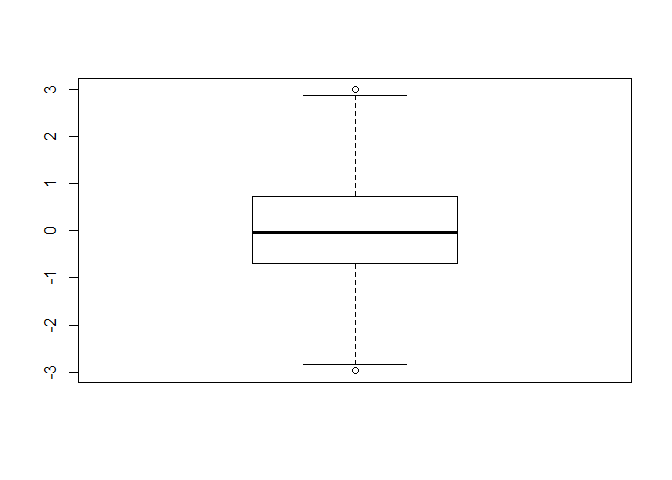<!-- -->

```r
# Now horizontal
par(mfrow=c(2,1))
boxplot(as.numeric(rtn), horizontal = TRUE)
boxplot(rnorm(1000), horizontal=TRUE)
```

<!-- -->

- Autocorrelation plot (not included here again! see other docs)
- (...)

- q-q plot

```r
# if normal distributed this would show a straight line
qqnorm(data)
qqline(data)
```

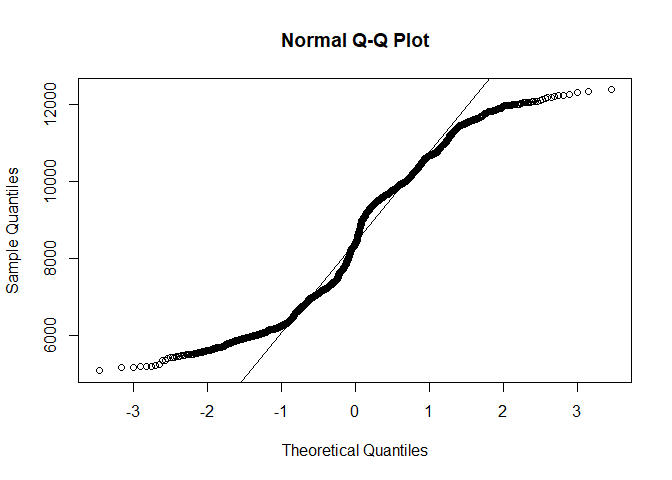<!-- -->

Information to extract from these tools:

- Histogram: Distribution and outliers
- Box and whisker: Center and outliers
- Autocorrelation: Dynamics -> trend in the data?
- QQ-plot: Visual diagnostic of normality. 

## Multivariate Time Series Data in R
Often it is of interest to identify how time series interact. E.g. how a single series reacts to interest rate changes. Also, stock price reaction of several stocks to interest rate changes. The goal is to identify patterns in the data.

Proper analysis of higher-dimensional series requires other, more sophisticated methods than what we have seen for the univariate case. 

Some standard concepts as basis:


```r
# Load different stocks and prepare them for analysis:
# load -> closing price -> returns (closing price) using ROC

# DAX30 Stock price symbol
getSymbols("^GDAXI", from=start_date, to=end_date)
```

```
## Warning: ^GDAXI contains missing values. Some functions will not work if
## objects contain missing values in the middle of the series. Consider using
## na.omit(), na.approx(), na.fill(), etc to remove or replace them.
```

```
## [1] "GDAXI"
```

```r
dax <- ROC(Cl(GDAXI))

# Volkswagen Stock price
getSymbols("VOW.DE",src="yahoo", from=start_date, to=end_date)
```

```
## [1] "VOW.DE"
```

```r
vw <- ROC(Cl(VOW.DE))

# Deutsche Bank AG Stocks 
getSymbols("DBK.DE", from=start_date, to=end_date)
```

```
## [1] "DBK.DE"
```

```r
dbk <- ROC(Cl(DBK.DE))

# bring returns together
df <- as.xts(data.frame(cbind(dax, vw, dbk)))

# Check for NAs
any(is.na(df)); sum(is.na(df)); which(is.na(df))
```

```
## [1] TRUE
```

```
## [1] 5
```

```
## [1]    1 1520 1521 1844 3687
```

```r
# Omit NAs 
df <- na.omit(df)

# change names
names(df) <- c("dax", "vw", "dbk")
```

Two time series grouped or stacked


```r
# barplot
barplot(df[1:12])
```

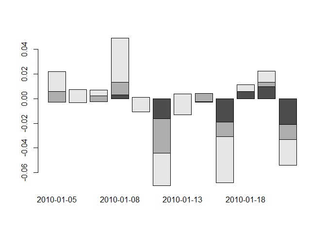<!-- -->

```r
barplot(df[1:12], beside=TRUE)
```

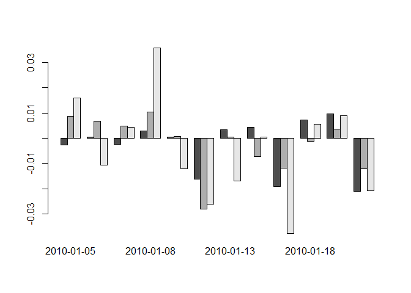<!-- -->

```r
# scatterplot 
plot(x = as.numeric(df$vw), y=as.numeric(df$dbk))

# add regression line 
abline(reg=lm(as.numeric(df$dbk) ~ as.numeric(df$vw)), lwd=2, col="red")
```

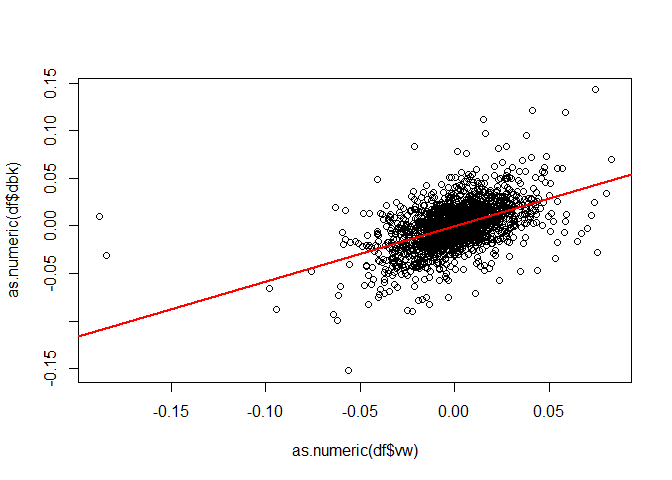<!-- -->

Now: New tools for multivariate time series


```r
# Correlation matrix
round(cor(df), 4)
```

```
##        dax     vw    dbk
## dax 1.0000 0.6807 0.7659
## vw  0.6807 1.0000 0.4995
## dbk 0.7659 0.4995 1.0000
```

```r
# corrplot
library("corrplot")
corrplot(cor(df),
         method="number",
         type="upper")
```

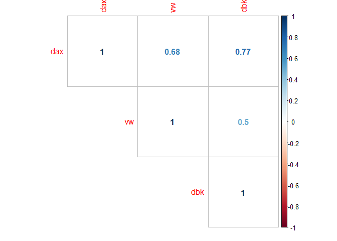<!-- -->

```r
corrplot(cor(df),
         method="color",
         type="upper")
```

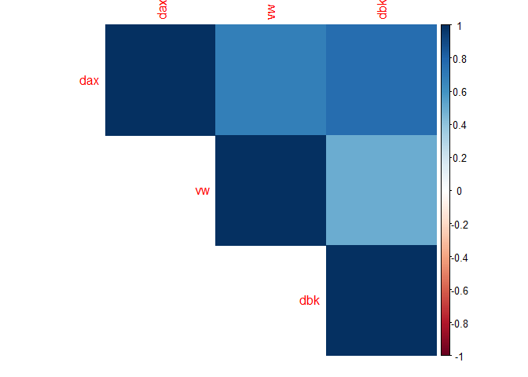<!-- -->

```r
# Series Scatterplots
pairs(as.data.frame(df),
      lower.panel = NULL,
      main = "Stocks Correlation Scatterplots")
```

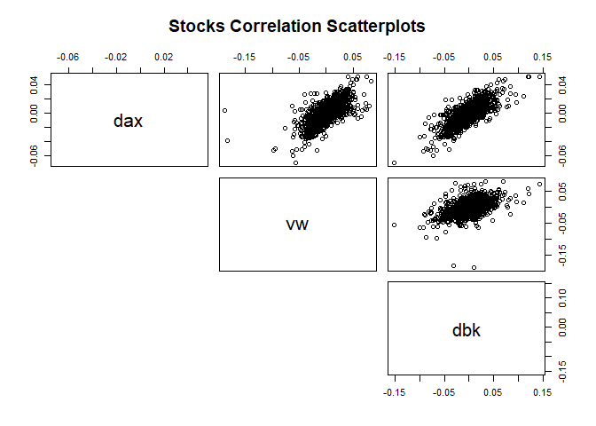<!-- -->

### Higher dimension time series
More than hundred time series? Hard to grasp using correlation matrix for example. But heatmap can be used, which is `corrplot(cor_mat, method="coler", type="upper")`. 

### Case Study
Additional cash to invest in stock. Check correlation to add a stock for corelation. Low correlation to protect from severe losses. Focus on low corelation for this case study...

(...)

A more accurate comparison of portfolios:


```r
library(PerformanceAnalytics)

charts.PerformanceSummary(na.omit(dax))
```

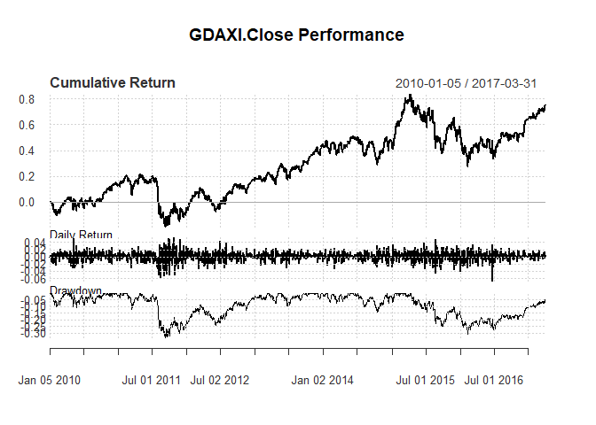<!-- -->


