```r
library("xts")
library("readr")
```

### Review

- What are xts objects? Time index + Matrix of values

## Case Study 1: Flight Data
Data set consists of flight delays and cancellations, 2010 through 2015. 


```r
# read RData directly from datacamp
flights <- readRDS(gzcon(url("https://assets.datacamp.com/production/course_1964/datasets/flights.RData")))

# Check data
head(flights)
```

```
##   total_flights delay_flights cancel_flights divert_flights       date
## 1          8912          1989            279              9 2010-01-01
## 2          8418          1918            785             23 2010-02-01
## 3          9637          2720            242             32 2010-03-01
## 4          9363          1312             58              7 2010-04-01
## 5          9360          1569            102              8 2010-05-01
## 6          9502          1955            157              5 2010-06-01
```

```r
str(flights)
```

```
## 'data.frame':	72 obs. of  5 variables:
##  $ total_flights : num  8912 8418 9637 9363 9360 ...
##  $ delay_flights : num  1989 1918 2720 1312 1569 ...
##  $ cancel_flights: num  279 785 242 58 102 157 222 138 144 131 ...
##  $ divert_flights: num  9 23 32 7 8 5 10 20 6 9 ...
##  $ date          : chr  "2010-01-01" "2010-02-01" "2010-03-01" "2010-04-01" ...
```

```r
# Notice that date is "chr" and convert it
flights$date <- as.Date(flights$date)

# Convert data to xts
flights_xts <- as.xts(flights[ , -5], order.by = flights$date)
```


### Manipulating and visualizing the data

- Manipulate and explore the data
- Check periodicity: Units of time in the data (`periodicity`)
- plot data using `plot` and `plot.xts`


```r
# periodicity
periodicity(flights_xts)
```

```
## Monthly periodicity from 2010-01-01 to 2015-12-01
```

```r
# periods
nmonths(flights_xts)
```

```
## [1] 72
```

```r
# select one month
flights_xts["2014-06"]
```

```
##            total_flights delay_flights cancel_flights divert_flights
## 2014-06-01          9662          2279            141              6
```

```r
# plotting 
plot.xts(x= flights_xts$total_flights)
```

<!-- -->

```r
plot.xts(flights_xts$delay_flights)
```

<!-- -->

```r
plot.zoo(flights_xts, plot.type = "multiple", ylab = labels(flights_xts)[[2]])
```

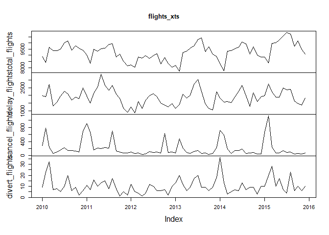<!-- -->

```r
plot.zoo(flights_xts, plot.type = "single", lty = c(1,2,3,4))
```

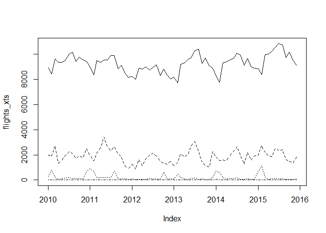<!-- -->

```r
# legend("right", lty = lty, legend = labels)

# Calculate percentages
flights_xts$pct_delay <- (flights_xts$delay_flights / flights_xts$total_flights ) * 100

plot.xts(flights_xts$pct_delay)
```

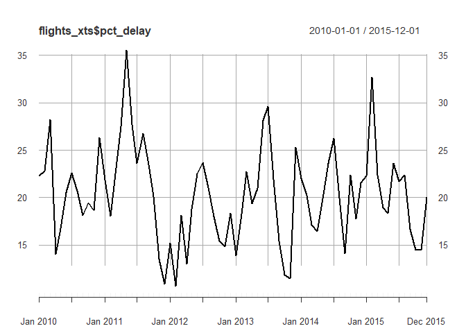<!-- -->

```r
flights_xts$pct_cancel <- (flights_xts$cancel_flights/flights_xts$total_flights)*100

flights_xts$pct_divert <- (flights_xts$divert_flights/flights_xts$total_flights)*100

#plot all percentages
plot.zoo(x = flights_xts[ , c("pct_delay", "pct_cancel", "pct_divert")])
```

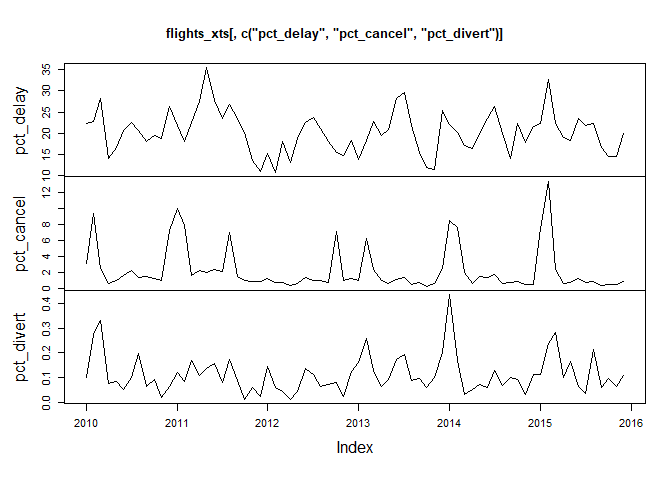<!-- -->

### Saving as rds

- Use `saveRDS()`and `readRDS()` for your own use: maintains time index of xts objects
- Therefore, this is the preferred method to save xts data for a later revisit 

Saving as CSV in case other people use a different programming tool.

- `write.zoo()` and `read.zoo()`


```r
# Export your xts object to a csv file using write.zoo
write.zoo(flights_xts, file = "flights_xts.csv", sep = ",")

# Open your saved object using read.zoo
flights2 <- read.zoo("flights_xts.csv", sep = ",", FUN = as.Date, header = TRUE, index.column = 1)

# Encode your new object back into xts
flights_xts2 <- as.xts(flights2)

# Examine the first five rows of your new flights_xts2 object
head(flights_xts2, n=5)
```

```
##            total_flights delay_flights cancel_flights divert_flights
## 2010-01-01          8912          1989            279              9
## 2010-02-01          8418          1918            785             23
## 2010-03-01          9637          2720            242             32
## 2010-04-01          9363          1312             58              7
## 2010-05-01          9360          1569            102              8
##            pct_delay pct_cancel pct_divert
## 2010-01-01  22.31822  3.1306104 0.10098743
## 2010-02-01  22.78451  9.3252554 0.27322404
## 2010-03-01  28.22455  2.5111549 0.33205354
## 2010-04-01  14.01260  0.6194596 0.07476236
## 2010-05-01  16.76282  1.0897436 0.08547009
```

## Case Study 2: Weather Data

### Merging using `rbind`
Merging xts objects using rbind preserves the order of the data

Combining is not necessary here but rbind can be used to combine various temperature dataset (eg. two data sets from different periods can be combined to one).

Example uses the Boston Weather Data: 


```r
# load temperature data
temps <- readRDS(gzcon(url("https://assets.datacamp.com/production/course_1964/datasets/temps_monthly.RData
")))

head(temps)
```

```
##              [,1]
## Jan 2010 36.12903
## Feb 2010 37.71429
## Mar 2010 42.22581
## Apr 2010 51.26667
## May 2010 56.87097
## Jun 2010 63.56667
```

```r
str(temps)
```

```
## An 'xts' object on Jan 2010/Dec 2015 containing:
##   Data: num [1:72, 1] 36.1 37.7 42.2 51.3 56.9 ...
##   Indexed by objects of class: [yearmon] TZ: UTC
##   Original class: 'double'  
##   xts Attributes:  
##  NULL
```

```r
summary(temps)
```

```
##      Index          temps      
##  Min.   :2010   Min.   :29.55  
##  1st Qu.:2011   1st Qu.:41.31  
##  Median :2013   Median :51.33  
##  Mean   :2013   Mean   :52.70  
##  3rd Qu.:2014   3rd Qu.:63.85  
##  Max.   :2016   Max.   :73.48
```

```r
# identify periodicity 
periodicity(temps)
```

```
## Monthly periodicity from Jan 2010 to Dec 2015
```

```r
# basic plot 
plot(temps)
```

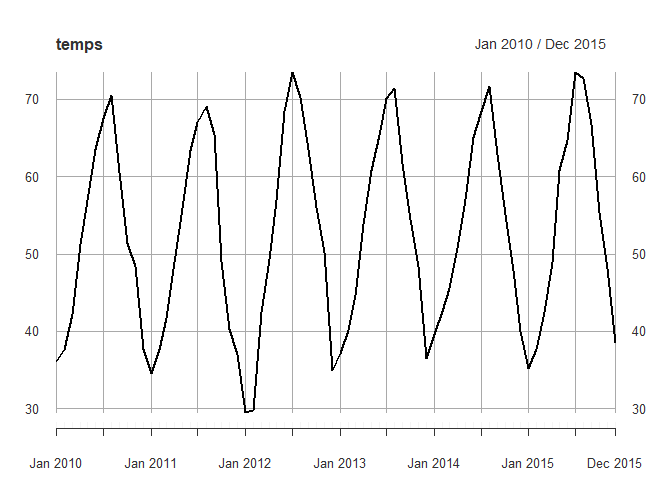<!-- -->

```r
plot.xts(first(temps, "6 months"))
```

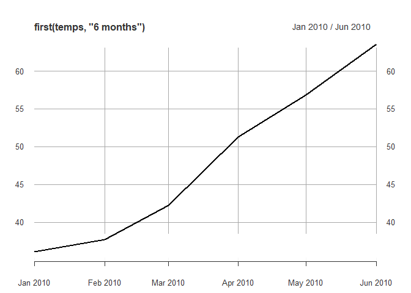<!-- -->

```r
plot.xts(temps["2010-11/2012-04"])
```

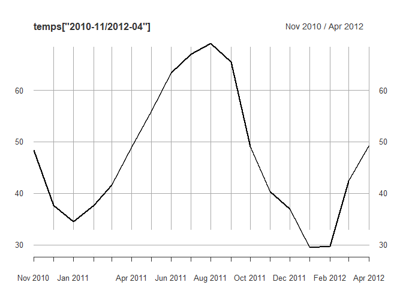<!-- -->

### Merging time seies data by column using `cbind`

First step is to check periodicity and coverage of the data. If we want to merge these data it is necessary that periodicity and coverage is identical. If this is not the case we can subset one dataset which encompasses the other or convert periodicity. 

- To convert the periodicity of xts objects, we can use the `to.period()` function. 


```r
# check periodicity
periodicity(flights_xts)
```

```
## Monthly periodicity from 2010-01-01 to 2015-12-01
```

```r
periodicity(temps)
```

```
## Monthly periodicity from Jan 2010 to Dec 2015
```

```r
# bind by col (merge)
head(cbind(flights_xts, temps))
```

```
##            total_flights delay_flights cancel_flights divert_flights
## 2010-01-01          8912          1989            279              9
## 2010-02-01          8418          1918            785             23
## 2010-03-01          9637          2720            242             32
## 2010-04-01          9363          1312             58              7
## 2010-05-01          9360          1569            102              8
## 2010-06-01          9502          1955            157              5
##            pct_delay pct_cancel pct_divert    temps
## 2010-01-01  22.31822  3.1306104 0.10098743 36.12903
## 2010-02-01  22.78451  9.3252554 0.27322404 37.71429
## 2010-03-01  28.22455  2.5111549 0.33205354 42.22581
## 2010-04-01  14.01260  0.6194596 0.07476236 51.26667
## 2010-05-01  16.76282  1.0897436 0.08547009 56.87097
## 2010-06-01  20.57462  1.6522837 0.05262050 63.56667
```

```r
flights_temps <- merge(flights_xts, temps)

# plot.zoo two cols in a single panel
plot.zoo(flights_temps[,c("pct_delay", "temps")], plot.type="single", lty=c(1,2))
legend("topright", lty = c(1,2) , bg = "white", legend=c("pct_delay","temps"))
```

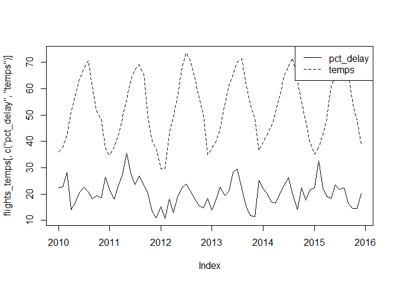<!-- -->

```r
# add flights cancelled ...
```

### Time Series data workflow

1. Encode all time series objects to xts
2. Examine and adjust periodicity
3. Merge xts objects and examine 

**Next:** 
Assess the hypothesis that flight delays are a function of visibility and wind. In order to do this, we add a few more cols by merging average visibility and wind speeds 


```r
# load wind data
wind <- readRDS(gzcon(url("https://assets.datacamp.com/production/course_1964/datasets/wind.RData")))

head(wind)
```

```
##              wind
## Jan 2010 7.193548
## Feb 2010 5.214286
## Mar 2010 4.903226
## Apr 2010 4.700000
## May 2010 4.129032
## Jun 2010 4.300000
```

```r
str(wind)
```

```
## An 'xts' object on Jan 2010/Dec 2015 containing:
##   Data: num [1:72, 1] 7.19 5.21 4.9 4.7 4.13 ...
##  - attr(*, "dimnames")=List of 2
##   ..$ : NULL
##   ..$ : chr "wind"
##   Indexed by objects of class: [yearmon] TZ: UTC
##   Original class: 'double'  
##   xts Attributes:  
##  NULL
```

```r
periodicity(wind)
```

```
## Monthly periodicity from Jan 2010 to Dec 2015
```

```r
# load visibility data
vis <- readRDS(gzcon(url("https://assets.datacamp.com/production/course_1964/datasets/vis.RData")))
head(vis)
```

```
##               vis
## Jan 2010 5.774194
## Feb 2010 5.857143
## Mar 2010 5.806452
## Apr 2010 6.000000
## May 2010 6.000000
## Jun 2010 6.000000
```

```r
str(vis)
```

```
## An 'xts' object on Jan 2010/Dec 2015 containing:
##   Data: num [1:72, 1] 5.77 5.86 5.81 6 6 ...
##  - attr(*, "dimnames")=List of 2
##   ..$ : NULL
##   ..$ : chr "vis"
##   Indexed by objects of class: [yearmon] TZ: UTC
##   Original class: 'double'  
##   xts Attributes:  
##  NULL
```

```r
periodicity(vis)
```

```
## Monthly periodicity from Jan 2010 to Dec 2015
```

Fortunately, the data has already been prepared to cover the same time period with modified periodicity. 


```r
# merge data after checking them
head(flights_temps)
```

```
##            total_flights delay_flights cancel_flights divert_flights
## 2010-01-01          8912          1989            279              9
## 2010-02-01          8418          1918            785             23
## 2010-03-01          9637          2720            242             32
## 2010-04-01          9363          1312             58              7
## 2010-05-01          9360          1569            102              8
## 2010-06-01          9502          1955            157              5
##            pct_delay pct_cancel pct_divert    temps
## 2010-01-01  22.31822  3.1306104 0.10098743 36.12903
## 2010-02-01  22.78451  9.3252554 0.27322404 37.71429
## 2010-03-01  28.22455  2.5111549 0.33205354 42.22581
## 2010-04-01  14.01260  0.6194596 0.07476236 51.26667
## 2010-05-01  16.76282  1.0897436 0.08547009 56.87097
## 2010-06-01  20.57462  1.6522837 0.05262050 63.56667
```

```r
periodicity(flights_temps)
```

```
## Monthly periodicity from 2010-01-01 to 2015-12-01
```

```r
periodicity(vis)
```

```
## Monthly periodicity from Jan 2010 to Dec 2015
```

```r
periodicity(wind)
```

```
## Monthly periodicity from Jan 2010 to Dec 2015
```

```r
flights_weather <- merge(flights_temps, vis, wind)

# plot pct delay, wind, and visibility
plot.zoo(x = flights_weather[, c("pct_delay", "vis", "wind")], plot.type = "multiple", lty=c(1:3) )
```

<!-- -->

- No clear relationships between visibility or wind and delayed flights
- flatline data on visibility prior to 2012 seems odd and should be examined (data quality problems?)

## Case Study 3: Economic Data

### Handling missingness
Common way is to fill NAs with last observation. 

- Last observation carried forward (LOCF): `na.locf()`
- Next observation carried backward (NOCB): `na.locf(data, fromLast = TRUE)`
- Linear Interpolation: `na.approx()`


```r
gdp <- readRDS(gzcon(url("https://assets.datacamp.com/production/course_1964/datasets/us_gdp.RData")))

# Get a summary of your GDP data
summary(gdp)
```

```
##       date      gdp_billions    
##  1947 Q1:  1   Min.   :  243.1  
##  1947 Q2:  1   1st Qu.:  708.8  
##  1947 Q3:  1   Median : 3167.3  
##  1947 Q4:  1   Mean   : 6186.6  
##  1948 Q1:  1   3rd Qu.:11497.9  
##  1948 Q2:  1   Max.   :18651.2  
##  (Other):273   NA's   :80
```

```r
# Convert GDP date column to time object
gdp$date <- as.yearqtr(gdp$date)

# Convert GDP data to xts
gdp_xts <- as.xts(gdp[, -1], order.by = gdp[,1])

# Plot GDP data over time
plot.xts(gdp_xts)
```

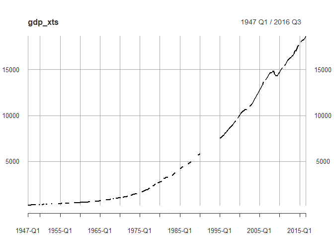<!-- -->

Notice that there are some missing values in our data that we'd want to impute. 


```r
# Fill NAs in gdp_xts with the last observation carried forward
gdp_locf <- na.locf(gdp_xts)

# Fill NAs in gdp_xts with the next observation carried backward 
gdp_nocb <- na.locf(gdp_xts, fromLast = TRUE)

# Produce a plot for each of your new xts objects
par(mfrow = c(2,1))
plot.xts(gdp_locf, major.format = "%Y")
plot.xts(gdp_nocb, major.format = "%Y")
```

<!-- -->

```r
# Query for GDP in 1993 in both gdp_locf and gdp_nocb
gdp_locf["1993"]
```

```
##           [,1]
## 1993 Q1 5890.8
## 1993 Q2 5890.8
## 1993 Q3 5890.8
## 1993 Q4 5890.8
```

```r
gdp_nocb["1993"]
```

```
##           [,1]
## 1993 Q1 7545.3
## 1993 Q2 7545.3
## 1993 Q3 7545.3
## 1993 Q4 7545.3
```

Both techniques lead to completely different results for 1993! So it must be reasoned which one to use or if there is another, better-suited way to solve the problem of missings. Next, we'll use the technique of `linear interpolation`.


```r
# Fill NAs in gdp_xts using linear approximation
gdp_approx <- na.approx(gdp_xts)

# Plot your new xts object
plot.xts(gdp_approx, major.format = "%Y")
```

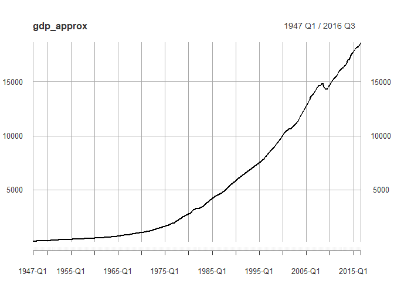<!-- -->

```r
# Query for GDP in 1993 in gdp_approx
gdp_approx["1993"]
```

```
##             [,1]
## 1993 Q1 6883.500
## 1993 Q2 6966.225
## 1993 Q3 7048.950
## 1993 Q4 7131.675
```

### Lagging and differencing


```r
# load unemployment data
unemployment <- readRDS(gzcon(url("https://assets.datacamp.com/production/course_1964/datasets/unemployment.RData")))

# View a summary of your unemployment data
summary(unemployment)
```

```
##      Index            us               ma        
##  Min.   :1976   Min.   : 3.800   Min.   : 2.100  
##  1st Qu.:1986   1st Qu.: 5.300   1st Qu.: 4.300  
##  Median :1996   Median : 6.000   Median : 5.500  
##  Mean   :1996   Mean   : 6.365   Mean   : 5.612  
##  3rd Qu.:2006   3rd Qu.: 7.300   3rd Qu.: 6.800  
##  Max.   :2016   Max.   :10.800   Max.   :11.600  
##                 NA's   :73       NA's   :20
```

```r
plot(unemployment)
```

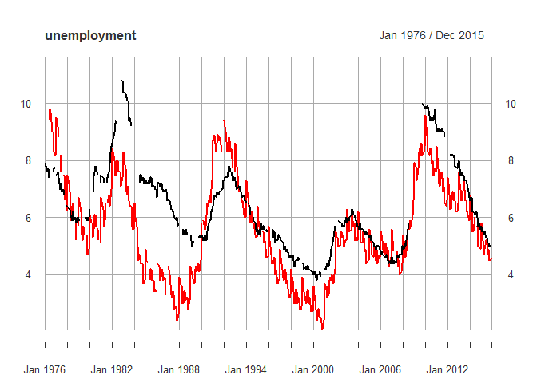<!-- -->

```r
# Use na.approx to remove missing values in unemployment data
unemployment <- na.approx(unemployment)

# Plot new unemployment data
plot.zoo(unemployment, plot.type = "single", lty = c(1,2), col=c(1,2))
legend("topright", lty = c(1,2), legend = c("us", "ma"), ,col =c(1,2),bg = "white")
```

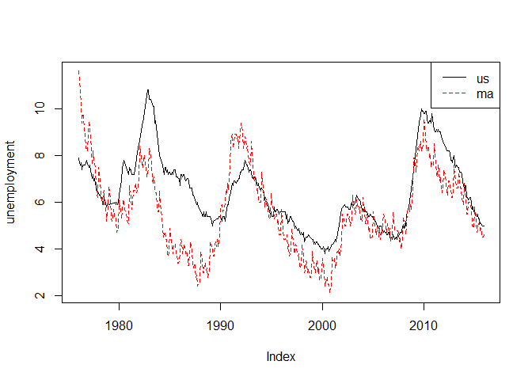<!-- -->

```r
# Create a one month lag of US unemployment
us_monthlag <- lag(unemployment$us, k = 1)

# Create a one year lag of US unemployment
us_yearlag <- lag(unemployment$us, k = 12)

# Merge your original data with your new lags 
unemployment_lags <- merge(unemployment, us_monthlag, us_yearlag)

# View the first 15 rows of unemployment_lags
head(unemployment_lags, n=15)
```

```
##            us    ma us.1 us.2
## Jan 1976 7.90 11.60   NA   NA
## Feb 1976 7.70 11.25 7.90   NA
## Mar 1976 7.60 10.90 7.70   NA
## Apr 1976 7.70 10.15 7.60   NA
## May 1976 7.40  9.40 7.70   NA
## Jun 1976 7.60  9.80 7.40   NA
## Jul 1976 7.60  9.70 7.60   NA
## Aug 1976 7.60  9.00 7.60   NA
## Sep 1976 7.60  9.00 7.60   NA
## Oct 1976 7.70  8.30 7.60   NA
## Nov 1976 7.80  8.30 7.70   NA
## Dec 1976 7.65  8.20 7.80   NA
## Jan 1977 7.50  9.50 7.65  7.9
## Feb 1977 7.60  9.20 7.50  7.7
## Mar 1977 7.40  8.80 7.60  7.6
```

```r
# Generate monthly difference in unemployment
unemployment$us_monthlydiff <- diff(unemployment$us, lag = 1, differences = 1)

# Generate yearly difference in unemployment
unemployment$us_yearlydiff <- diff(unemployment$us, lag = 12, differences = 1)

# Plot US unemployment and annual difference
par(mfrow = c(2,1))
plot.xts(unemployment$us_monthlydiff)
plot.xts(unemployment$us_yearlydiff, type = "h")
```

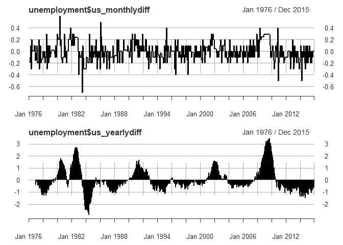<!-- -->

### Rolling functions
Applying a function over a particular window over time. For discrete windows:

- split the data according to period: `split()`
- apply function within period: `lapply()`
- bind new data into xts object: `do.call()`

Rolling windows to calculate a rolling average across a certain period. E.g. rolling averages... 
Of particular use is the split-lapply-bind pattern here:


```r
# Add a quarterly difference in gdp
gdp$quarterly_diff <- diff(gdp_approx, lag = 1, differences = 1)

# Split gdp$quarterly_diff into years
gdpchange_years <- split(gdp$quarterly_diff, f = "years")

# Use lapply to calculate the cumsum each year
gdpchange_ytd <- lapply(gdpchange_years, FUN = cumsum)

# Use do.call to rbind the results
gdpchange_xts <- do.call(rbind, gdpchange_ytd)

# Plot cumulative year-to-date change in GDP
plot.xts(gdpchange_xts, type = "h")
```

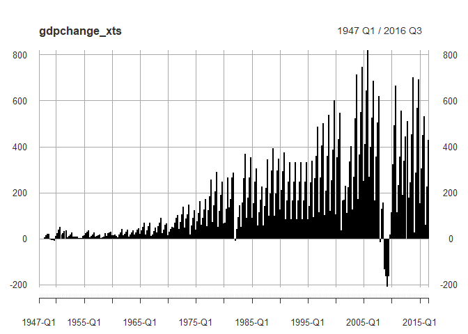<!-- -->

Add a continous rolling yearly average to US unemployment:


```r
# Use rollapply to calculate the rolling yearly average US unemployment
unemployment$year_avg <- rollapply(unemployment$us, width = 12, FUN = mean)

# Plot all columns of US unemployment data
plot.zoo(unemployment[, c("us", "year_avg")], plot.type = "single", lty = c(1,2), lwd = c(1,2), col=c(1,2))
```

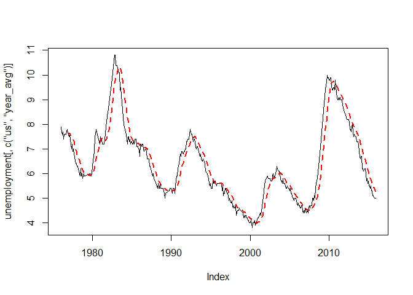<!-- -->


```r
# Add a one-year lag of MA unemployment
unemployment$ma_yearlag <- lag(unemployment$ma, k=12)

# Add a six-month difference of MA unemployment
unemployment$ma_sixmonthdiff <- diff(unemployment$ma, lag=6, differences = 1)

# Add a six-month rolling average of MA unemployment
unemployment$ma_sixmonthavg <- rollapply(unemployment$ma, width=6, FUN=mean)
  
# Add a yearly rolling maximum of MA unemployment
unemployment$ma_yearmax <- rollapply(unemployment$ma, width=12, FUN = max)

# View the last year of unemployment data
tail(unemployment, n=12)
```

```
##           us  ma us_monthlydiff us_yearlydiff year_avg ma_yearlag
## Jan 2015 5.7 5.8            0.1          -0.9 6.091667       6.80
## Feb 2015 5.5 5.5           -0.2          -1.2 5.991667       6.50
## Mar 2015 5.5 5.2            0.0          -1.2 5.891667       6.20
## Apr 2015 5.4 4.7           -0.1          -0.8 5.825000       5.50
## May 2015 5.5 4.9            0.1          -0.7 5.766667       5.50
## Jun 2015 5.3 5.2           -0.2          -0.8 5.700000       6.00
## Jul 2015 5.3 5.2            0.0          -0.9 5.625000       6.00
## Aug 2015 5.1 4.7           -0.2          -1.1 5.533333       5.85
## Sep 2015 5.1 4.9            0.0          -0.9 5.458333       5.70
## Oct 2015 5.0 4.5           -0.1          -0.7 5.400000       5.00
## Nov 2015 5.0 4.5            0.0          -0.8 5.333333       5.00
## Dec 2015 5.0 4.6            0.0          -0.6 5.283333       4.90
##          ma_sixmonthdiff ma_sixmonthavg ma_yearmax
## Jan 2015           -0.20       5.375000       6.50
## Feb 2015           -0.35       5.316667       6.20
## Mar 2015           -0.50       5.233333       6.00
## Apr 2015           -0.30       5.183333       6.00
## May 2015           -0.10       5.166667       6.00
## Jun 2015            0.30       5.216667       6.00
## Jul 2015           -0.60       5.116667       5.85
## Aug 2015           -0.80       4.983333       5.80
## Sep 2015           -0.30       4.933333       5.80
## Oct 2015           -0.20       4.900000       5.80
## Nov 2015           -0.40       4.833333       5.80
## Dec 2015           -0.60       4.733333       5.80
```

## Case Study 4: Sports data

### Advanced features of xts

- Finding Endpoints: `years <- endpoints(unemployment, on = "years")`
- Apply by period: `period.apply(unemployment, INDEX = years, FUN = mean)`


```r
# endpoints
years <- endpoints(unemployment, on = "years")
head(years) # gives index
```

```
## [1]  0 12 24 36 48 60
```

```r
head(unemployment[years])
```

```
##            us  ma us_monthlydiff us_yearlydiff year_avg ma_yearlag
## Dec 1976 7.65 8.2     -0.1500000            NA 7.654167         NA
## Dec 1977 6.40 6.2     -0.1333333         -1.25 7.016667        8.2
## Dec 1978 6.00 5.7      0.1000000         -0.40 6.066667        6.2
## Dec 1979 6.00 4.9      0.1000000          0.00 5.945833        5.7
## Dec 1980 7.20 5.1     -0.1000000          1.20 7.200000        4.9
## Dec 1981 8.50 7.0      0.2000000          1.30 7.566667        5.1
##          ma_sixmonthdiff ma_sixmonthavg ma_yearmax
## Dec 1976            -1.6       8.750000       11.6
## Dec 1977            -2.0       7.025000        9.5
## Dec 1978            -0.7       5.791667        7.5
## Dec 1979            -0.8       5.100000        6.7
## Dec 1980            -1.0       5.475000        6.1
## Dec 1981             0.5       6.650000        7.0
```

```r
# apply by period
head(period.apply(unemployment, INDEX = years, FUN = mean))
```

```
##                us       ma us_monthlydiff us_yearlydiff year_avg
## Dec 1976 7.654167 9.633333             NA            NA       NA
## Dec 1977 7.016667 7.804167    -0.10416667    -0.6375000 7.406366
## Dec 1978 6.066667 6.220833    -0.03333333    -0.9500000 6.442593
## Dec 1979 5.945833 5.516667     0.00000000    -0.1208333 5.953704
## Dec 1980 7.200000 5.629167     0.10000000     1.2541667 6.541435
## Dec 1981 7.566667 6.450000     0.10833333     0.3666667 7.400694
##          ma_yearlag ma_sixmonthdiff ma_sixmonthavg ma_yearmax
## Dec 1976         NA              NA             NA         NA
## Dec 1977   9.633333      -0.8625000       8.179861   9.883333
## Dec 1978   7.804167      -0.6166667       6.432639   7.962500
## Dec 1979   6.220833      -0.3458333       5.652778   6.758333
## Dec 1980   5.516667       0.1875000       5.565278   6.133333
## Dec 1981   5.629167       0.5875000       6.137500   6.750000
```

Next, explore Sports Data and relation to tourism. 


```r
# Load sports data
sports <- readRDS(gzcon(url("https://assets.datacamp.com/production/course_1964/datasets/sports.RData
")))

head(sports)
```

```
##            boston_score opponent_score homegame mlb nfl nhl nba season
## 2010-04-04            9              7        1   1   0   0   0   2010
## 2010-04-06            4              6        1   1   0   0   0   2010
## 2010-04-07            1              3        1   1   0   0   0   2010
## 2010-04-09            3              4        0   1   0   0   0   2010
## 2010-04-10            8              3        0   1   0   0   0   2010
## 2010-04-11            8              6        0   1   0   0   0   2010
##            sports_type win_loss
## 2010-04-04           1        1
## 2010-04-06           1        0
## 2010-04-07           1        0
## 2010-04-09           1        0
## 2010-04-10           1        1
## 2010-04-11           1        1
```

```r
# Generate a new variable coding for red sox wins
sports$win_loss <- ifelse(sports$boston_score > sports$opponent_score, 1, 0)

# Identify the date of the last game each season
close <- endpoints(sports, on = "years")

# Calculate average win/loss record at the end of each season
period.apply(sports[, "win_loss"], INDEX = close, FUN = mean)
```

```
##             win_loss
## 2010-12-31 0.5983607
## 2011-12-31 0.5904762
## 2012-12-30 0.5015576
## 2013-12-31 0.5828571
## 2014-12-31 0.4529412
## 2015-12-30 0.5275362
## 2016-04-13 0.5360825
```


```r
# Split redsox_xts win_loss data into years 
redsox_seasons <- split(sports$win_loss, f = "years")

# Use lapply to calculate the cumulative mean for each season
cummean <- function(x){
  y <- cumsum(x) / seq_along(x)
  return(y)
}

redsox_ytd <- lapply(redsox_seasons, FUN = cummean)

# Use do.call to rbind the results
redsox_winloss <- do.call(rbind, redsox_ytd)

# Plot the win_loss average for the 2013 season
plot.xts(redsox_winloss["2013"], ylim = c(0, 1))
```

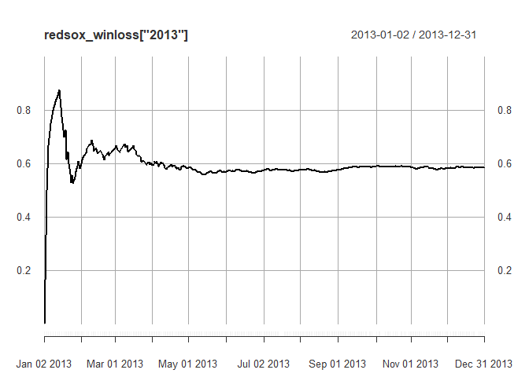<!-- -->


```r
# Select only the 2013 season
redsox_2013 <- sports["2013"]

# Use rollapply to generate the last ten average
lastten_2013 <- rollapply(redsox_2013$win_loss, width = 10, FUN = mean)

# Plot the last ten average during the 2013 season
plot.xts(lastten_2013, ylim = c(0, 1))
```

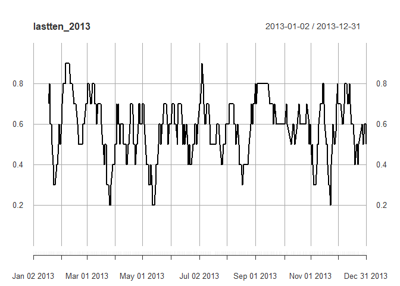<!-- -->

### Indexing commands in xts

- .index() extracts raw time index
- .indexwday() for weekdays


```r
# extract raw time index
head(.index(unemployment))
```

```
## [1] 189302400 191980800 194486400 197164800 199756800 202435200
```

```r
# extract weekday
head(.indexwday(sports))
```

```
## [1] 0 2 3 5 6 0
```

```r
# extract sunday games
sunday_games <- which(.indexwday(sports) == 0)
head(sunday_games)
```

```
## [1]  1  6 12 19 25 32
```


```r
# Extract the day of the week of each observation
weekday <- .indexwday(sports)
head(weekday)
```

```
## [1] 0 2 3 5 6 0
```

```r
# Generate an index of weekend dates
weekend <- which(.indexwday(sports) == 0 | .indexwday(sports) == 6)

# Subset only weekend games
weekend_games <- sports[weekend]
head(weekend_games)
```

```
##            boston_score opponent_score homegame mlb nfl nhl nba season
## 2010-04-04            9              7        1   1   0   0   0   2010
## 2010-04-10            8              3        0   1   0   0   0   2010
## 2010-04-11            8              6        0   1   0   0   0   2010
## 2010-04-17            5              6        1   1   0   0   0   2010
## 2010-04-18            1              7        1   1   0   0   0   2010
## 2010-04-24            7              6        1   1   0   0   0   2010
##            sports_type win_loss
## 2010-04-04           1        1
## 2010-04-10           1        1
## 2010-04-11           1        1
## 2010-04-17           1        0
## 2010-04-18           1        0
## 2010-04-24           1        1
```


```r
# Generate a subset of sports data with only homegames
homegames <- sports[sports$homegame == 1]

# Calculate the win/loss average of the last 20 home games
homegames$win_loss_20 <- rollapply(homegames$win_loss, width = 20, FUN = mean)

# Calculate the win/loss average of the last 100 home games
homegames$win_loss_100 <- rollapply(homegames$win_loss, width = 100, FUN = mean)

# Use plot.xts to generate
plot.zoo(homegames[, c("win_loss_20", "win_loss_100")], plot.type = "single", lty = c(2,1), lwd = c(1,2), col=c(1,2))
```

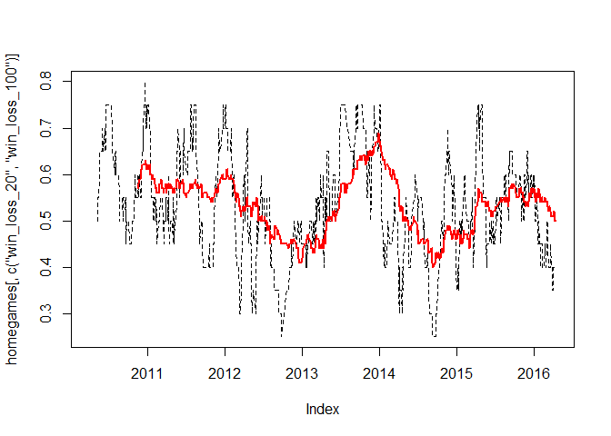<!-- -->


